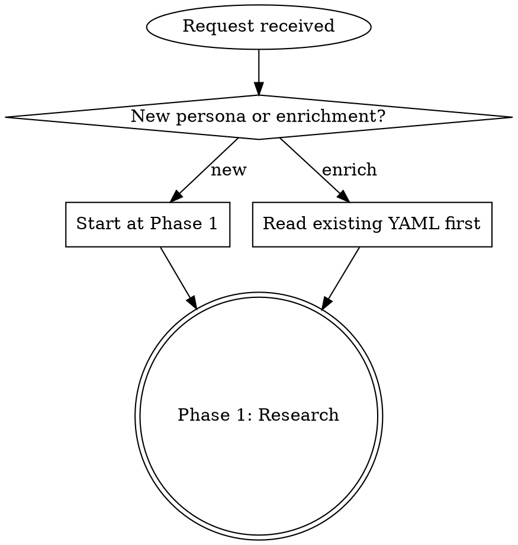

# Persona Craft

Create new personas or enrich existing ones with authentic, source-accurate content. Two phases: research the character, then author the YAML.

**Core principle:** Quotes must be recognizable from source material — adapt, don't fabricate. Swap one key noun to make it about coding; keep the rhythm and voice intact.

## When to Use

- "Create a new persona for X character"
- "Enrich the Spock persona with better quotes"
- "The quotes feel generic / made up"
- "Add more statusline messages to Y"
- "Improve persona Z's theme"

**Don't use for:** Switching personas, weighting, curation, or configuration — use `sidekick-personas` instead. That skill also has a "Create Custom Persona" recipe for quick stubs; use THIS skill when you need research-backed authoring with 18+ quotes and rich traits.

## Decision Gate



**For enrichment:** Read the existing persona YAML at `assets/sidekick/personas/<id>.yaml` (or `~/.sidekick/personas/` / `.sidekick/personas/` for custom). Note what exists, what's missing, and what's weak. Preserve `llmProfile` and all existing fields.

## Phase 1: Research

Search for iconic quotes, traits, and speech patterns from the character's **source material** (movies, TV, books).

1. **Web search** for the character's most famous quotes, catchphrases, and dialogue
2. **Collect 25-30 candidate quotes** — aim for variety across the character's range
3. **Identify defining traits**: How do they speak? What words do they repeat? What's their worldview?
4. **Note speech patterns**: Inverted syntax (Yoda), profanity cadence (Avasarala), formal address (JARVIS), passive-aggression (GLaDOS)

**Research quality gate:** You should have enough material to write the theme from memory. If you can't describe the character's voice without looking at notes, research more.

## Phase 2: Author

### Theme (Required)

200-400 characters. Must include:
- Full character name
- Source (show/movie/book)
- Role/title
- Vivid personality description with specific mannerisms
- How they relate to coding/programming

**Gold standard:**

> "Chrisjen Avasarala, UN Undersecretary turned Secretary-General from The Expanse. The solar system's foul-mouthed political razor: sari-clad, cane-wielding, bullshit-intolerant genius who swears like she breathes and cuts through deception like a railgun. She'll call your code 'horseshit' to your face, then fix the architecture because humanity — or at least this goddamn project — depends on it."

**What makes this good:** Full name + title + source + 3 vivid physical/personality details + specific speech pattern + coding bridge that fits the character.

### personality_traits (Required)

6-8 **hyphenated compound traits**. Not generic adjectives.

| Bad (generic) | Good (specific) |
|---------------|----------------|
| `logical` | `relentlessly-logical` |
| `funny` | `mischievously-playful` |
| `smart` | `intellectually-superior` |
| `angry` | `impatient-with-fools` |
| `polite` | `impeccably-polite` |

Each trait should evoke the character — a reader familiar with the source should nod.

### tone_traits (Required)

5-6 **speech-pattern descriptors** — HOW they speak, not WHAT they say.

| Bad (content) | Good (delivery) |
|--------------|-----------------|
| `talks about logic` | `measured-and-deliberate` |
| `uses profanity` | `profane-precision` |
| `is sarcastic` | `diplomatically-deadpan` |

**Preserve behavioral directives** if present (e.g., "no mechanical sounds" for C-3PO). These constrain the LLM and must survive enrichment.

### statusline_empty_messages (Required)

**Target: 18-20 messages.**

These appear when a session starts. They should:
- Be instantly recognizable as the character
- Reference coding/development naturally
- Vary in tone (some funny, some philosophical, some pointed)
- Use the character's actual speech patterns

**Adaptation technique:** Take a real quote, find the noun or phrase that anchors it to the original context, and swap that one element for a coding concept. Keep the rest verbatim.

**How to pick the noun to swap:** Look for the subject the character is talking ABOUT — that's your swap target. The character's voice (syntax, rhythm, attitude) stays; only the topic changes.

```
# Original Spock quote:
"Insufficient facts always invite danger."
# Swap target: none needed — already applies to coding
# Adapted: "Insufficient facts always invite danger. Provide more context."

# Original Avasarala quote:
"I have 900 pages of contingency plans."
# Swap target: what the plans are FOR → "this codebase"
# Adapted: "I have 900 pages of contingency plans for this codebase."

# Original GLaDOS quote:
"This was a triumph. I'm making a note here: huge success."
# Swap target: what the "triumph" refers to → "the session"
# Adapted: "This was a triumph. I'm making a note here: the session hasn't started yet."
```

**Verify adaptations:** Search the original quote on Wikiquote or IMDb to confirm it's real before adapting. If you can't find the source, don't use it.

### snarky_examples (Required)

**Target: 5-7 messages. Max 15 words each.**

Triggered by user actions (vague prompts, untested commits, etc.). Each should:
- React to a specific developer behavior
- Sound like the character, not a generic bot
- Stay under 15 words

### snarky_welcome_examples (Required)

**Target: 4-5 messages. Max 8-10 words each.**

Shown when user returns to an existing session. Short, punchy, in-character.

## YAML Structure

```yaml
id: character-id              # lowercase, hyphens only, matches filename
display_name: Character Name
llmProfile: creative          # Optional. Preserve if present during enrichment.
theme: "200-400 char description..."
personality_traits:
  - trait-one
  - trait-two
  # 6-8 total
tone_traits:
  - tone-one
  - tone-two
  # 5-6 total
statusline_empty_messages:
  - "Message one"
  # 18-20 total
snarky_examples:
  - "Short reaction"
  # 5-7 total
snarky_welcome_examples:
  - "Welcome back variant"
  # 4-5 total
```

**File locations:**
- Bundled (built-in): `assets/sidekick/personas/<id>.yaml`
- Custom user: `~/.sidekick/personas/<id>.yaml`
- Custom project: `.sidekick/personas/<id>.yaml`

**New bundled personas** go in `assets/`. Custom personas created for a user go in `~/.sidekick/personas/` or `.sidekick/personas/` — ask scope first.

## Quality Gates

Run after EVERY edit, not just at the end.

### Validation Checklist

- [ ] **YAML parses** — no syntax errors (test with `pnpm build` or a YAML linter)
- [ ] **Count targets met:**
  - personality_traits: 6-8
  - tone_traits: 5-6
  - statusline_empty_messages: 18-20
  - snarky_examples: 5-7
  - snarky_welcome_examples: 4-5
- [ ] **No within-file duplicates** — same quote must not appear in multiple sections
- [ ] **No cross-character contamination** — quotes attributed to the right character
- [ ] **Quotes are source-recognizable** — a fan would know where they came from
- [ ] **Theme includes:** full name, source, role, vivid description, coding bridge
- [ ] **Traits are compound-hyphenated** — not single generic adjectives
- [ ] **tone_traits describe delivery** — not content
- [ ] **llmProfile preserved** — if it existed before enrichment, it must still be there
- [ ] **Build passes:** `pnpm build`
- [ ] **Persona tests pass:** `pnpm --filter @sidekick/core test -- 'persona'`

### Verification Commands

```bash
# Build
pnpm build

# Persona-specific tests
pnpm --filter @sidekick/core test -- 'persona'

# Test the voice
pnpm sidekick persona test <id> --session-id=<session-id> --type=snarky
```

## Common Mistakes

| Mistake | Fix |
|---------|-----|
| Fabricating quotes that sound plausible | Research first — real quotes adapted > invented ones |
| Generic traits like `smart`, `funny` | Compound-hyphenated: `intellectually-superior`, `mischievously-playful` |
| tone_traits describing content | Describe delivery: `measured-and-deliberate`, not `talks about logic` |
| Same quote in statusline and snarky | Check for within-file duplicates after each edit |
| Losing `llmProfile` during enrichment | Read full YAML first, preserve all existing fields |
| Theme that's just a Wikipedia summary | Include vivid physical/personality details + coding bridge |
| Exceeding word limits on snarky messages | snarky_examples: max 15 words. welcome: max 8-10 words. |
| Skipping research phase | Research is not optional. 25-30 candidates minimum. |

## Red Flags — STOP and Recheck

- Writing quotes without having done web research first
- Theme reads like a Wikipedia bio, not a character sketch
- All statusline messages have the same tone (no variety)
- Traits are single generic words, not hyphenated compounds
- You can't identify the source material for a quote you wrote
- Count targets not met (too few OR too many)
- Editing without validating YAML after each change
