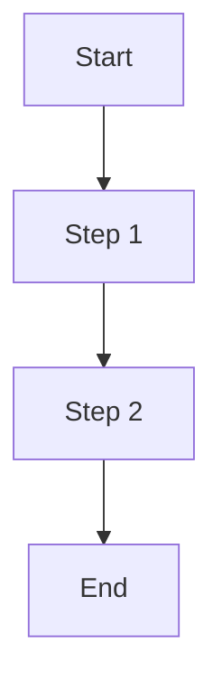

# Contributing to Claude Code Configuration Lab

First off, thanks for taking the time to contribute! This project serves as an experimental proving ground for Claude Code configurations, and your contributions help improve the Claude Code ecosystem.

## Code of Conduct

Be respectful, professional, and constructive. This is a technical project focused on Claude Code configuration development.

## How Can I Contribute?

### Reporting Bugs

Before creating bug reports, please check existing issues. When you create a bug report, include:

- **Clear description** of the problem
- **Steps to reproduce** the issue
- **Expected vs actual behavior**
- **Environment details** (OS, Claude Code version, shell)
- **Relevant logs** from `.sidekick/sessions/${session_id}/sidekick.log` if applicable

### Suggesting Enhancements

Enhancement suggestions are tracked as GitHub issues. When suggesting:

- **Use a clear title** describing the enhancement
- **Provide detailed explanation** of the proposed functionality
- **Explain why this would be useful** to the Claude Code community
- **Consider dual-scope implications** (project vs user scope)

### Pull Requests

1. **Fork the repository** and create your branch from `main`
2. **Test thoroughly** using both scopes:
   ```bash
   # Test project-scope
   ./scripts/setup-reminders.sh --project
   ./tests/test-setup-reminders.sh
   ./tests/test-cleanup-reminders.sh

   # Test user-scope deployment
   ./scripts/push-to-claude.sh
   ```
3. **Follow existing patterns**:
   - Dual-scope compatibility for all scripts
   - Permission-based execution for hooks
   - Idempotent sync operations
4. **Update documentation** (README.md, CLAUDE.md) for significant changes
5. **Write clear commit messages** using semantic format:
   - `feat:` for new features
   - `fix:` for bug fixes
   - `docs:` for documentation
   - `test:` for tests
   - `refactor:` for refactoring
   - `chore:` for maintenance

## Development Guidelines

### Dual-Scope Compatibility

**Critical requirement**: All scripts must work identically in both contexts:

- **Project scope**: `.claude/` in this repository
- **User scope**: `~/.claude/` global directory

Use environment variables for path resolution:
```bash
# Good - works in both scopes
hook_dir="${CLAUDE_PROJECT_DIR}/.claude/hooks"

# Bad - hard-coded project path
hook_dir="/home/user/projects/claude-config/.claude/hooks"
```

### Hook Development

When creating or modifying hooks:

1. **Declare permissions** in `.claude/settings.json`:
   ```json
   {
     "permissions": {
       "allow": ["Bash(/path/to/hook.sh:*)"]
     }
   }
   ```

2. **Maintain state** in `.sidekick/sessions/` (automatically gitignored)

3. **Handle errors gracefully** - hooks should never crash Claude Code

4. **Document behavior** in hook file comments

### Script Best Practices

- **No `set -e`** in scripts that need graceful error handling
- **Use `set -e`** for scripts that should fail fast
- **Color output** for user feedback (see existing scripts for patterns)
- **Backup before modifying** critical files (see `setup-reminders.sh:109-116`)
- **Validate JSON** before/after modifications using `jq`

### Testing Requirements

All significant changes require tests:

```bash
# Add test cases to appropriate test file
./tests/test-setup-reminders.sh
./tests/test-cleanup-reminders.sh
./tests/test-response-tracker.sh

# Create new test file for new functionality
./tests/test-your-feature.sh
```

Test files should:
- Use temporary directories (`/tmp/...`)
- Clean up after execution (`trap cleanup EXIT`)
- Provide clear pass/fail output
- Test both success and failure scenarios

### Synchronization Rules

When modifying sync scripts (`pull-from-claude.sh`, `push-to-claude.sh`):

- **Preserve timestamps** - critical for idempotent sync
- **Respect `.claudeignore`** patterns
- **Avoid copying** `.local.*` files (project-specific)
- **Verify file existence** before operations
- **Log operations clearly** for debugging

### Command Template Format

New commands in `backlog/` should follow this structure:

````markdown
# Command Name

## Purpose
Brief description of what this command does

## Requirements
- List prerequisites
- Environment assumptions

## Process Flow


## Implementation
```bash
#!/bin/bash
# Command implementation
```
````

## Coding Style

### Shell Scripts

- Use **4 spaces** for indentation (not tabs)
- **Quote variables**: `"$var"` not `$var`
- **Use `[[ ]]`** for conditionals, not `[ ]`
- **Function names**: `lowercase_with_underscores`
- **Local variables**: declare within functions
- **Comprehensive comments** for complex logic

### JSON Configuration

- **2 spaces** for indentation
- **Validate with jq** before committing
- **Sort arrays** alphabetically where order doesn't matter

## Documentation Standards

- **Update CLAUDE.md** for architectural changes
- **Update README.md** for user-facing changes
- **Inline comments** for non-obvious code
- **Reference line numbers** when documenting: `setup-reminders.sh:186-254`

## Questions?

Open an issue with the `question` label.

## Attribution

By contributing, you agree that your contributions will be licensed under the MIT License.
