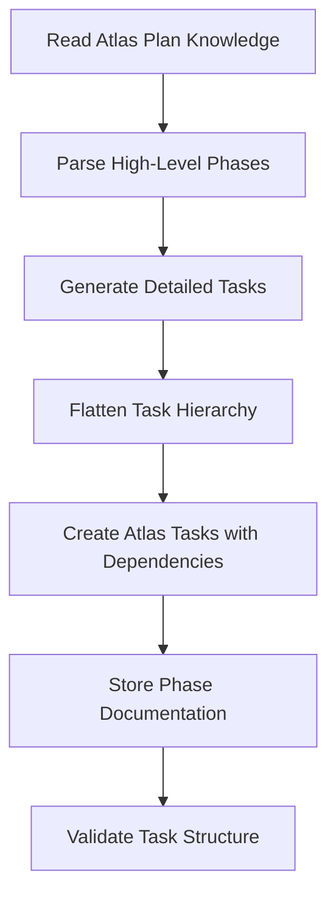

Decompose high-level plan into detailed Atlas tasks with dependencies: $ARGUMENTS

## Purpose

This command takes an existing Atlas project created by `/plan-create` and decomposes each high-level phase into specific, actionable Atlas tasks. It implements the hierarchy flattening strategy where phases become task tags and the original hierarchy is preserved through task dependencies and naming conventions.

## **CRITICAL REQUIREMENTS**

1. **MUST use Atlas MCP tools** - All task creation through Atlas, not filesystem
2. **MUST implement flattening strategy** - Convert Plan→Phases→Tasks→Subtasks to flat Atlas tasks
3. **MUST use task ID conventions** - Format: `[phase-num]-[task-num][-subtask-num]`
4. **MUST preserve dependencies** - Maintain execution order through Atlas task dependencies
5. **MUST use Atlas enums** - TaskStatus, TaskType, PriorityLevel properly
6. **MUST store phase documentation** as categorized knowledge

## Architecture Overview



## **Hierarchy Flattening Strategy**

```
Conceptual Plan Structure:
├── Phase 1: Foundation
│   ├── Task 1.1: Setup Development Environment
│   │   ├── Subtask 1.1.1: Configure build tools
│   │   └── Subtask 1.1.2: Setup testing framework
│   └── Task 1.2: Database Schema Design
├── Phase 2: Core Features
│   └── Task 2.1: User Authentication

Flattened Atlas Tasks:
├── 01-001: "Foundation: Setup Development Environment" 
├── 01-001-01: "Foundation: Configure build tools" (depends on 01-001)
├── 01-001-02: "Foundation: Setup testing framework" (depends on 01-001)
├── 01-002: "Foundation: Database Schema Design"
├── 02-001: "Core Features: User Authentication" (depends on 01-002)
```

## Implementation Steps

### Step 1: **Project Resolution and Knowledge Retrieval**

```javascript
// Resolve project ID from arguments or last-plan.json
let projectId = extractProjectIdFromArguments($ARGUMENTS)
if (!projectId) {
  const lastPlan = await readLastPlanReference()
  projectId = lastPlan?.atlas_project_id
}

if (!projectId) {
  throw new Error("No project specified. Run /plan-create first or provide project name.")
}

// Retrieve existing Atlas project and plan knowledge
const atlasProject = await atlas_project_list({
  mode: "details",
  id: projectId,
  includeKnowledge: true
})

if (!atlasProject) {
  throw new Error(`Atlas project ${projectId} not found. Run /plan-create first.`)
}

// Get plan overview knowledge 
const planKnowledge = await atlas_knowledge_list({
  projectId: projectId,
  tags: ["doc-type-plan-overview"]
})

if (planKnowledge.length === 0) {
  throw new Error("Plan overview knowledge not found. Project may be corrupted.")
}
```

### Step 2: **Phase Analysis and Task Generation**

```javascript
// Parse plan content to extract phases and generate detailed tasks
const planContent = planKnowledge[0].text
const parsedPlan = parsePlanMarkdown(planContent)

// Generate detailed tasks for each phase using decomposition templates
const detailedPhases = []
for (let phaseIndex = 0; phaseIndex < parsedPlan.phases.length; phaseIndex++) {
  const phase = parsedPlan.phases[phaseIndex]
  const phaseNumber = String(phaseIndex + 1).padStart(2, '0')
  
  // Apply phase-specific decomposition templates
  const detailedPhase = await generateDetailedPhase(phase, phaseNumber, atlasProject.taskType)
  detailedPhases.push(detailedPhase)
}
```

**Phase Decomposition Templates by Project Type**:

```javascript
function generateDetailedPhase(phase, phaseNumber, projectType) {
  const templates = {
    'integration': generateIntegrationTasks(phase, phaseNumber),
    'generation': generateGenerationTasks(phase, phaseNumber), 
    'analysis': generateAnalysisTasks(phase, phaseNumber),
    'research': generateResearchTasks(phase, phaseNumber)
  }
  
  return templates[projectType] || templates['integration']
}

function generateIntegrationTasks(phase, phaseNumber) {
  // Standard integration phase tasks
  return [
    {
      name: "Environment Setup and Configuration",
      type: "integration",
      priority: "high",
      subtasks: ["Configure development tools", "Setup CI/CD pipeline", "Establish code standards"]
    },
    {
      name: "Component Integration Planning", 
      type: "analysis",
      priority: "high",
      dependencies: [`${phaseNumber}-001`],
      subtasks: ["Define integration points", "Create API contracts", "Plan data flow"]
    },
    // ... more template tasks
  ]
}
```

### Step 3: **Atlas Task Creation with Flattening**

**CRITICAL**: Create Atlas tasks using bulk operation for efficiency:

```javascript
// Flatten hierarchy into Atlas tasks with proper dependencies
const allAtlasTasks = []

for (const phase of detailedPhases) {
  const phaseNumber = phase.number.padStart(2, '0')
  
  for (let taskIndex = 0; taskIndex < phase.tasks.length; taskIndex++) {
    const task = phase.tasks[taskIndex]
    const taskNumber = String(taskIndex + 1).padStart(3, '0')
    const taskId = `${phaseNumber}-${taskNumber}`
    
    // Create main task
    const atlasTask = {
      id: taskId,
      title: `${phase.name}: ${task.name}`,
      description: task.description,
      projectId: projectId,
      taskType: mapToAtlasTaskType(task.type),
      status: "backlog", // Use TaskStatus.BACKLOG
      priority: mapToAtlasPriority(task.priority),
      tags: [
        `phase-${phaseNumber}`,
        `task-type-${task.type}`,
        ...generateTaskContextTags(task)
      ],
      dependencies: task.dependencies.map(dep => 
        resolveTaskDependency(dep, phaseNumber, taskNumber)
      ),
      completionRequirements: task.acceptanceCriteria.join("; "),
      outputFormat: task.deliverables.join(", "),
      urls: task.referenceUrls || []
    }
    
    allAtlasTasks.push(atlasTask)
    
    // Create subtasks with dependencies on parent task
    for (let subtaskIndex = 0; subtaskIndex < (task.subtasks || []).length; subtaskIndex++) {
      const subtask = task.subtasks[subtaskIndex]
      const subtaskNumber = String(subtaskIndex + 1).padStart(2, '0')
      const subtaskId = `${taskId}-${subtaskNumber}`
      
      const atlasSubtask = {
        id: subtaskId,
        title: `${phase.name}: ${subtask.name}`,
        description: subtask.description,
        projectId: projectId,
        taskType: "generation", // Subtasks typically generation work
        status: "backlog",
        priority: atlasTask.priority, // Inherit parent priority
        tags: [
          `phase-${phaseNumber}`,
          "subtask",
          `parent-task-${taskId}`
        ],
        dependencies: [taskId], // Depends on parent task
        completionRequirements: subtask.acceptanceCriteria?.join("; ") || "",
        outputFormat: subtask.deliverables?.join(", ") || ""
      }
      
      allAtlasTasks.push(atlasSubtask)
    }
  }
}

// **CRITICAL**: Use bulk task creation for efficiency
const taskCreationResult = await atlas_task_create({
  mode: "bulk",
  tasks: allAtlasTasks
})
```

### Step 4: **Priority and Dependency Mapping**

```javascript
// Atlas enum conformant mapping functions
function mapToAtlasTaskType(taskType) {
  const mapping = {
    'setup': 'integration',
    'configuration': 'integration',
    'implementation': 'generation', 
    'development': 'generation',
    'testing': 'analysis',
    'validation': 'analysis',
    'research': 'research',
    'documentation': 'generation',
    'review': 'analysis',
    'deployment': 'integration'
  }
  return mapping[taskType] || 'generation'
}

function mapToAtlasPriority(priority) {
  const mapping = {
    'critical': 'critical',
    'high': 'high',
    'medium': 'medium', 
    'low': 'low'
  }
  return mapping[priority] || 'medium'
}

function resolveTaskDependency(dependency, currentPhase, currentTask) {
  // Handle different dependency formats:
  // "previous-task" -> previous task in same phase
  // "phase-1.task-2" -> specific task reference
  // "phase-1" -> depends on phase completion
  
  if (dependency.startsWith('phase-')) {
    const [phaseRef, taskRef] = dependency.split('.task-')
    const phaseNum = phaseRef.split('-')[1].padStart(2, '0')
    
    if (taskRef) {
      return `${phaseNum}-${taskRef.padStart(3, '0')}`
    } else {
      // Depends on last task of specified phase
      return findLastTaskOfPhase(phaseNum)
    }
  }
  
  // Handle relative dependencies
  if (dependency === 'previous-task') {
    const taskNum = String(parseInt(currentTask) - 1).padStart(3, '0')
    return `${currentPhase}-${taskNum}`
  }
  
  return dependency
}
```

### Step 5: **Phase Documentation Storage**

**CRITICAL**: Store detailed phase documentation as categorized knowledge:

```javascript
// Store each phase as detailed execution plan knowledge
const phaseKnowledgeItems = []

for (const phase of detailedPhases) {
  const phaseMarkdown = generatePhaseDocumentation(phase)
  
  phaseKnowledgeItems.push({
    projectId: projectId,
    text: phaseMarkdown,
    domain: "technical", // Use KnowledgeDomain.TECHNICAL for execution plans
    tags: [
      "doc-type-execution-plan",
      "lifecycle-planning",
      `scope-phase-${phase.number.padStart(2, '0')}`,
      "quality-approved"
    ]
  })
}

// Bulk create phase documentation knowledge
if (phaseKnowledgeItems.length > 0) {
  await atlas_knowledge_add({
    mode: "bulk", 
    knowledge: phaseKnowledgeItems
  })
}
```

**Phase Documentation Template**:

```markdown
# Phase [#]: [Phase Name]

## Phase Overview
- **Duration**: [Refined estimate based on task breakdown]
- **Dependencies**: [Inter-phase dependencies]
- **Team Requirements**: [Specific roles and skills needed]
- **Risk Level**: [Assessment based on task complexity]

## Phase Objectives
1. [Specific measurable objective]
2. [Technical milestone]
3. [Quality gate criteria]

## Atlas Tasks (Phase [#])

### [01-001]: [Task Name]
**Type**: [Atlas TaskType]
**Priority**: [Atlas PriorityLevel] 
**Dependencies**: [Task IDs]
**Description**: [Detailed task description]

**Subtasks**:
- [01-001-01]: [Subtask name and description]
- [01-001-02]: [Subtask name and description]

**Acceptance Criteria**:
- [ ] [Specific measurable criterion]
- [ ] [Validation method]

**Deliverables**: [Expected outputs]

### [01-002]: [Next Task Name]
[Similar structure...]

## Phase Completion Criteria
- [ ] All Atlas tasks in phase marked as completed
- [ ] Integration tests passing
- [ ] Phase deliverables validated
- [ ] Dependencies for next phase satisfied

## Risk Mitigation
| Risk | Probability | Impact | Mitigation |
|------|-------------|--------|------------|
| [Risk] | [High/Medium/Low] | [High/Medium/Low] | [Strategy] |
```

### Step 6: **Validation and Dependency Verification**

```javascript
// Validate created Atlas task structure
const createdTasks = await atlas_task_list({
  projectId: projectId,
  limit: 100
})

// Verify task count and structure
const expectedTaskCount = allAtlasTasks.length
if (createdTasks.length !== expectedTaskCount) {
  throw new Error(`Task creation validation failed. Expected ${expectedTaskCount}, got ${createdTasks.length}`)
}

// Validate dependency graph has no cycles
const dependencyGraph = buildDependencyGraph(createdTasks)
if (hasCycles(dependencyGraph)) {
  throw new Error("Circular dependencies detected in task graph")
}

// Verify proper phase distribution
const phaseDistribution = analyzePhaseDistribution(createdTasks)
console.log("Phase Task Distribution:", phaseDistribution)
```

## **Usage Examples**

```bash
# Decompose current plan (uses last-plan.json)
/plan-decompose

# Decompose specific project
/plan-decompose "plan-web-customer-portal"

# Decompose with high detail level
/plan-decompose --detail high

# Force regeneration (overwrites existing tasks)
/plan-decompose --regenerate

# Decompose specific phase only
/plan-decompose --phase 2
```

## **Arguments Processing**

**Input Format**: `[project-id] [--option value]`

**Optional Arguments**:
- `[project-id]`: Atlas project ID (defaults to last-plan.json)
- `--detail [low|medium|high]`: Level of task granularity
- `--regenerate`: Overwrite existing Atlas tasks
- `--phase [N]`: Decompose only specified phase number
- `--validate-only`: Check dependencies without creating tasks

## **Output and Confirmation**

```bash
✅ Plan Decomposition Completed

Atlas Tasks Created:
- Phase 1 (Foundation): 8 tasks, 12 subtasks
- Phase 2 (Development): 12 tasks, 18 subtasks  
- Phase 3 (Integration): 6 tasks, 8 subtasks
- Phase 4 (Deployment): 5 tasks, 6 subtasks

Total: 31 tasks, 44 subtasks
Dependencies: 67 relationships validated

Knowledge Stored:
- Phase Documentation: 4 items (doc-type-execution-plan)

Dependency Validation: ✅ No cycles detected
Next Steps:
1. Review Atlas tasks in project dashboard
2. Run: /plan-execution-init (validate Atlas project structure)  
3. Run: /plan-prepare-next-task (prepare first task for execution)
```

## **Error Handling**

1. **Missing Project**: Clear guidance to run `/plan-create` first
2. **Circular Dependencies**: Specific identification of problematic task relationships
3. **Atlas Task Creation Failures**: Partial rollback and retry mechanisms
4. **Invalid Phase Structure**: Detailed validation errors with correction suggestions

## **Quality Assurance**

- Validates dependency graph for cycles before Atlas task creation
- Confirms all phases have minimum required tasks (3-10 per phase)
- Verifies proper Atlas enum usage throughout task creation
- Ensures knowledge storage with correct categorization tags
- Provides comprehensive task distribution analysis

## **Integration Points**

- **Reads**: Atlas project and plan overview knowledge from `/plan-create`
- **Creates**: Flattened Atlas tasks with dependencies and phase documentation knowledge
- **Enables**: `/plan-execution-init` and `/plan-prepare-next-task` workflows
- **Maintains**: Project state consistency for automated execution cycles