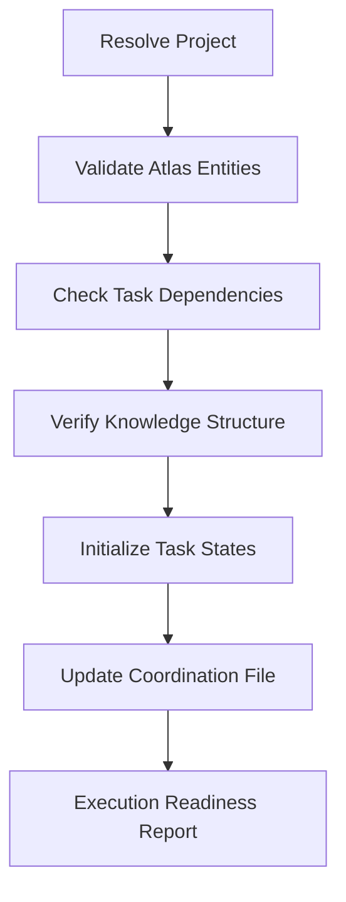

Initialize and validate Atlas project for execution tracking: $ARGUMENTS

## Purpose

This command validates an existing Atlas project created by `/plan-create` and decomposed by `/plan-decompose`, ensuring it's ready for automated execution. It performs comprehensive validation, dependency verification, and state initialization to prepare for the execution workflow starting with `/plan-prepare-next-task`.

## **CRITICAL REQUIREMENTS**

1. **MUST validate Atlas project completeness** - Verify project, tasks, and knowledge exist
2. **MUST check dependency graph integrity** - Ensure no cycles and proper task relationships  
3. **MUST reset task states for execution** - Initialize all tasks to proper starting states
4. **MUST validate knowledge categorization** - Ensure plan and phase documentation exists
5. **MUST update coordination file** - Prepare last-plan.json for execution commands

## Validation Architecture



## Implementation Steps

### Step 1: **Project Resolution and Existence Validation**

```javascript
// Resolve project ID from arguments or last-plan.json
let projectId = extractProjectIdFromArguments($ARGUMENTS)
if (!projectId) {
  const lastPlan = await readLastPlanReference()
  projectId = lastPlan?.atlas_project_id
}

if (!projectId) {
  throw new Error("No project specified. Run /plan-create and /plan-decompose first.")
}

// **CRITICAL**: Validate Atlas project exists and is properly configured
const atlasProject = await atlas_project_list({
  mode: "details",
  id: projectId,
  includeKnowledge: true,
  includeTasks: true
})

if (!atlasProject) {
  throw new Error(`Atlas project ${projectId} not found. Run /plan-create first.`)
}

// Verify project has active status
if (atlasProject.status !== "active" && atlasProject.status !== "in-progress") {
  console.warn(`Project status is ${atlasProject.status}. Expected 'active' or 'in-progress'.`)
}
```

### Step 2: **Task Structure Validation**

```javascript
// Retrieve all Atlas tasks for the project
const allTasks = await atlas_task_list({
  projectId: projectId,
  limit: 200, // Adjust based on expected project size
  sortBy: "createdAt"
})

if (allTasks.length === 0) {
  throw new Error(`No tasks found for project ${projectId}. Run /plan-decompose first.`)
}

// Validate task ID conventions and structure
const validationResults = validateTaskStructure(allTasks)
if (!validationResults.isValid) {
  throw new Error(`Task structure validation failed: ${validationResults.errors.join(", ")}`)
}

function validateTaskStructure(tasks) {
  const errors = []
  const taskIdPattern = /^(\d{2}-\d{3})(-\d{2})?$/
  const phaseDistribution = {}
  
  for (const task of tasks) {
    // Validate task ID format
    if (!taskIdPattern.test(task.id)) {
      errors.push(`Invalid task ID format: ${task.id}`)
    }
    
    // Track phase distribution
    const phaseId = task.id.substring(0, 2)
    phaseDistribution[phaseId] = (phaseDistribution[phaseId] || 0) + 1
    
    // Validate required fields
    if (!task.title || !task.description) {
      errors.push(`Task ${task.id} missing required fields`)
    }
    
    // Validate Atlas enum compliance
    const validStatuses = ["backlog", "todo", "in-progress", "completed"]
    if (!validStatuses.includes(task.status)) {
      errors.push(`Task ${task.id} has invalid status: ${task.status}`)
    }
    
    const validPriorities = ["low", "medium", "high", "critical"]
    if (!validPriorities.includes(task.priority)) {
      errors.push(`Task ${task.id} has invalid priority: ${task.priority}`)
    }
    
    const validTaskTypes = ["research", "generation", "analysis", "integration"]
    if (!validTaskTypes.includes(task.taskType)) {
      errors.push(`Task ${task.id} has invalid taskType: ${task.taskType}`)
    }
  }
  
  // Validate phase distribution (each phase should have at least 2 tasks)
  for (const [phaseId, count] of Object.entries(phaseDistribution)) {
    if (count < 2) {
      errors.push(`Phase ${phaseId} has insufficient tasks (${count})`)
    }
  }
  
  return {
    isValid: errors.length === 0,
    errors: errors,
    taskCount: tasks.length,
    phaseCount: Object.keys(phaseDistribution).length,
    phaseDistribution: phaseDistribution
  }
}
```

### Step 3: **Dependency Graph Validation**

**CRITICAL**: Verify task dependencies form a valid execution graph:

```javascript
// Build and validate dependency graph
const dependencyGraph = buildDependencyGraph(allTasks)
const graphValidation = validateDependencyGraph(dependencyGraph, allTasks)

if (!graphValidation.isValid) {
  throw new Error(`Dependency validation failed: ${graphValidation.errors.join(", ")}`)
}

function buildDependencyGraph(tasks) {
  const graph = { nodes: new Set(), edges: [] }
  
  for (const task of tasks) {
    graph.nodes.add(task.id)
    
    for (const dependency of task.dependencies || []) {
      graph.edges.push({ from: dependency, to: task.id })
    }
  }
  
  return graph
}

function validateDependencyGraph(graph, tasks) {
  const errors = []
  const taskIds = new Set(tasks.map(t => t.id))
  
  // Check for invalid dependency references
  for (const edge of graph.edges) {
    if (!taskIds.has(edge.from)) {
      errors.push(`Task ${edge.to} depends on non-existent task ${edge.from}`)
    }
  }
  
  // Check for circular dependencies using DFS
  const visited = new Set()
  const recursionStack = new Set()
  
  function hasCycle(nodeId) {
    if (recursionStack.has(nodeId)) return true
    if (visited.has(nodeId)) return false
    
    visited.add(nodeId)
    recursionStack.add(nodeId)
    
    const dependencies = graph.edges
      .filter(edge => edge.to === nodeId)
      .map(edge => edge.from)
    
    for (const dep of dependencies) {
      if (hasCycle(dep)) return true
    }
    
    recursionStack.delete(nodeId)
    return false
  }
  
  for (const nodeId of graph.nodes) {
    if (hasCycle(nodeId)) {
      errors.push(`Circular dependency detected involving task ${nodeId}`)
      break // Report only first cycle found
    }
  }
  
  // Calculate execution order
  const executionOrder = topologicalSort(graph)
  
  return {
    isValid: errors.length === 0,
    errors: errors,
    cycleDetected: errors.some(e => e.includes("Circular")),
    executionOrder: executionOrder,
    totalDependencies: graph.edges.length
  }
}
```

### Step 4: **Knowledge Structure Verification**

```javascript
// Validate knowledge structure and categorization
const projectKnowledge = await atlas_knowledge_list({
  projectId: projectId,
  limit: 50
})

const knowledgeValidation = validateKnowledgeStructure(projectKnowledge)
if (!knowledgeValidation.isValid) {
  console.warn(`Knowledge structure issues: ${knowledgeValidation.warnings.join(", ")}`)
}

function validateKnowledgeStructure(knowledge) {
  const warnings = []
  const requiredDocTypes = ["doc-type-plan-overview"]
  const foundDocTypes = new Set()
  
  for (const item of knowledge) {
    // Track document types found
    const docTypeTags = item.tags.filter(tag => tag.startsWith("doc-type-"))
    docTypeTags.forEach(tag => foundDocTypes.add(tag))
    
    // Validate knowledge domain
    const validDomains = ["technical", "business", "scientific"]
    if (!validDomains.includes(item.domain)) {
      warnings.push(`Knowledge item has invalid domain: ${item.domain}`)
    }
    
    // Check for essential tags
    const hasLifecycleTag = item.tags.some(tag => tag.startsWith("lifecycle-"))
    const hasScopeTag = item.tags.some(tag => tag.startsWith("scope-"))
    const hasQualityTag = item.tags.some(tag => tag.startsWith("quality-"))
    
    if (!hasLifecycleTag || !hasScopeTag || !hasQualityTag) {
      warnings.push(`Knowledge item missing essential categorization tags`)
    }
  }
  
  // Check for required document types
  for (const requiredType of requiredDocTypes) {
    if (!foundDocTypes.has(requiredType)) {
      warnings.push(`Missing required knowledge type: ${requiredType}`)
    }
  }
  
  return {
    isValid: warnings.length === 0,
    warnings: warnings,
    knowledgeCount: knowledge.length,
    docTypesFound: Array.from(foundDocTypes)
  }
}
```

### Step 5: **Task State Initialization**

**CRITICAL**: Reset task states for proper execution flow:

```javascript
// Initialize all tasks to proper execution states
const taskStateUpdates = []

for (const task of allTasks) {
  let newStatus = task.status
  const newTags = [...(task.tags || [])]
  
  // Reset any execution-specific tags
  const executionTags = ["status-preparing", "status-ready", "status-blocked", "status-review"]
  const cleanedTags = newTags.filter(tag => !executionTags.includes(tag))
  
  // Set initial status based on dependencies
  const hasUnmetDependencies = task.dependencies && task.dependencies.length > 0
  
  if (task.status === "completed") {
    // Keep completed tasks as-is
    newStatus = "completed"
  } else if (hasUnmetDependencies) {
    // Tasks with dependencies start in backlog
    newStatus = "backlog"
  } else {
    // Tasks without dependencies are ready to be prepared
    newStatus = "todo"
  }
  
  // Only update if changes are needed
  if (newStatus !== task.status || cleanedTags.length !== newTags.length) {
    taskStateUpdates.push({
      id: task.id,
      updates: {
        status: newStatus,
        tags: cleanedTags
      }
    })
  }
}

// **CRITICAL**: Apply task state updates using bulk operation
if (taskStateUpdates.length > 0) {
  await atlas_task_update({
    mode: "bulk",
    tasks: taskStateUpdates
  })
  
  console.log(`Initialized ${taskStateUpdates.length} tasks for execution`)
}
```

### Step 6: **Project Status and Coordination Update**

```javascript
// Update Atlas project status to in-progress if not already
if (atlasProject.status === "active") {
  await atlas_project_update({
    mode: "single",
    id: projectId,
    updates: {
      status: "in-progress"
    }
  })
}

// **CRITICAL**: Update last-plan.json for command coordination
const lastPlanData = {
  plan_name: projectId,
  plan_title: atlasProject.name,
  last_updated: new Date().toISOString(),
  updated_by: "plan-execution-init",
  atlas_project_id: projectId,
  total_tasks: allTasks.length,
  ready_for_execution: true,
  next_available_tasks: getNextAvailableTasks(allTasks)
}

await writeFile('${project_root}/last-plan.json', JSON.stringify(lastPlanData, null, 2))

function getNextAvailableTasks(tasks) {
  return tasks
    .filter(task => task.status === "todo" && (!task.dependencies || task.dependencies.length === 0))
    .slice(0, 3) // Get first 3 available tasks
    .map(task => ({
      id: task.id,
      title: task.title,
      priority: task.priority
    }))
}
```

## **Usage Examples**

```bash
# Initialize current plan (uses last-plan.json)
/plan-execution-init

# Initialize specific project
/plan-execution-init "plan-web-customer-portal"

# Validate only (no state changes)
/plan-execution-init --validate-only

# Force reinitialization (reset all tasks)
/plan-execution-init --force-reset
```

## **Arguments Processing**

**Input Format**: `[project-id] [--option]`

**Optional Arguments**:
- `[project-id]`: Atlas project ID (defaults to last-plan.json)
- `--validate-only`: Perform validation without state changes
- `--force-reset`: Reset all task states to initial values
- `--skip-knowledge-check`: Skip knowledge structure validation

## **Output and Confirmation**

```bash
✅ Execution Initialization Completed

Project Validation:
- Atlas Project: plan-web-customer-portal ✅
- Status: in-progress
- Type: integration

Task Structure:
- Total Tasks: 31 main tasks, 44 subtasks
- Phases: 4 phases validated
- Dependencies: 67 relationships verified ✅
- Dependency Graph: No cycles detected ✅

Knowledge Structure:
- Plan Overview: 1 item ✅
- Phase Documentation: 4 items ✅
- Total Knowledge Items: 5

Task Initialization:
- Reset for Execution: 12 tasks updated
- Ready for Preparation: 3 tasks available
- Blocked by Dependencies: 72 tasks

Next Available Tasks:
1. [01-001] Foundation: Environment Setup (priority: high)
2. [01-002] Foundation: Requirements Analysis (priority: high)  
3. [02-001] Core Features: Architecture Design (priority: medium)

✅ Project Ready for Execution

Next Steps:
1. Run: /plan-prepare-next-task (prepare first available task)
2. Run: /plan-status (view detailed progress dashboard)
```

## **Error Handling**

1. **Missing Project**: Clear guidance to run `/plan-create` and `/plan-decompose`
2. **Invalid Task Structure**: Specific validation errors with correction guidance
3. **Circular Dependencies**: Identification of problematic task relationships
4. **Knowledge Structure Issues**: Warnings about missing documentation
5. **Atlas Connection Issues**: Retry mechanisms and fallback validation

## **Quality Assurance**

- Comprehensive validation of Atlas project structure
- Dependency graph cycle detection and execution order calculation
- Task state consistency verification across all project tasks
- Knowledge categorization compliance checking
- Coordination file accuracy for downstream command integration

## **Integration Points**

- **Validates**: Atlas entities from `/plan-create` and `/plan-decompose`
- **Initializes**: Task states for proper execution workflow
- **Prepares**: Project for `/plan-prepare-next-task` and `/plan-implement-task`
- **Maintains**: Last-plan.json coordination for automated execution flow
- **Enables**: Full Atlas-backed execution workflow with state consistency