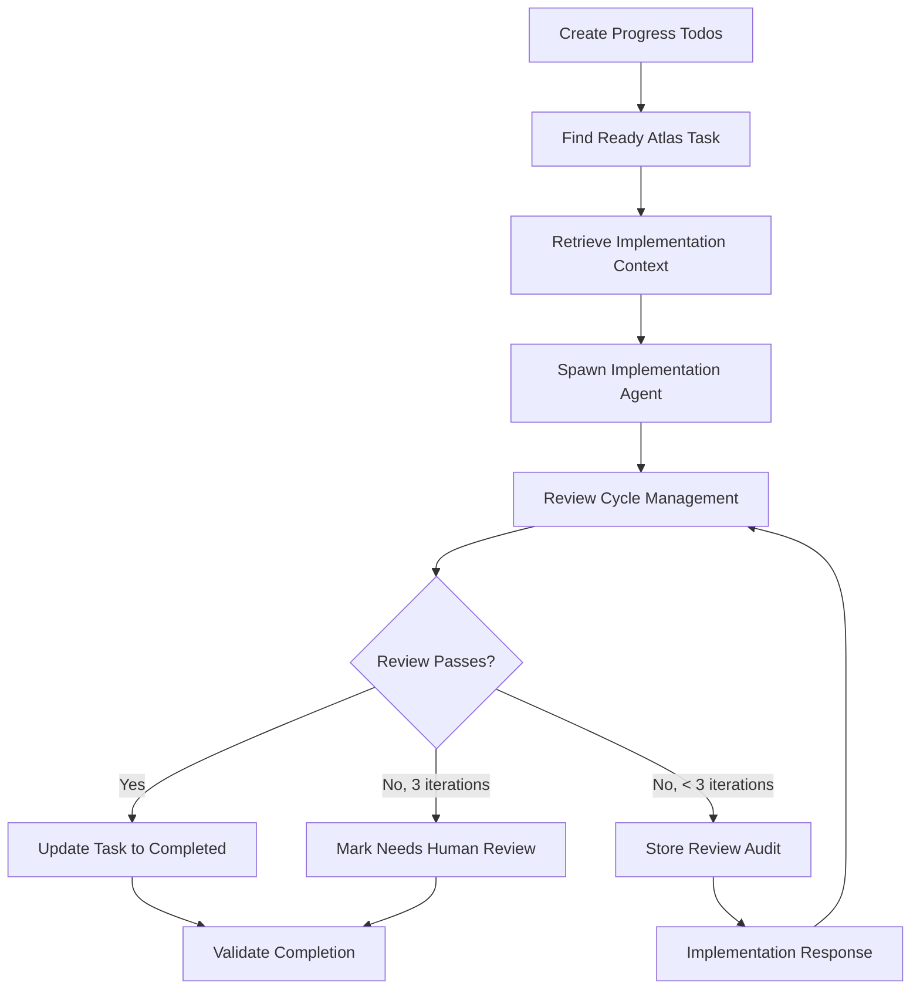

Execute ready Atlas task with automated implementation and review cycles: $ARGUMENTS

## Purpose

This command finds and executes tasks with "status-ready" tag from Atlas, spawns implementation and review agents, and manages the review cycle to produce quality code ready for human review or PR. Task preparation must be completed first using `/plan-prepare-next-task`.

## **CRITICAL REQUIREMENTS**

1. **MUST use Atlas MCP tools exclusively** - All task queries, updates, and context through Atlas
2. **MUST use TodoWrite for progress tracking** - Create todos immediately and update throughout
3. **MUST retrieve context from Atlas knowledge** - No filesystem dependency for task context
4. **MUST store all outputs as categorized knowledge** - Implementation notes, reviews, audit trail
5. **MUST use atomic Atlas task updates** - Prevent race conditions during status changes
6. **MUST enforce 3-iteration review limit** - Escalate to human review after maximum cycles
7. **MUST maintain complete audit trail** in Atlas knowledge for human review

## **Implementation Strategy Overview**



## Implementation Steps

### **Step 1: Progress Tracking Initialization**

**CRITICAL**: Create TodoWrite tracking immediately for all major steps:

```javascript
// **MUST CREATE TODOS FIRST** - Provides progress visibility and prevents duplicate work
const implementationTodos = [
  {
    id: "task-discovery",
    content: "Find ready Atlas task and validate context availability",
    status: "pending",
    priority: "high"
  },
  {
    id: "implementation-execution",
    content: "Execute task implementation with agent and context",
    status: "pending", 
    priority: "high"
  },
  {
    id: "review-cycle-management",
    content: "Manage review cycles with audit trail storage",
    status: "pending",
    priority: "high"
  },
  {
    id: "completion-validation",
    content: "Update Atlas task status and validate completion",
    status: "pending",
    priority: "high"
  }
]

await TodoWrite({ todos: implementationTodos })
```

### **Step 2: Ready Task Discovery and Validation**

**CRITICAL**: Mark task-discovery todo as in_progress, then proceed:

```javascript
// Update TodoWrite to show progress
await TodoWrite({ 
  todos: implementationTodos.map(t => 
    t.id === "task-discovery" ? {...t, status: "in_progress"} : t
  )
})

// Resolve project ID from arguments or last-plan.json
let projectId = extractProjectIdFromArguments($ARGUMENTS)
if (!projectId) {
  const lastPlan = await readLastPlanReference()
  projectId = lastPlan?.atlas_project_id
}

if (!projectId) {
  throw new Error("No project specified. Run /plan-execution-init first.")
}

// **CRITICAL**: Find ready Atlas tasks using unified search
const readyTasks = await atlas_task_list({
  projectId: projectId,
  status: "todo", // Use TaskStatus.TODO
  limit: 20,
  sortBy: "priority",
  sortDirection: "desc"
})

// Filter for tasks with status-ready tag
const actualReadyTasks = readyTasks.filter(task => 
  task.tags && task.tags.includes("status-ready")
)

if (actualReadyTasks.length === 0) {
  throw new Error("No tasks ready for implementation. Run /plan-prepare-next-task first.")
}

// Select highest priority ready task
const selectedTask = actualReadyTasks[0]

// **CRITICAL**: Validate task has required context knowledge
const requiredContext = await atlas_knowledge_list({
  projectId: projectId,
  tags: [`scope-task-${selectedTask.id}`],
  limit: 10
})

const hasTaskContext = requiredContext.some(k => k.tags.includes("doc-type-task-context"))
const hasArchitecturePrimer = requiredContext.some(k => k.tags.includes("doc-type-architecture-primer"))

if (!hasTaskContext || !hasArchitecturePrimer) {
  throw new Error(`Task ${selectedTask.id} missing required context. Run /plan-prepare-next-task first.`)
}
```

### **Step 3: Implementation Context Retrieval**

**CRITICAL**: Gather comprehensive context from Atlas knowledge:

```javascript
// **CRITICAL**: Mark task as in-progress to prevent duplicate execution
await atlas_task_update({
  mode: "single",
  id: selectedTask.id,
  updates: {
    status: "in-progress", // Use TaskStatus.IN_PROGRESS
    tags: [...(selectedTask.tags || []).filter(t => t !== "status-ready"), "status-implementing"]
  }
})

// Retrieve comprehensive implementation context
const taskContextKnowledge = await atlas_knowledge_list({
  projectId: projectId,
  tags: [`scope-task-${selectedTask.id}`, "doc-type-task-context"],
  limit: 5
})

const architecturePrimerKnowledge = await atlas_knowledge_list({
  projectId: projectId,
  tags: [`scope-task-${selectedTask.id}`, "doc-type-architecture-primer"],
  limit: 5
})

const projectArchitectureKnowledge = await atlas_knowledge_list({
  projectId: projectId,
  tags: ["doc-type-architecture-docs", "doc-type-standards"],
  limit: 10
})

const planOverviewKnowledge = await atlas_knowledge_list({
  projectId: projectId,
  tags: ["doc-type-plan-overview"],
  limit: 3
})
```

### **Step 4: Implementation Agent Execution**

**CRITICAL**: Mark implementation-execution todo as in_progress and spawn agent:

```javascript
// Update TodoWrite progress
await TodoWrite({
  todos: implementationTodos.map(t => 
    t.id === "task-discovery" ? {...t, status: "completed"} :
    t.id === "implementation-execution" ? {...t, status: "in_progress"} : t
  )
})

// Build comprehensive implementation context
const implementationContext = buildImplementationContext(
  selectedTask,
  taskContextKnowledge,
  architecturePrimerKnowledge,
  projectArchitectureKnowledge,
  planOverviewKnowledge
)

// **CRITICAL**: Spawn implementation agent with comprehensive context
const implementationPrompt = `You are tasked with implementing a specific Atlas task as part of a larger plan execution.

**CRITICAL - Implementation Context**:
You have comprehensive context available:

${implementationContext}

**Task Information**:
- **Task ID**: ${selectedTask.id}
- **Title**: ${selectedTask.title}  
- **Priority**: ${selectedTask.priority}
- **Type**: ${selectedTask.taskType}
- **Status**: implementing

**Task Description**:
${selectedTask.description}

**Acceptance Criteria**:
${selectedTask.completionRequirements}

**Expected Deliverables**:
${selectedTask.outputFormat}

**Implementation Requirements**:
1. **Read all context thoroughly** - Review the provided context entirely before beginning
2. **Follow architectural guidance** - Adhere to constraints and patterns from architecture primer
3. **Implement complete solution** - Meet all acceptance criteria and deliverables
4. **Document implementation decisions** - Create clear implementation notes
5. **Ensure quality standards** - Run all linting, type checking, and testing
6. **Handle architecture questions** - Use Task tool to spawn architect agent if needed

**Architecture Questions Process**:
If you encounter architectural questions during implementation:
1. **Use the Task tool** to spawn an architect subagent
2. **Provide specific context** about your architectural question
3. **Include current implementation approach** and where you're stuck
4. **Store architect responses** as Atlas knowledge for audit trail

**Quality Requirements**:
- **ALL linting must pass** - Run project-specific linting tools and fix all issues
- **Type checking must pass** - Ensure no type errors remain
- **Tests must pass** - All existing and new tests must succeed
- **Code documentation** - Follow project documentation standards

**When Complete**:
1. Store implementation notes as Atlas knowledge
2. Ensure all quality checks pass
3. Provide summary of work completed
4. Indicate readiness for review

Implement the complete solution meeting all requirements.`

const implementationResult = await Task("Implementation Execution", implementationPrompt)

// Store implementation notes as Atlas knowledge
const implementationNotesKnowledge = {
  mode: "single",
  projectId: projectId,
  text: extractImplementationNotes(implementationResult),
  domain: "technical", // KnowledgeDomain.TECHNICAL
  tags: [
    "doc-type-implementation-notes",
    "lifecycle-execution",
    `scope-task-${selectedTask.id}`,
    "quality-draft"
  ]
}

await atlas_knowledge_add(implementationNotesKnowledge)
```

### **Step 5: Review Cycle Management**

**CRITICAL**: Implement sophisticated review cycle with Atlas audit trail:

```javascript
// Update TodoWrite progress  
await TodoWrite({
  todos: implementationTodos.map(t => 
    t.id === "implementation-execution" ? {...t, status: "completed"} :
    t.id === "review-cycle-management" ? {...t, status: "in_progress"} : t
  )
})

// **CRITICAL**: Update task status to ready-for-review
await atlas_task_update({
  mode: "single",
  id: selectedTask.id,
  updates: {
    status: "in-progress", // Keep TaskStatus.IN_PROGRESS
    tags: [...(selectedTask.tags || []).filter(t => !t.startsWith("status-")), "status-review"]
  }
})

let reviewIteration = 1
const maxIterations = 3
let reviewPassed = false

while (reviewIteration <= maxIterations && !reviewPassed) {
  console.log(`🔍 Review Iteration ${reviewIteration}/${maxIterations}`)
  
  // **CRITICAL**: Spawn review agent with comprehensive context
  const reviewPrompt = `You are a code reviewer evaluating an Atlas task implementation.

**Review Context**:
- **Task**: ${selectedTask.id} - ${selectedTask.title}
- **Iteration**: ${reviewIteration}/${maxIterations}
- **Implementation Notes**: Available in Atlas knowledge

**Required Context Sources**:
${implementationContext}

**Review Process**:
1. **Check git status and diff** to see all implementation changes
2. **Run ALL linting tools** before code review:
   - Python: ruff check, ruff format --check, black --check, mypy, pyright
   - Node.js/TypeScript: npm run lint, tsc --noEmit, ESLint/Prettier  
   - Other: All project-specific linting commands
3. **CRITICAL**: Flag linting errors as blocking issues
4. **Evaluate implementation approach**:
   - Does this solve the problem effectively?
   - Is there a simpler, better approach?
   - Does it follow established codebase patterns?
   - Any architectural concerns or missed opportunities?
5. **Assess code documentation quality**
6. **Verify acceptance criteria are met**
7. **Review code quality, patterns, and best practices**
8. **Check test coverage and edge cases**

**Output Requirements**:
Generate structured review findings as JSON:
{
  "review_iteration": ${reviewIteration},
  "total_findings": 0,
  "overall_assessment": "approved|needs_changes", 
  "findings": [
    {
      "id": "finding-001",
      "category": "approach|linting|functionality|code_quality|testing|documentation|security",
      "severity": "blocker|major|minor",
      "description": "Clear description of the issue",
      "file": "specific_file.py or 'multiple' for approach issues", 
      "line": "line_number or null",
      "reviewer_comment": "Detailed explanation and suggestions",
      "status": "recommended"
    }
  ],
  "summary": {
    "blockers_remaining": 0,
    "major_issues": 0,
    "minor_issues": 0
  },
  "recommendations": [
    "Specific actionable recommendations"
  ]
}

**Review Categories**:
- **approach**: Overall solution approach and architecture
- **linting**: Syntax, formatting, type checking issues  
- **functionality**: Does it work as intended?
- **code_quality**: Maintainability, patterns, best practices
- **testing**: Test coverage and edge cases
- **documentation**: Code and project documentation quality
- **security**: Security vulnerabilities or concerns

Be thorough but constructive. Focus on blocking issues first.`

  const reviewResult = await Task("Code Review Execution", reviewPrompt)
  
  // **CRITICAL**: Store review findings as Atlas knowledge
  const reviewKnowledge = {
    mode: "single",
    projectId: projectId,
    text: JSON.stringify(reviewResult),
    domain: "technical", // KnowledgeDomain.TECHNICAL
    tags: [
      "doc-type-review-findings",
      "lifecycle-review",
      `scope-task-${selectedTask.id}`,
      `review-iteration-${reviewIteration}`,
      "quality-draft"
    ]
  }
  
  await atlas_knowledge_add(reviewKnowledge)
  
  // Parse review findings
  let reviewFindings
  try {
    reviewFindings = JSON.parse(reviewResult)
  } catch (error) {
    console.warn("⚠️  Review result parsing failed, treating as needs changes")
    reviewFindings = { overall_assessment: "needs_changes", summary: { blockers_remaining: 1 } }
  }
  
  // Check if review passed
  if (reviewFindings.overall_assessment === "approved" && 
      reviewFindings.summary.blockers_remaining === 0) {
    reviewPassed = true
    console.log("✅ Review passed - no blocking issues remain")
    break
  }
  
  // If final iteration and still has issues, escalate to human
  if (reviewIteration === maxIterations) {
    console.log("🚨 Maximum review iterations reached - escalating to human review")
    
    // **CRITICAL**: Mark task as needs human review
    await atlas_task_update({
      mode: "single",
      id: selectedTask.id,
      updates: {
        status: "in-progress", // Keep TaskStatus.IN_PROGRESS
        tags: [...(selectedTask.tags || []).filter(t => !t.startsWith("status-")), "status-blocked"]
      }
    })
    
    // Store final audit summary
    const auditSummaryKnowledge = {
      mode: "single",
      projectId: projectId,
      text: JSON.stringify({
        task_id: selectedTask.id,
        iterations_completed: maxIterations,
        final_status: "needs-human-review",
        remaining_blockers: reviewFindings.summary.blockers_remaining,
        escalation_reason: "Maximum review iterations exceeded with unresolved issues",
        human_review_required: true,
        audit_trail: `Review iterations 1-${maxIterations} stored in Atlas knowledge with tags: scope-task-${selectedTask.id}, doc-type-review-findings`
      }),
      domain: "technical", // KnowledgeDomain.TECHNICAL
      tags: [
        "doc-type-audit-trail",
        "lifecycle-review",
        `scope-task-${selectedTask.id}`,
        "escalation-human-review",
        "quality-reviewed"
      ]
    }
    
    await atlas_knowledge_add(auditSummaryKnowledge)
    break
  }
  
  // Spawn implementation agent to address review findings
  const implementationResponsePrompt = `Review feedback has been provided for your Atlas task implementation.

**Review Findings**:
${JSON.stringify(reviewFindings, null, 2)}

**Your Task**:
1. **Address each finding** in the review results
2. **Focus on blockers first** - these must be resolved
3. **For each finding**:
   - If fixing: Make the code changes and update status to "fixed"
   - If rejecting: Provide detailed technical rationale for rejection
4. **Re-run ALL linting tools** after making changes
5. **Ensure ALL linting passes** before marking issues as fixed
6. **Update review tracker** with your responses

**Response Format**:
For each finding, update the status and add your response:
{
  "id": "finding-001",
  "status": "fixed|rejected", 
  "implementation_response": "Clear description of what you did",
  "implementation_rationale": "Technical justification (especially for rejections)"
}

**Quality Requirements**:
- ALL linting errors must be fixed
- ALL type checking must pass
- ALL tests must pass
- Provide clear rationale for any rejected suggestions

Focus on resolving blocking issues to progress through review.`

  const implementationResponseResult = await Task("Implementation Response", implementationResponsePrompt)
  
  // Store implementation response as Atlas knowledge
  const responseKnowledge = {
    mode: "single",
    projectId: projectId,
    text: JSON.stringify(implementationResponseResult),
    domain: "technical", // KnowledgeDomain.TECHNICAL
    tags: [
      "doc-type-audit-trail",
      "lifecycle-review",
      `scope-task-${selectedTask.id}`,
      `review-iteration-${reviewIteration}`,
      "implementation-response",
      "quality-draft"
    ]
  }
  
  await atlas_knowledge_add(responseKnowledge)
  
  reviewIteration++
}
```

### **Step 6: Task Completion and Validation**

**CRITICAL**: Complete task processing and update Atlas status:

```javascript
// Update TodoWrite progress
await TodoWrite({
  todos: implementationTodos.map(t => 
    t.id === "review-cycle-management" ? {...t, status: "completed"} :
    t.id === "completion-validation" ? {...t, status: "in_progress"} : t
  )
})

if (reviewPassed) {
  // **CRITICAL**: Mark task as completed in Atlas
  await atlas_task_update({
    mode: "single",
    id: selectedTask.id,
    updates: {
      status: "completed", // Use TaskStatus.COMPLETED
      tags: [...(selectedTask.tags || []).filter(t => !t.startsWith("status-")), "status-completed"]
    }
  })
  
  // Store completion summary
  const completionSummaryKnowledge = {
    mode: "single",
    projectId: projectId,
    text: JSON.stringify({
      task_id: selectedTask.id,
      completion_status: "successful",
      review_iterations: reviewIteration - 1,
      implementation_quality: "approved",
      completion_timestamp: new Date().toISOString()
    }),
    domain: "technical", // KnowledgeDomain.TECHNICAL
    tags: [
      "doc-type-audit-trail",
      "lifecycle-completion",
      `scope-task-${selectedTask.id}`,
      "quality-approved"
    ]
  }
  
  await atlas_knowledge_add(completionSummaryKnowledge)
  
  console.log(`✅ Task ${selectedTask.id} completed successfully`)
} else {
  console.log(`⚠️  Task ${selectedTask.id} requires human review`)
}

// Update coordination file
const lastPlan = await readLastPlanReference()
lastPlan.last_implemented_task = {
  id: selectedTask.id,
  title: selectedTask.title,
  status: reviewPassed ? "completed" : "needs-human-review",
  implemented_at: new Date().toISOString(),
  review_iterations: reviewIteration - 1
}
lastPlan.last_updated = new Date().toISOString()
lastPlan.updated_by = "plan-implement-task"

await writeFile('${project_root}/last-plan.json', JSON.stringify(lastPlan, null, 2))

// **CRITICAL**: Complete all todos
await TodoWrite({
  todos: implementationTodos.map(t => ({...t, status: "completed"}))
})
```

## **Helper Functions**

### Context Building

```javascript
function buildImplementationContext(task, taskContext, architecturePrimer, projectArchitecture, planOverview) {
  const context = `# Implementation Context for Task ${task.id}

## Task Overview
**Title**: ${task.title}
**Description**: ${task.description}
**Acceptance Criteria**: ${task.completionRequirements}
**Expected Output**: ${task.outputFormat}

## Task-Specific Context
${taskContext.length > 0 ? taskContext[0].text : "No task-specific context available"}

## Architecture Primer
${architecturePrimer.length > 0 ? architecturePrimer[0].text : "No architecture primer available"}

## Project Architecture
${projectArchitecture.map(k => `### ${k.tags.join(', ')}\n${k.text}`).join('\n\n')}

## Plan Overview
${planOverview.length > 0 ? planOverview[0].text : "No plan overview available"}

## Implementation Guidelines
- Follow architectural constraints from primer
- Adhere to project coding standards
- Ensure all acceptance criteria are met
- Maintain code quality and documentation standards
- Run comprehensive linting and testing before completion
`

  return context
}

function extractImplementationNotes(implementationResult) {
  // Extract key implementation decisions and notes from agent result
  return `# Implementation Notes for Task ${selectedTask.id}

## Implementation Approach
${extractSection(implementationResult, "approach") || "Implementation approach not documented"}

## Key Decisions
${extractSection(implementationResult, "decisions") || "No key decisions documented"}

## Files Modified
${extractSection(implementationResult, "files") || "Modified files not documented"}

## Challenges Encountered
${extractSection(implementationResult, "challenges") || "No challenges documented"}

## Testing Approach
${extractSection(implementationResult, "testing") || "Testing approach not documented"}

## Quality Validation
${extractSection(implementationResult, "quality") || "Quality validation not documented"}

## Implementation Timestamp
${new Date().toISOString()}
`
}
```

## **Usage Examples**

```bash
# Execute ready task for current project (uses last-plan.json)
/plan-implement-task

# Execute ready task for specific project
/plan-implement-task "plan-web-customer-portal"

# Force re-implementation (resets task to ready state)
/plan-implement-task --force-retry

# Check implementation status without executing
/plan-implement-task --status-only
```

## **Arguments Processing**

**Input Format**: `[project-id] [--option]`

**Optional Arguments**:
- `[project-id]`: Atlas project ID (defaults to last-plan.json)
- `--force-retry`: Reset ready task to allow re-implementation
- `--status-only`: Show available ready tasks without implementing
- `--max-iterations [N]`: Override default 3-iteration review limit

## **Output and Confirmation**

```bash
🔄 Task Implementation Progress

✅ Task Discovery: Found task 01-003 ready for implementation
✅ Implementation Execution: Task implemented with agent assistance
✅ Review Cycle Management: 2 iterations completed, all issues resolved
✅ Completion Validation: Task marked as completed in Atlas

📋 Implementation Summary

Task Details:
- ID: 01-003  
- Title: Foundation: Setup Development Environment
- Status: completed ✅
- Priority: high
- Type: integration

Implementation Results:
- Review Iterations: 2/3
- Blocking Issues: 0 remaining
- Implementation Quality: approved
- Atlas Knowledge Stored: 
  - Implementation Notes: doc-type-implementation-notes
  - Review Findings: doc-type-review-findings (2 iterations)
  - Completion Audit: doc-type-audit-trail

🎯 Task Completed Successfully

Next Steps:
1. Run: /plan-prepare-next-task (prepare next available task)
2. Run: /plan-status (view overall project progress)
3. Continue implementation cycle with prepared tasks

Last Plan Updated: ${project_root}/last-plan.json
```

## **Error Handling and Recovery**

1. **No Ready Tasks**: Clear guidance to run `/plan-prepare-next-task` first
2. **Missing Context**: Specific validation of required Atlas knowledge with re-preparation guidance
3. **Implementation Failures**: Atomic rollback of task status with error preservation
4. **Review Cycle Failures**: Graceful escalation to human review with complete audit trail
5. **Atlas Connection Issues**: Retry mechanisms and state consistency validation

## **Quality Assurance**

- Comprehensive review cycle with structured findings tracking
- Complete audit trail preserved in Atlas knowledge for human review
- Atomic task status updates prevent race conditions and inconsistent states
- TodoWrite progress tracking provides complete implementation visibility
- 3-iteration limit prevents infinite review loops while ensuring quality
- Knowledge categorization enables efficient context retrieval and audit

## **Integration Points**

- **Reads**: Ready Atlas tasks and comprehensive implementation context from previous commands
- **Creates**: Implementation notes, review findings, and audit trail as categorized Atlas knowledge
- **Updates**: Atlas task status with proper state transitions and coordination file
- **Enables**: Continuous implementation workflow with `/plan-prepare-next-task` and `/plan-status`
- **Maintains**: Complete implementation and review workflow with quality assurance and human escalation