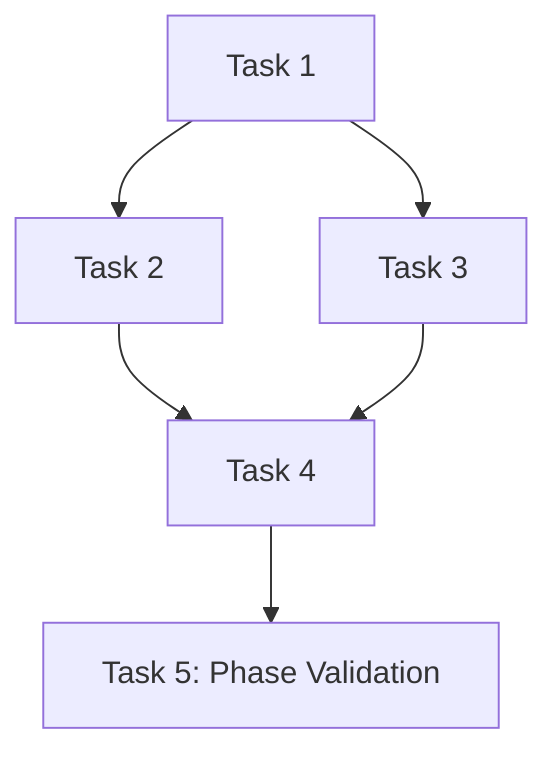

Decompose high-level plan into detailed phases with tasks: $ARGUMENTS

## Purpose

This command takes an existing high-level plan created by `/plan-create` and decomposes each phase into detailed, actionable tasks with subtasks, dependencies, and acceptance criteria. It creates individual phase files ready for execution tracking.

## Process

1. **Plan Analysis**:
   - Read existing PLAN.md in `/tasks/[plan-name]/`
   - Parse high-level phases and objectives
   - Analyze phase relationships and dependencies
   - Identify technical requirements

2. **Task Decomposition**:
   - Break each phase into 3-10 specific tasks
   - Define subtasks for complex tasks
   - Establish task dependencies
   - Create measurable acceptance criteria

3. **File Generation**:
   - Create detailed phase files (phase-01-[name].md, etc.)
   - Update PLAN.md with task references
   - Generate dependency graph
   - Create implementation notes

## Detailed Phase Template

```markdown
# Phase [#]: [Phase Name]

## Phase Overview

- **Duration**: [Refined estimate]
- **Dependencies**: [Previous phases/external requirements]
- **Team Requirements**: [Roles needed]
- **Risk Level**: [Low/Medium/High]

## Phase Objectives

1. [Specific objective 1]
2. [Specific objective 2]
3. [Validation objectives]

## Tasks

### Task 1: [Task Name]

**Description**: [Detailed task description]

**Priority**: High/Medium/Low

**Estimated Effort**: [Hours/Days]

**Dependencies**:
- [ ] [Specific dependency]
- [ ] [Previous task reference]

**Subtasks**:
1. [ ] [Specific subtask with clear outcome]
2. [ ] [Implementation step]
3. [ ] [Testing/validation step]

**Acceptance Criteria**:
- [ ] [Specific measurable criterion]
- [ ] [Quality metric]
- [ ] [Performance requirement]

**Deliverables**:
- [Specific file/component]
- [Documentation]
- [Test results]

**Technical Notes**:
- [Implementation approach]
- [Technology choices]
- [Potential challenges]

### Task 2: [Task Name]

[Similar structure for each task]

## Phase Acceptance Criteria

1. [ ] All tasks completed and validated
2. [ ] Integration tests passing
3. [ ] Documentation updated
4. [ ] Code review completed
5. [ ] [Phase-specific criteria]

## Phase Deliverables

- [Consolidated deliverable 1]
- [Integrated components]
- [Phase documentation]

## Risk Mitigation

| Task | Risk | Mitigation Strategy |
|------|------|-------------------|
| Task 1 | [Specific risk] | [Specific action] |
| Task 3 | [Technical risk] | [Fallback plan] |

## Implementation Order



## Success Metrics

- [ ] [Quantifiable metric 1]
- [ ] [Performance benchmark]
- [ ] [Quality threshold]
```

## Implementation Details

### Task Decomposition Algorithm

1. **Analyze Phase Objectives**:
   - Parse objectives into actionable components
   - Identify technical requirements
   - Determine logical task groupings

2. **Generate Task Structure**:
   - Create setup/configuration tasks first
   - Follow with core implementation tasks
   - Include testing and validation tasks
   - End with integration/documentation tasks

3. **Define Dependencies**:
   - Identify task prerequisites
   - Map inter-task relationships
   - Note external dependencies
   - Create optimal execution order

4. **Create Acceptance Criteria**:
   - Generate measurable criteria for each task
   - Include functional requirements
   - Add non-functional requirements
   - Define validation methods

### Automatic Task Patterns

Based on phase type, automatically include relevant tasks:

**Development Phases**:
- Environment setup
- Core feature implementation
- Unit testing
- Integration testing
- Code review
- Documentation

**Infrastructure Phases**:
- Resource provisioning
- Configuration management
- Security setup
- Monitoring setup
- Performance testing
- Deployment automation

**Data Phases**:
- Schema design
- Data modeling
- ETL implementation
- Data validation
- Performance optimization
- Backup strategy

## Usage Examples

```bash
# Decompose all phases in a plan
/plan-decompose "web-app-redesign"

# Decompose specific phase only
/plan-decompose "mobile-app --phase 2"

# Decompose with detail level
/plan-decompose "api-project --detail high"

# Re-decompose after plan changes
/plan-decompose "data-pipeline --regenerate"
```

## Arguments

Plan name (required): $ARGUMENTS

Options:
- `--phase N`: Decompose only phase N
- `--detail [low|medium|high]`: Level of task detail
- `--regenerate`: Overwrite existing decomposition

## Output Structure

Updates the plan directory:
```
/tasks/[plan-name]/
├── README.md                    # Updated with task count
├── PLAN.md                     # Updated with task references  
├── phase-01-planning.md        # Detailed phase file
├── phase-02-implementation.md  # Detailed phase file
├── phase-03-testing.md         # Detailed phase file
├── phase-04-deployment.md      # Detailed phase file
├── dependencies.md             # Task dependency graph
└── .decomposition-metadata     # Decomposition details
```

## Quality Checks

The command performs these validations:

1. **Completeness**:
   - Each phase has 3-10 tasks
   - All tasks have acceptance criteria
   - Dependencies are clearly defined

2. **Coherence**:
   - Tasks align with phase objectives
   - No circular dependencies
   - Logical progression maintained

3. **Executability**:
   - Tasks are specific and actionable
   - Acceptance criteria are measurable
   - Effort estimates are reasonable

4. **Coverage**:
   - All phase objectives addressed
   - Testing tasks included
   - Documentation tasks present

## Integration Points

After decomposition:

1. **Review Phase Files**:
   - Adjust task details if needed
   - Refine acceptance criteria
   - Update dependencies

2. **Initialize Tracking**:
   - Run `/plan-execution-init [plan-name]`
   - Generates plan-tracker.json from phase files

3. **Begin Execution**:
   - Use `/plan-execute-continue [plan-name]`
   - Executes tasks in dependency order

## Next Steps

1. Review generated phase files for accuracy
2. Adjust task details or dependencies as needed  
3. Run `/plan-execution-init [plan-name]` to create tracking
4. Begin execution with `/plan-execute-continue [plan-name]`