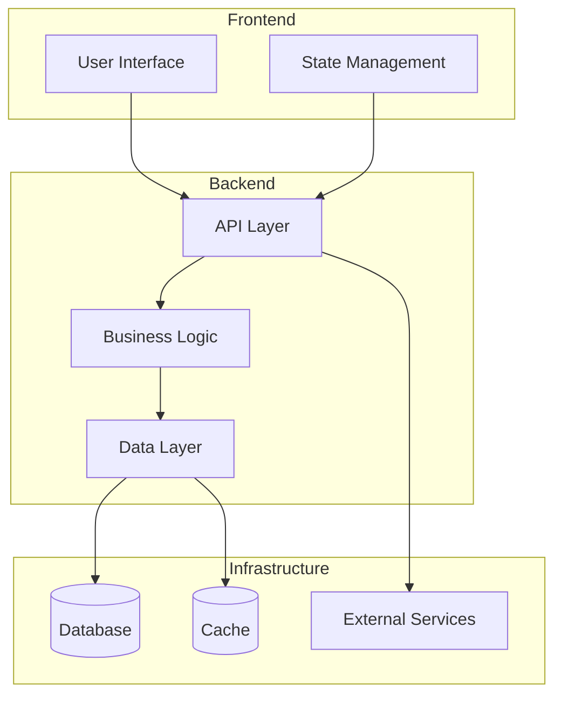
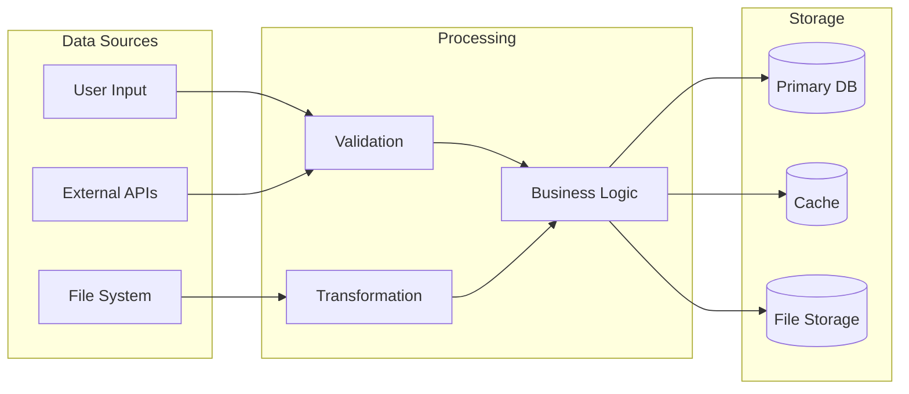
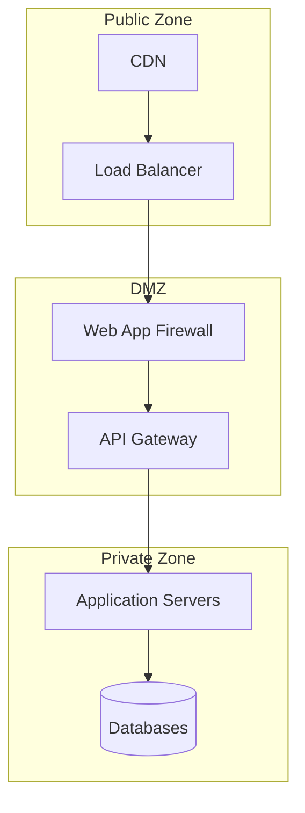
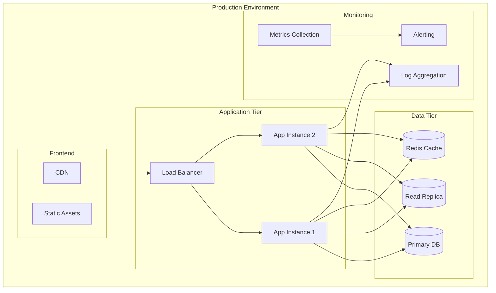

Ensure high-level architecture documentation exists and is current: $ARGUMENTS

## Purpose

This command creates and maintains comprehensive architecture documentation for the codebase, including high-level system architecture and development standards. It creates architecture files in `/planning/` and updates them based on git changelog analysis when files already exist.

## Process

1. **Plan Name Resolution**:

   - If plan name provided in $ARGUMENTS, use it and update `/planning/tasks/last-plan.json`
   - If no plan name provided, read from `/planning/tasks/last-plan.json` for the last referenced plan
   - If neither exists, use "general" as default architecture scope
   - Update `/planning/tasks/last-plan.json` with resolved plan name

2. **Architecture Files Assessment**:

   - Check if `/planning/architecture.md` exists
   - Check if `/planning/standards.md` exists
   - If files exist, analyze git log since last modification to understand what's changed
   - Determine if incremental updates or full regeneration is needed

3. **Git Changelog Analysis** (for existing files):

   - Get git log since last modification date of architecture files
   - Analyze commits for:
     - New files/modules added
     - Significant architectural changes
     - Framework/library changes
     - Infrastructure modifications
     - API or interface changes
   - Categorize changes that impact architecture documentation

4. **Codebase Analysis**:

   - Scan project structure for architectural patterns
   - Identify frameworks, libraries, and key dependencies
   - Analyze module organization and relationships
   - Detect architectural patterns (MVC, microservices, etc.)
   - Identify infrastructure components

5. **Documentation Generation/Update**:
   - Generate `/planning/architecture.md` with high-level system architecture
   - Generate `/planning/standards.md` with development standards and guidelines
   - Include system diagrams (Mermaid) where appropriate
   - Add last-updated timestamps and change summaries

## Architecture Documentation Template

````markdown
# System Architecture

Last Updated: [ISO Timestamp]
Project: [Plan Name or "General"]
Change Summary: [New | Updated | No Changes]

## Executive Summary

[2-3 sentence overview of the system's purpose and architectural approach]

## System Overview

### Architecture Pattern

- **Primary Pattern**: [MVC, Microservices, Layered, Event-Driven, etc.]
- **Secondary Patterns**: [Supporting patterns used]
- **Architectural Style**: [RESTful, GraphQL, Event-Sourcing, etc.]

### Technology Stack

#### Core Technologies

- **Language(s)**: [Primary and secondary languages]
- **Framework**: [Main framework/platform]
- **Database**: [Primary data storage]
- **Infrastructure**: [Cloud, on-premise, containerized]

#### Key Dependencies

```text
[Major libraries and frameworks with versions]
```

### High-Level Component Diagram



## Component Architecture

### [Component 1 Name]

**Purpose**: [What this component does]
**Technology**: [Implementation details]
**Key Responsibilities**:

- [Responsibility 1]
- [Responsibility 2]

**Interfaces**:

- Input: [What it receives]
- Output: [What it provides]

### [Component 2 Name]

**Purpose**: [What this component does]
**Technology**: [Implementation details]
**Key Responsibilities**:

- [Responsibility 1]
- [Responsibility 2]

**Interfaces**:

- Input: [What it receives]
- Output: [What it provides]

## Data Architecture

### Data Flow Diagram



### Data Models

- **Core Entities**: [Primary data entities]
- **Relationships**: [Key relationships between entities]
- **Data Integrity**: [How consistency is maintained]

## Security Architecture

### Authentication & Authorization

- **Authentication Method**: [JWT, OAuth, Session-based, etc.]
- **Authorization Model**: [RBAC, ABAC, etc.]
- **Session Management**: [How sessions are handled]

### Data Protection

- **Encryption**: [At rest and in transit]
- **Sensitive Data**: [How PII/secrets are handled]
- **API Security**: [Rate limiting, validation, etc.]

### Security Boundaries



## Deployment Architecture

### Environment Strategy

- **Development**: [Local development setup]
- **Staging**: [Pre-production environment]
- **Production**: [Live system configuration]

### Infrastructure Diagram



### Scalability Considerations

- **Horizontal Scaling**: [How system scales out]
- **Vertical Scaling**: [Resource scaling approach]
- **Bottlenecks**: [Known limitations and mitigation strategies]

## Integration Architecture

### External Dependencies

| Service     | Purpose   | Integration Method | Criticality         |
| ----------- | --------- | ------------------ | ------------------- |
| [Service 1] | [Purpose] | [REST/GraphQL/etc] | [High/Medium/Low]   |
| [Service 2] | [Purpose] | [Integration type] | [Criticality level] |

### API Design

- **API Style**: [REST, GraphQL, gRPC, etc.]
- **Versioning Strategy**: [How APIs are versioned]
- **Documentation**: [Where API docs are maintained]

## Monitoring & Observability

### Monitoring Stack

- **Metrics**: [Prometheus, CloudWatch, etc.]
- **Logging**: [ELK, Splunk, etc.]
- **Tracing**: [Jaeger, Zipkin, etc.]
- **Alerting**: [PagerDuty, OpsGenie, etc.]

### Key Metrics

- **Performance**: [Response time, throughput]
- **Reliability**: [Uptime, error rates]
- **Business**: [User engagement, conversion]

## Decision Records

### [Decision 1: Technology Choice]

**Date**: [Date]
**Status**: [Accepted/Superseded]
**Context**: [Why this decision was needed]
**Decision**: [What was decided]
**Consequences**: [Impact of this decision]

### [Decision 2: Architectural Pattern]

**Date**: [Date]
**Status**: [Accepted/Superseded]
**Context**: [Why this decision was needed]
**Decision**: [What was decided]
**Consequences**: [Impact of this decision]

## Change Log

### [Version/Date]

- [Change description]
- [Impact assessment]

### [Previous Version/Date]

- [Previous changes]

## Future Architecture Considerations

### Planned Improvements

- [Improvement 1]: [Timeline and rationale]
- [Improvement 2]: [Timeline and rationale]

### Technical Debt

- [Technical debt item 1]: [Priority and plan]
- [Technical debt item 2]: [Priority and plan]

### Scalability Roadmap

- [Short-term scaling plans]
- [Long-term architectural evolution]

````

## Development Standards Template

````markdown
# Development Standards & Guidelines

Last Updated: [ISO Timestamp]
Project: [Plan Name or "General"]
Change Summary: [New | Updated | No Changes]

## Code Standards

### Language-Specific Guidelines

#### [Primary Language - e.g., TypeScript]
- **Style Guide**: [Airbnb, Google, internal]
- **Linting**: [ESLint, TSLint configuration]
- **Formatting**: [Prettier, built-in formatters]
- **Type Safety**: [Strict mode, any usage, etc.]

```typescript
// Example: Preferred function declaration style
interface UserRequest {
  id: string;
  email: string;
  metadata?: Record<string, unknown>;
}

async function fetchUser(request: UserRequest): Promise<User> {
  // Implementation
}

#### [Secondary Language - e.g., Python]

- **Style Guide**: [PEP 8, Black, internal]
- **Linting**: [pylint, flake8, mypy]
- **Type Hints**: [Required for public APIs]

```python
# Example: Preferred class definition
from typing import Optional, Dict, Any

class UserService:
    def __init__(self, config: Dict[str, Any]) -> None:
        self.config = config

    async def get_user(self, user_id: str) -> Optional[User]:
        # Implementation
        pass
```

### File Organization

#### Directory Structure

```text
/src
├── components/         # Reusable UI components
├── services/          # Business logic services
├── utils/             # Shared utilities
├── types/             # Type definitions
├── constants/         # Application constants
└── tests/             # Test files
```

#### Naming Conventions

- **Files**: `kebab-case.ts` or `snake_case.py`
- **Classes**: `PascalCase`
- **Functions**: `camelCase` (JS/TS) or `snake_case` (Python)
- **Constants**: `UPPER_SNAKE_CASE`
- **Components**: `PascalCase`

### Import/Export Standards

#### TypeScript/JavaScript

```typescript
// Preferred import order
import React from "react"; // External libraries
import { Button } from "@mui/material"; // UI framework
import { apiClient } from "../services/api"; // Internal services
import { UserType } from "../types/user"; // Internal types
import "./Component.styles.css"; // Styles (last)

// Preferred export style
export const UserComponent: React.FC<Props> = () => {
  // Implementation
};

export default UserComponent;
```

## Testing Standards

### Test Strategy

- **Unit Tests**: Minimum 80% coverage for business logic
- **Integration Tests**: Critical user flows
- **E2E Tests**: Core user journeys
- **Performance Tests**: Load and stress testing

### Test Organization

```text
/tests
├── unit/              # Unit tests mirror src structure
├── integration/       # Integration test suites
├── e2e/              # End-to-end scenarios
├── fixtures/         # Test data and mocks
└── utils/            # Test utilities
```

### Test Naming

```typescript
// Test naming convention: should_expectedBehavior_whenCondition
describe("UserService", () => {
  it("should_returnUser_whenValidIdProvided", async () => {
    // Test implementation
  });

  it("should_throwError_whenInvalidIdProvided", async () => {
    // Test implementation
  });
});
```

### Mock and Fixture Standards

- **API Mocks**: Use consistent mock data structure
- **Database Fixtures**: Maintain realistic test data
- **External Services**: Mock all external dependencies

## Documentation Standards

### Code Documentation

#### Function Documentation

```typescript
/**
 * Retrieves user information by ID with caching support
 *
 * @param userId - Unique identifier for the user
 * @param options - Optional configuration for the request
 * @returns Promise resolving to user data or null if not found
 * @throws {ValidationError} When userId format is invalid
 * @throws {NotFoundError} When user doesn't exist
 *
 * @example
 * ```typescript
 * const user = await fetchUser('user-123', { useCache: true });
 * if (user) {
 *   console.log(user.email);
 * }
 * ```
 */
async function fetchUser(
  userId: string,
  options: FetchOptions = {}
): Promise<User | null> {
  // Implementation
}
```

#### Class Documentation

```typescript
/**
 * Service for managing user operations including CRUD and authentication
 *
 * Handles user lifecycle management, authentication, and profile updates.
 * Integrates with external identity providers and maintains local user data.
 *
 * @example
 * ```typescript
 * const userService = new UserService(config);
 * const user = await userService.authenticate(credentials);
 * ```
 */
class UserService {
  // Implementation
}
```

### README Standards

- **Purpose**: Clear 1-2 sentence purpose statement
- **Quick Start**: Single command to get running
- **Core Commands**: 3-5 most important commands
- **Architecture**: Link to `/planning/architecture.md`
- **Contributing**: Link to development guidelines

### API Documentation

- **OpenAPI/Swagger**: For REST APIs
- **GraphQL Schema**: For GraphQL APIs
- **Examples**: Real request/response examples
- **Error Codes**: Comprehensive error documentation

## Git & Version Control

### Commit Standards

```text
type(scope): description

feat(auth): add OAuth2 integration with Google
fix(api): resolve user data validation error
docs(readme): update installation instructions
refactor(db): optimize user query performance
test(auth): add integration tests for login flow
chore(deps): update security dependencies
```

### Branching Strategy

- **main**: Production-ready code
- **develop**: Integration branch for features
- **feature/**: New features (`feature/user-authentication`)
- **hotfix/**: Production fixes (`hotfix/security-patch`)
- **release/**: Release preparation (`release/v1.2.0`)

### Pull Request Standards

#### PR Title Format

```text
[Type] Brief description of changes

feat: Add user authentication with OAuth2
fix: Resolve memory leak in data processing
docs: Update API documentation for v2 endpoints
```

#### PR Description Template

```markdown
## Changes

- [ ] Feature implementation
- [ ] Tests added/updated
- [ ] Documentation updated

## Testing

- [ ] Unit tests pass
- [ ] Integration tests pass
- [ ] Manual testing completed

## Security Checklist

- [ ] No sensitive data exposed
- [ ] Input validation implemented
- [ ] Authorization checks in place

## Performance Impact

- [ ] No performance regression
- [ ] Caching implemented where appropriate
- [ ] Database queries optimized
```

## Security Standards

### Authentication & Authorization

- **Password Policy**: Minimum 12 characters, complexity requirements
- **Token Management**: JWT with reasonable expiration (15 minutes access, 7 days refresh)
- **Session Security**: Secure, HttpOnly, SameSite cookies
- **MFA**: Required for administrative access

### Data Protection

- **Encryption**: AES-256 for data at rest, TLS 1.3 for transit
- **PII Handling**: Minimize collection, encrypt storage, secure deletion
- **Secrets Management**: Environment variables, secret management systems
- **Logging**: No sensitive data in logs, structured logging

### Input Validation

```typescript
// Example: Input validation pattern
import Joi from "joi";

const userSchema = Joi.object({
  email: Joi.string().email().required(),
  password: Joi.string().min(12).required(),
  age: Joi.number().integer().min(13).max(120),
});

function validateUserInput(data: unknown): User {
  const { error, value } = userSchema.validate(data);
  if (error) {
    throw new ValidationError(error.message);
  }
  return value;
}
```

### Security Headers

```typescript
// Required security headers
const securityHeaders = {
  "Content-Security-Policy": "default-src 'self'",
  "X-Frame-Options": "DENY",
  "X-Content-Type-Options": "nosniff",
  "Referrer-Policy": "strict-origin-when-cross-origin",
  "Permissions-Policy": "geolocation=(), microphone=(), camera=()",
};
```

## Performance Standards

### Response Time Targets

- **API Endpoints**: < 200ms for 95th percentile
- **Database Queries**: < 100ms for simple queries
- **Page Load**: < 3 seconds first contentful paint
- **Cache Hit Ratio**: > 85% for frequently accessed data

### Code Performance Guidelines

#### Database Optimization

```sql
-- Preferred: Use indexed columns in WHERE clauses
SELECT id, email FROM users WHERE user_id = $1;

-- Avoid: SELECT * and unindexed queries
SELECT * FROM users WHERE email LIKE '%example%';
```

#### Caching Strategy

```typescript
// Example: Multi-level caching implementation
class CacheService {
  async get<T>(key: string): Promise<T | null> {
    // L1: Memory cache (fastest)
    let result = this.memoryCache.get(key);
    if (result) return result;

    // L2: Redis cache
    result = await this.redisCache.get(key);
    if (result) {
      this.memoryCache.set(key, result);
      return result;
    }

    return null;
  }
}
```

### Monitoring Requirements

- **APM Integration**: Application performance monitoring
- **Error Tracking**: Comprehensive error reporting
- **Metrics Collection**: Business and technical metrics
- **Alerting**: Real-time alerts for critical issues

## Quality Assurance

### Code Review Checklist

- [ ] **Functionality**: Does the code work as intended?
- [ ] **Performance**: Are there any performance concerns?
- [ ] **Security**: Are security best practices followed?
- [ ] **Testing**: Are tests comprehensive and meaningful?
- [ ] **Documentation**: Is the code well-documented?
- [ ] **Standards**: Does it follow our coding standards?

### Definition of Done

- [ ] Feature implemented according to requirements
- [ ] Unit tests written and passing (>80% coverage)
- [ ] Integration tests passing
- [ ] Code review approved
- [ ] Documentation updated
- [ ] Security review completed (if applicable)
- [ ] Performance impact assessed
- [ ] Deployment pipeline successful

### Quality Gates

- **Build**: All builds must pass
- **Tests**: No failing tests in main branch
- **Coverage**: Maintain minimum 80% code coverage
- **Linting**: Zero linting errors
- **Security**: No high/critical security vulnerabilities

## Development Workflow

### Local Development Setup

```bash
# Standard setup commands
git clone [repository]
cd [project]
cp .env.example .env
npm install  # or pip install -r requirements.txt
npm run dev  # or python manage.py runserver
```

### Development Commands

```bash
# Code quality
npm run lint          # Run linting
npm run format        # Format code
npm run type-check    # Type checking

# Testing
npm test              # Run all tests
npm run test:unit     # Unit tests only
npm run test:e2e      # End-to-end tests
npm run test:coverage # Coverage report

# Database
npm run db:migrate    # Run migrations
npm run db:seed       # Seed test data
npm run db:reset      # Reset database
```

### CI/CD Pipeline Standards

```yaml
# Example pipeline stages
stages:
  - build # Compile and build
  - lint # Code quality checks
  - test # Run test suites
  - security # Security scanning
  - deploy-staging # Deploy to staging
  - e2e-tests # End-to-end testing
  - deploy-prod # Production deployment
```

## Error Handling Standards

### Error Classification

```typescript
// Standard error hierarchy
class AppError extends Error {
  constructor(
    message: string,
    public statusCode: number,
    public code: string,
    public isOperational: boolean = true
  ) {
    super(message);
  }
}

class ValidationError extends AppError {
  constructor(message: string) {
    super(message, 400, "VALIDATION_ERROR");
  }
}

class NotFoundError extends AppError {
  constructor(resource: string) {
    super(`${resource} not found`, 404, "NOT_FOUND");
  }
}
```

### Error Response Format

```json
{
  "error": {
    "code": "VALIDATION_ERROR",
    "message": "User input validation failed",
    "details": [
      {
        "field": "email",
        "message": "Email format is invalid"
      }
    ],
    "timestamp": "2024-01-15T14:30:22.123Z",
    "requestId": "req-123-456-789"
  }
}
```

## Change Management

### Breaking Changes

- **Deprecation Notice**: 30-day minimum notice
- **Migration Guide**: Detailed upgrade instructions
- **Backward Compatibility**: Maintain for at least one major version
- **Communication**: Team notification and documentation

### Dependency Management

- **Regular Updates**: Monthly security updates
- **Version Pinning**: Lock major versions in production
- **Vulnerability Scanning**: Automated security scanning
- **License Compliance**: Ensure compatible licenses

## Compliance & Governance

### Data Privacy

- **GDPR Compliance**: Data minimization, right to deletion
- **Data Retention**: Defined retention policies
- **Consent Management**: Clear consent mechanisms
- **Data Portability**: Export capabilities

### Audit Requirements

- **Access Logs**: Comprehensive access logging
- **Change Tracking**: All configuration changes logged
- **Compliance Reports**: Regular compliance assessments
- **Data Lineage**: Track data flow and transformations

---

_This document should be reviewed and updated quarterly or when significant architectural changes occur._

````

## Implementation Steps

1. **Codebase Analysis**:
   - Detect programming languages and frameworks
   - Identify project structure and patterns
   - Analyze package.json, requirements.txt, or similar dependency files
   - Scan for existing documentation

2. **Git Analysis** (for updates):
   ```bash
   # Get commits since last architecture update
   git log --since="[last-update-date]" --oneline --name-only

   # Analyze file changes for architectural impact
   git diff --stat HEAD~[n] HEAD
   ```

3. **Template Population**:

   - Fill in technology-specific details
   - Generate appropriate Mermaid diagrams
   - Customize standards based on detected languages/frameworks
   - Include actual project structure

4. **File Generation**:
   - Create `/planning/architecture.md`
   - Create `/planning/standards.md`
   - Set appropriate file permissions
   - Add to git if in a repository

## Usage Examples

```bash
# Create architecture docs for last referenced plan
/plan-architecture

# Create architecture docs for specific plan
/plan-architecture "web-app-redesign"

# Force regeneration of existing docs
/plan-architecture "mobile-app" --force

# Create general architecture docs (no specific plan)
/plan-architecture --general

# Update existing docs based on git changes since last update
/plan-architecture "api-service" --incremental

# Example workflow showing last-plan tracking:
/plan-architecture "web-app-redesign"  # Updates last-plan.json
/plan-architecture                     # Uses "web-app-redesign" from last-plan.json
```

## Arguments

**Plan Name**: $ARGUMENTS (optional)

- If no plan name provided, uses the last referenced plan from `/planning/tasks/last-plan.json`
- If `--general` flag used, creates general architecture documentation
- Updates `/planning/tasks/last-plan.json` with the resolved plan name

**Options**:

- `--force`: Force complete regeneration, ignore existing files
- `--incremental`: Update existing files based on git changes
- `--general`: Create general architecture docs (not plan-specific)
- `--no-git`: Skip git changelog analysis
- `--templates-only`: Show templates without generating files

## Output

Creates the following files in `/planning/`:

```
/planning/
├── architecture.md     # High-level system architecture
└── standards.md        # Development standards and guidelines
```

Returns:

- Files created/updated summary
- Git changes analyzed (if applicable)
- Architecture assessment overview
- Standards compliance checklist
- Next recommended actions

## Integration with Existing Planning System

- Updates `/planning/tasks/last-plan.json` for plan tracking consistency
- References plan-specific context when available
- Can be run independently of active plan execution
- Integrates with `/plan-status` for architecture documentation tracking
- Works alongside other planning commands in the workflow

## Next Steps

After creating architecture documentation:

1. Review and customize generated templates for project specifics
2. Use `/plan-status` to track architecture documentation in plan progress
3. Reference architecture docs in phase planning and task decomposition
4. Set up regular architecture review cycles (quarterly recommended)
5. Integrate architecture standards into code review processes
