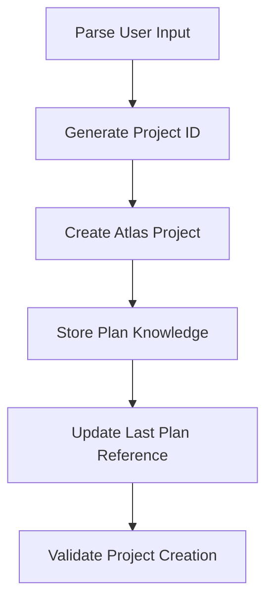

Create a high-level plan from user requirements using Atlas MCP: $ARGUMENTS

## Purpose

This command takes a user's idea, project description, or requirements and creates an Atlas project with structured plan knowledge. It establishes the foundation for automated planning and execution workflows by leveraging Atlas's project and knowledge management capabilities.

## **CRITICAL REQUIREMENTS**

1. **MUST use Atlas MCP tools** - All data storage goes through Atlas, not filesystem
2. **MUST generate unique project ID** using format: `plan-[kebab-case-name]`
3. **MUST store plan documentation as categorized knowledge** using proper document type tags
4. **MUST use Atlas enums** - ProjectStatus, TaskType, KnowledgeDomain
5. **MUST update last-plan.json** for command coordination

## Process Overview



## Implementation Steps

### Step 1: **Input Analysis and Project Setup**

```javascript
// Parse user requirements and extract key components
const userInput = $ARGUMENTS
const projectAnalysis = analyzeUserRequirements(userInput)

// Generate unique project identifier
const projectName = extractOrGenerateProjectName(projectAnalysis)
const projectId = `plan-${kebabCase(projectName)}`

// Validate project doesn't already exist
const existingProject = await atlas_project_list({ 
  mode: "details", 
  id: projectId 
})
if (existingProject) {
  throw new Error(`Project ${projectId} already exists. Use a different name or update existing project.`)
}
```

### Step 2: **Atlas Project Creation**

**CRITICAL**: Use `atlas_project_create` MCP tool with proper enum values:

```javascript
// Create Atlas project with categorized metadata
const projectData = {
  mode: "single",
  id: projectId,
  name: projectAnalysis.title,
  description: projectAnalysis.description,
  taskType: mapToAtlasTaskType(projectAnalysis.projectType), // "integration", "generation", "analysis", "research"
  status: "active", // Use ProjectStatus enum
  completionRequirements: projectAnalysis.successCriteria.join("; "),
  outputFormat: projectAnalysis.expectedDeliverables.join(", "),
  urls: projectAnalysis.referenceUrls || []
}

const atlasProject = await atlas_project_create(projectData)
```

**Task Type Mapping Logic**:
```javascript
function mapToAtlasTaskType(projectType) {
  const mapping = {
    'web-application': 'integration',
    'api-service': 'generation', 
    'data-pipeline': 'analysis',
    'research-project': 'research',
    'migration-project': 'integration',
    'mobile-app': 'integration'
  }
  return mapping[projectType] || 'integration'
}
```

### Step 3: **Plan Knowledge Storage**

**CRITICAL**: Store plan documentation using knowledge categorization system:

```javascript
// Create plan overview knowledge (IMPERATIVE document)
const planOverviewKnowledge = {
  mode: "single",
  projectId: projectId,
  text: generatePlanMarkdown(projectAnalysis), // Full PLAN.md content
  domain: "business", // Use KnowledgeDomain.BUSINESS for plan overview
  tags: [
    "doc-type-plan-overview",
    "lifecycle-planning", 
    "scope-project",
    "quality-approved"
  ]
}

await atlas_knowledge_add(planOverviewKnowledge)

// Create README knowledge if substantial content exists
if (projectAnalysis.quickStartGuide) {
  const readmeKnowledge = {
    mode: "single", 
    projectId: projectId,
    text: generateReadmeContent(projectAnalysis),
    domain: "technical",
    tags: [
      "doc-type-reference",
      "lifecycle-planning",
      "scope-project", 
      "quality-reviewed"
    ]
  }
  
  await atlas_knowledge_add(readmeKnowledge)
}
```

### Step 4: **Plan Content Generation**

Generate comprehensive plan structure following established templates:

```markdown
# [Project Title]

## Overview
[Project description emphasizing business value and technical approach]

## Objectives
1. [Primary objective - clearly measurable]
2. [Secondary objectives - specific outcomes]  
3. [Success metrics - quantifiable results]

## Success Criteria
- [ ] [Measurable outcome 1 with specific acceptance criteria]
- [ ] [Measurable outcome 2 with validation method]
- [ ] [Completion criteria with clear definition of done]

## Constraints & Assumptions
- **Timeline**: [Estimated duration with milestones]
- **Technology**: [Tech stack requirements and constraints]
- **Resources**: [Team composition and budget limitations]
- **Dependencies**: [External requirements and blockers]

## High-Level Phases

### Phase 1: [Foundation/Setup Phase]
**Duration**: [Time estimate]
**Objectives**: [Phase-specific goals]
**Key Deliverables**: [Major outputs]

### Phase 2: [Core Development Phase] 
**Duration**: [Time estimate]
**Objectives**: [Implementation goals]
**Key Deliverables**: [Core features and components]

### Phase 3: [Integration/Testing Phase]
**Duration**: [Time estimate]  
**Objectives**: [Quality and integration goals]
**Key Deliverables**: [Tested and integrated system]

### Phase 4: [Deployment/Launch Phase]
**Duration**: [Time estimate]
**Objectives**: [Production readiness goals]
**Key Deliverables**: [Deployed system with documentation]

## Risk Assessment
| Risk Category | Impact | Probability | Mitigation Strategy |
|---------------|--------|-------------|-------------------|
| [Technical Risk] | High/Medium/Low | High/Medium/Low | [Specific mitigation approach] |
| [Resource Risk] | High/Medium/Low | High/Medium/Low | [Contingency plan] |

## Next Steps
1. Review and approve high-level plan structure
2. Run `/plan-decompose` to create detailed phase breakdowns
3. Use `/plan-execution-init` to begin Atlas-tracked execution
```

### Step 5: **Last Plan Reference Update**

**CRITICAL**: Update coordination file for subsequent commands:

```javascript
// Update last-plan.json for command coordination
const lastPlanData = {
  plan_name: projectId,
  plan_title: projectAnalysis.title,
  last_updated: new Date().toISOString(),
  updated_by: "plan-create",
  project_type: projectAnalysis.projectType,
  atlas_project_id: projectId
}

await writeFile('/planning/tasks/last-plan.json', JSON.stringify(lastPlanData, null, 2))
```

### Step 6: **Validation and Confirmation**

```javascript
// Verify Atlas project creation
const createdProject = await atlas_project_list({
  mode: "details",
  id: projectId,
  includeKnowledge: true
})

// Validate knowledge storage
const projectKnowledge = await atlas_knowledge_list({
  projectId: projectId,
  tags: ["doc-type-plan-overview"]
})

if (!createdProject || projectKnowledge.length === 0) {
  throw new Error("Project creation validation failed - Atlas entities not properly created")
}
```

## **Usage Examples**

```bash
# Create plan from description
/plan-create "Build a customer portal with authentication, dashboard, and reporting features"

# Create plan with specific name
/plan-create "E-commerce platform --name shop-v2"

# Create plan with constraints
/plan-create "API migration project --timeline 3-months --team 2-developers"

# Create plan with project type specification
/plan-create "Mobile app redesign --type mobile-app"
```

## **Arguments Processing**

**Input Format**: `[project-description] [--option value]`

**Required**: Project description (first argument)

**Optional Flags**:
- `--name [custom-name]`: Override auto-generated project name
- `--type [project-type]`: Specify project type for phase template selection
- `--timeline [duration]`: Set initial timeline constraint
- `--team [size-description]`: Specify team composition

**Project Type Templates**:
- **`web-application`**: Planning → Frontend → Backend → Integration → Testing → Deployment
- **`api-service`**: Design → Core API → Data Layer → Testing → Documentation → Deployment  
- **`data-pipeline`**: Requirements → Data Sources → Processing → Storage → Monitoring → Deployment
- **`mobile-app`**: Design → Core Features → Platform Integration → Testing → Release
- **`migration-project`**: Analysis → Preparation → Migration → Validation → Cutover

## **Output and Confirmation**

```bash
✅ Atlas Project Created Successfully

Project Details:
- ID: plan-web-customer-portal
- Name: Web Customer Portal  
- Status: active
- Type: integration

Knowledge Stored:
- Plan Overview: 1 item (doc-type-plan-overview)
- Reference Material: 1 item (doc-type-reference)

Last Plan Updated: /planning/tasks/last-plan.json

Next Steps:
1. Review plan structure if needed
2. Run: /plan-decompose (to break down phases into detailed tasks)
3. Run: /plan-execution-init (to begin Atlas-tracked execution)
```

## **Error Handling**

1. **Duplicate Project**: Clear error message with suggestion to use different name
2. **Invalid Arguments**: Specific guidance on correct argument format
3. **Atlas Connection Issues**: Fallback error handling with retry suggestions
4. **Knowledge Storage Failures**: Rollback project creation and report specific failure

## **Integration Points**

- **Creates**: Atlas project with categorized knowledge
- **Updates**: `/planning/tasks/last-plan.json` for command coordination
- **Prepares**: Foundation for `/plan-decompose` and `/plan-execution-init`
- **Enables**: Automated planning workflow through Atlas MCP integration

## **Quality Assurance**

- Validates Atlas project creation before proceeding
- Confirms knowledge storage with proper categorization
- Ensures last-plan.json update for workflow continuity
- Provides clear success/failure feedback with actionable next steps