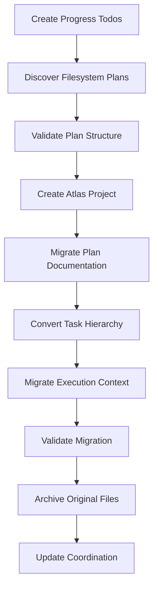

Migrate existing filesystem-based plan to Atlas MCP with comprehensive validation: $ARGUMENTS

## Purpose

This command discovers and migrates existing filesystem-based plans from `/planning/tasks/` to Atlas MCP, converting hierarchical structures to flattened Atlas entities while preserving all execution context, documentation, and audit trails. The migration enables seamless transition to the Atlas-backed planning system without data loss.

## **CRITICAL REQUIREMENTS**

1. **MUST preserve all existing data** - No loss of plans, tasks, documentation, or execution context
2. **MUST use TodoWrite for progress tracking** - Complex migration requires comprehensive progress visibility
3. **MUST validate migration completeness** - Verify all entities migrated correctly before cleanup
4. **MUST handle hierarchy flattening** - Convert nested task structures to Atlas flat tasks with dependencies
5. **MUST categorize knowledge properly** - Apply doc-type tags based on content analysis
6. **MUST provide rollback capability** - Enable recovery if migration fails
7. **MUST support batch and individual migration** - Handle single plans or all plans efficiently

## **Migration Strategy Overview**



## Implementation Steps

### **Step 1: Migration Progress Tracking**

**CRITICAL**: Create TodoWrite tracking for all migration phases:

```javascript
// **MUST CREATE TODOS FIRST** - Complex migration needs comprehensive tracking
const migrationTodos = [
  {
    id: "plan-discovery",
    content: "Discover and validate filesystem plans for migration",
    status: "pending",
    priority: "high"
  },
  {
    id: "structure-validation",
    content: "Validate plan structure and identify migration requirements",
    status: "pending",
    priority: "high"
  },
  {
    id: "atlas-project-creation",
    content: "Create Atlas project with proper metadata and configuration",
    status: "pending",
    priority: "high"
  },
  {
    id: "knowledge-migration",
    content: "Migrate plan documentation as categorized Atlas knowledge",
    status: "pending",
    priority: "high"
  },
  {
    id: "task-hierarchy-conversion",
    content: "Convert nested task hierarchy to flattened Atlas tasks",
    status: "pending",
    priority: "high"
  },
  {
    id: "context-migration",
    content: "Migrate execution context and scratch directory contents",
    status: "pending",
    priority: "high"
  },
  {
    id: "migration-validation",
    content: "Validate complete migration and data integrity",
    status: "pending",
    priority: "high"
  },
  {
    id: "cleanup-archival",
    content: "Archive original files and update coordination",
    status: "pending",
    priority: "high"
  }
]

await TodoWrite({ todos: migrationTodos })
```

### **Step 2: Filesystem Plan Discovery**

**CRITICAL**: Mark plan-discovery todo as in_progress and discover plans:

```javascript
// Update TodoWrite to show progress
await TodoWrite({ 
  todos: migrationTodos.map(t => 
    t.id === "plan-discovery" ? {...t, status: "in_progress"} : t
  )
})

// **CRITICAL**: Determine migration scope from arguments
const migrationScope = determineMigrationScope($ARGUMENTS)

function determineMigrationScope(args) {
  if (args.includes("--all")) {
    return { type: "all", planNames: [] }
  } else if (args.includes("--list")) {
    return { type: "list", planNames: [] }
  } else {
    const planName = extractPlanNameFromArguments(args)
    if (!planName) {
      throw new Error("No plan specified. Use plan name, --all, or --list")
    }
    return { type: "single", planNames: [planName] }
  }
}

// **CRITICAL**: Discover filesystem plans in /planning/tasks/
const planningTasksDir = "/planning/tasks/"
const discoveredPlans = await discoverFilesystemPlans(planningTasksDir, migrationScope)

async function discoverFilesystemPlans(baseDir, scope) {
  const plans = []
  
  if (scope.type === "all" || scope.type === "list") {
    // Discover all plans in directory
    const planDirs = await glob(`${baseDir}*/`)
    
    for (const planDir of planDirs) {
      const planName = path.basename(planDir)
      if (planName === "archive" || planName.startsWith(".")) continue
      
      const planData = await analyzePlanDirectory(planDir)
      if (planData) {
        plans.push({ name: planName, ...planData })
      }
    }
  } else {
    // Single plan migration
    const planName = scope.planNames[0]
    const planDir = `${baseDir}${planName}/`
    
    if (!await exists(planDir)) {
      throw new Error(`Plan directory not found: ${planDir}`)
    }
    
    const planData = await analyzePlanDirectory(planDir)
    if (planData) {
      plans.push({ name: planName, ...planData })
    }
  }
  
  return plans
}

async function analyzePlanDirectory(planDir) {
  const analysis = {
    path: planDir,
    hasTracker: false,
    hasPlan: false,
    hasReadme: false,
    phaseFiles: [],
    scratchDirs: [],
    totalFiles: 0,
    estimatedSize: "unknown"
  }
  
  // Check for core files
  const trackerPath = `${planDir}plan-tracker.json`
  const planPath = `${planDir}PLAN.md`
  const readmePath = `${planDir}README.md`
  
  analysis.hasTracker = await exists(trackerPath)
  analysis.hasPlan = await exists(planPath)
  analysis.hasReadme = await exists(readmePath)
  
  // Find phase files
  const phaseFiles = await glob(`${planDir}phase-*.md`)
  analysis.phaseFiles = phaseFiles
  
  // Find scratch directories
  const scratchDir = `${planDir}scratch/`
  if (await exists(scratchDir)) {
    const scratchContents = await glob(`${scratchDir}**/*`)
    analysis.scratchDirs = scratchContents.filter(p => path.extname(p) !== "")
  }
  
  // Calculate total files
  analysis.totalFiles = [
    analysis.hasTracker ? 1 : 0,
    analysis.hasPlan ? 1 : 0, 
    analysis.hasReadme ? 1 : 0,
    analysis.phaseFiles.length,
    analysis.scratchDirs.length
  ].reduce((a, b) => a + b, 0)
  
  // Size estimation
  if (analysis.totalFiles > 50) {
    analysis.estimatedSize = "large"
  } else if (analysis.totalFiles > 20) {
    analysis.estimatedSize = "medium"
  } else {
    analysis.estimatedSize = "small"
  }
  
  // Must have either tracker or plan to be valid
  return (analysis.hasTracker || analysis.hasPlan) ? analysis : null
}

console.log(`📂 Discovered ${discoveredPlans.length} plans for migration`)

// Handle list-only mode
if (migrationScope.type === "list") {
  console.log("\n📋 Available Plans for Migration:\n")
  for (const plan of discoveredPlans) {
    console.log(`• ${plan.name}`)
    console.log(`  - Files: ${plan.totalFiles} (${plan.estimatedSize})`)
    console.log(`  - Has Tracker: ${plan.hasTracker ? "✅" : "❌"}`)
    console.log(`  - Has Plan: ${plan.hasPlan ? "✅" : "❌"}`)
    console.log(`  - Phase Files: ${plan.phaseFiles.length}`)
    console.log(`  - Scratch Context: ${plan.scratchDirs.length} files`)
    console.log("")
  }
  return
}
```

### **Step 3: Structure Validation**

**CRITICAL**: Mark structure-validation todo as in_progress and validate each plan:

```javascript
// Update TodoWrite progress
await TodoWrite({
  todos: migrationTodos.map(t => 
    t.id === "plan-discovery" ? {...t, status: "completed"} :
    t.id === "structure-validation" ? {...t, status: "in_progress"} : t
  )
})

// **CRITICAL**: Validate each plan's structure for migration readiness
const validatedPlans = []

for (const plan of discoveredPlans) {
  console.log(`🔍 Validating plan: ${plan.name}`)
  
  const validation = await validatePlanStructure(plan)
  
  if (validation.isValid) {
    validatedPlans.push({ ...plan, validation })
    console.log(`✅ ${plan.name}: Ready for migration`)
  } else {
    console.log(`❌ ${plan.name}: ${validation.errors.join(", ")}`)
    
    if (!$ARGUMENTS.includes("--force")) {
      throw new Error(`Plan ${plan.name} validation failed. Use --force to override.`)
    } else {
      console.log(`⚠️  Proceeding with ${plan.name} despite validation errors (--force specified)`)
      validatedPlans.push({ ...plan, validation })
    }
  }
}

async function validatePlanStructure(plan) {
  const errors = []
  const warnings = []
  
  // Check for required files
  if (!plan.hasPlan && !plan.hasTracker) {
    errors.push("Missing both PLAN.md and plan-tracker.json")
  }
  
  // Validate tracker structure if exists
  if (plan.hasTracker) {
    try {
      const trackerContent = await readFile(`${plan.path}plan-tracker.json`)
      const tracker = JSON.parse(trackerContent)
      
      if (!tracker.phases || !Array.isArray(tracker.phases)) {
        errors.push("Invalid plan-tracker.json structure: missing phases array")
      }
      
      // Check for Atlas conflicts
      const projectId = `plan-${kebabCase(plan.name)}`
      const existingProject = await atlas_project_list({ mode: "details", id: projectId })
      if (existingProject) {
        if (!$ARGUMENTS.includes("--force")) {
          errors.push(`Atlas project ${projectId} already exists`)
        } else {
          warnings.push(`Will overwrite existing Atlas project ${projectId}`)
        }
      }
      
    } catch (error) {
      errors.push(`Invalid plan-tracker.json: ${error.message}`)
    }
  }
  
  // Check for large migration
  if (plan.totalFiles > 100) {
    warnings.push(`Large migration (${plan.totalFiles} files) - may take several minutes`)
  }
  
  return {
    isValid: errors.length === 0,
    errors,
    warnings,
    complexity: plan.estimatedSize,
    estimatedDuration: estimateMigrationDuration(plan)
  }
}

function estimateMigrationDuration(plan) {
  // Rough estimates based on file count and complexity
  const baseTime = 30 // seconds
  const fileMultiplier = plan.totalFiles * 2 // seconds per file
  const scratchMultiplier = plan.scratchDirs.length * 5 // extra time for context
  
  const totalSeconds = baseTime + fileMultiplier + scratchMultiplier
  
  if (totalSeconds < 60) return `${totalSeconds}s`
  if (totalSeconds < 3600) return `${Math.ceil(totalSeconds / 60)}m`
  return `${Math.ceil(totalSeconds / 3600)}h`
}
```

### **Step 4: Atlas Project Creation**

**CRITICAL**: Mark atlas-project-creation todo as in_progress and create projects:

```javascript
// Update TodoWrite progress  
await TodoWrite({
  todos: migrationTodos.map(t => 
    t.id === "structure-validation" ? {...t, status: "completed"} :
    t.id === "atlas-project-creation" ? {...t, status: "in_progress"} : t
  )
})

const migratedProjects = []

for (const plan of validatedPlans) {
  console.log(`🚀 Creating Atlas project for: ${plan.name}`)
  
  // **CRITICAL**: Extract project metadata from filesystem plan
  const projectMetadata = await extractProjectMetadata(plan)
  
  // Create Atlas project
  const atlasProject = await atlas_project_create({
    mode: "single",
    id: projectMetadata.id,
    name: projectMetadata.name,
    description: projectMetadata.description,
    taskType: projectMetadata.taskType,
    status: projectMetadata.status,
    completionRequirements: projectMetadata.completionRequirements,
    outputFormat: projectMetadata.outputFormat,
    urls: projectMetadata.urls || []
  })
  
  migratedProjects.push({
    originalPlan: plan,
    atlasProject: atlasProject,
    metadata: projectMetadata
  })
  
  console.log(`✅ Created Atlas project: ${atlasProject.id}`)
}

async function extractProjectMetadata(plan) {
  let metadata = {
    id: `plan-${kebabCase(plan.name)}`,
    name: plan.name,
    description: "Migrated from filesystem-based plan",
    taskType: "integration", // Default
    status: "active",
    completionRequirements: "Complete all migrated tasks",
    outputFormat: "Project deliverables as defined in plan"
  }
  
  // Extract from PLAN.md if available
  if (plan.hasPlan) {
    const planContent = await readFile(`${plan.path}PLAN.md`)
    const parsed = parsePlanMarkdown(planContent)
    
    if (parsed.title) metadata.name = parsed.title
    if (parsed.description) metadata.description = parsed.description
    if (parsed.objectives) metadata.completionRequirements = parsed.objectives.join("; ")
    if (parsed.deliverables) metadata.outputFormat = parsed.deliverables.join(", ")
    if (parsed.projectType) metadata.taskType = mapToAtlasTaskType(parsed.projectType)
  }
  
  // Extract from plan-tracker.json if available
  if (plan.hasTracker) {
    const trackerContent = await readFile(`${plan.path}plan-tracker.json`)
    const tracker = JSON.parse(trackerContent)
    
    if (tracker.plan_name) metadata.name = tracker.plan_name
    if (tracker.description) metadata.description = tracker.description
    if (tracker.status) metadata.status = mapToAtlasProjectStatus(tracker.status)
    
    // Determine project type from tasks
    const taskTypes = extractTaskTypesFromTracker(tracker)
    if (taskTypes.length > 0) {
      metadata.taskType = determineDominantTaskType(taskTypes)
    }
  }
  
  return metadata
}

function mapToAtlasTaskType(planType) {
  const mapping = {
    'web-application': 'integration',
    'api-service': 'generation',
    'data-pipeline': 'analysis', 
    'mobile-app': 'integration',
    'research-project': 'research',
    'migration': 'integration'
  }
  return mapping[planType] || 'integration'
}

function mapToAtlasProjectStatus(planStatus) {
  const mapping = {
    'pending': 'pending',
    'in_progress': 'in-progress',
    'active': 'active',
    'completed': 'completed',
    'archived': 'archived'
  }
  return mapping[planStatus] || 'active'
}
```

### **Step 5: Knowledge Migration**

**CRITICAL**: Mark knowledge-migration todo as in_progress and migrate documentation:

```javascript
// Update TodoWrite progress
await TodoWrite({
  todos: migrationTodos.map(t => 
    t.id === "atlas-project-creation" ? {...t, status: "completed"} :
    t.id === "knowledge-migration" ? {...t, status: "in_progress"} : t
  )
})

for (const project of migratedProjects) {
  console.log(`📚 Migrating knowledge for: ${project.atlasProject.name}`)
  
  const knowledgeItems = await collectPlanKnowledge(project.originalPlan)
  
  if (knowledgeItems.length > 0) {
    // **CRITICAL**: Bulk create knowledge with proper categorization
    await atlas_knowledge_add({
      mode: "bulk",
      knowledge: knowledgeItems.map(item => ({
        projectId: project.atlasProject.id,
        text: item.text,
        domain: item.domain,
        tags: item.tags
      }))
    })
    
    console.log(`✅ Migrated ${knowledgeItems.length} knowledge items`)
  }
}

async function collectPlanKnowledge(plan) {
  const knowledgeItems = []
  
  // Migrate PLAN.md as plan overview
  if (plan.hasPlan) {
    const planContent = await readFile(`${plan.path}PLAN.md`)
    knowledgeItems.push({
      text: planContent,
      domain: "business",
      tags: [
        "doc-type-plan-overview",
        "lifecycle-planning",
        "scope-project", 
        "quality-approved",
        "migrated-from-filesystem"
      ]
    })
  }
  
  // Migrate README.md as reference documentation
  if (plan.hasReadme) {
    const readmeContent = await readFile(`${plan.path}README.md`)
    knowledgeItems.push({
      text: readmeContent,
      domain: "technical",
      tags: [
        "doc-type-reference",
        "lifecycle-planning",
        "scope-project",
        "quality-reviewed", 
        "migrated-from-filesystem"
      ]
    })
  }
  
  // Migrate phase files as execution plans
  for (let i = 0; i < plan.phaseFiles.length; i++) {
    const phaseFile = plan.phaseFiles[i]
    const phaseContent = await readFile(phaseFile)
    const phaseNumber = extractPhaseNumber(phaseFile) || String(i + 1).padStart(2, '0')
    
    knowledgeItems.push({
      text: phaseContent,
      domain: "technical",
      tags: [
        "doc-type-execution-plan",
        "lifecycle-planning",
        `scope-phase-${phaseNumber}`,
        "quality-approved",
        "migrated-from-filesystem"
      ]
    })
  }
  
  // Check for architecture documentation
  const architectureFiles = [
    `${plan.path}architecture.md`,
    `${plan.path}ARCHITECTURE.md`,
    `${plan.path}docs/architecture.md`
  ]
  
  for (const archFile of architectureFiles) {
    if (await exists(archFile)) {
      const archContent = await readFile(archFile)
      knowledgeItems.push({
        text: archContent,
        domain: "technical",
        tags: [
          "doc-type-architecture-docs",
          "lifecycle-planning",
          "scope-project",
          "quality-reviewed",
          "migrated-from-filesystem"
        ]
      })
      break // Only migrate one architecture file
    }
  }
  
  // Check for standards documentation
  const standardsFiles = [
    `${plan.path}standards.md`,
    `${plan.path}STANDARDS.md`,
    `${plan.path}docs/standards.md`
  ]
  
  for (const standardsFile of standardsFiles) {
    if (await exists(standardsFile)) {
      const standardsContent = await readFile(standardsFile)
      knowledgeItems.push({
        text: standardsContent,
        domain: "technical",
        tags: [
          "doc-type-standards",
          "lifecycle-planning",
          "scope-project",
          "quality-reviewed",
          "migrated-from-filesystem"
        ]
      })
      break
    }
  }
  
  return knowledgeItems
}

function extractPhaseNumber(phaseFilePath) {
  const match = phaseFilePath.match(/phase-(\d+)/)
  return match ? match[1].padStart(2, '0') : null
}
```

### **Step 6: Task Hierarchy Conversion**

**CRITICAL**: Mark task-hierarchy-conversion todo as in_progress and convert tasks:

```javascript
// Update TodoWrite progress
await TodoWrite({
  todos: migrationTodos.map(t => 
    t.id === "knowledge-migration" ? {...t, status: "completed"} :
    t.id === "task-hierarchy-conversion" ? {...t, status: "in_progress"} : t
  )
})

for (const project of migratedProjects) {
  console.log(`🔄 Converting task hierarchy for: ${project.atlasProject.name}`)
  
  const atlasTasks = await convertTaskHierarchy(project.originalPlan, project.atlasProject.id)
  
  if (atlasTasks.length > 0) {
    // **CRITICAL**: Bulk create flattened Atlas tasks
    await atlas_task_create({
      mode: "bulk",
      tasks: atlasTasks
    })
    
    console.log(`✅ Created ${atlasTasks.length} Atlas tasks`)
  }
}

async function convertTaskHierarchy(plan, projectId) {
  const atlasTasks = []
  
  if (!plan.hasTracker) {
    console.log(`⚠️  No plan-tracker.json found for ${plan.name} - skipping task migration`)
    return atlasTasks
  }
  
  const trackerContent = await readFile(`${plan.path}plan-tracker.json`)
  const tracker = JSON.parse(trackerContent)
  
  if (!tracker.phases || !Array.isArray(tracker.phases)) {
    console.log(`⚠️  Invalid tracker structure for ${plan.name} - skipping task migration`)
    return atlasTasks
  }
  
  // **CRITICAL**: Convert nested hierarchy to flat Atlas tasks
  for (let phaseIndex = 0; phaseIndex < tracker.phases.length; phaseIndex++) {
    const phase = tracker.phases[phaseIndex]
    const phaseNumber = String(phaseIndex + 1).padStart(2, '0')
    
    if (!phase.tasks || !Array.isArray(phase.tasks)) continue
    
    for (let taskIndex = 0; taskIndex < phase.tasks.length; taskIndex++) {
      const task = phase.tasks[taskIndex]
      const taskNumber = String(taskIndex + 1).padStart(3, '0')
      const taskId = `${phaseNumber}-${taskNumber}`
      
      // Create main task
      const atlasTask = {
        id: taskId,
        title: `${phase.name}: ${task.name}`,
        description: task.description || task.name,
        projectId: projectId,
        taskType: mapTaskTypeToAtlas(task.type),
        status: mapTaskStatusToAtlas(task.status),
        priority: mapTaskPriorityToAtlas(task.priority),
        tags: [
          `phase-${phaseNumber}`,
          `task-type-${task.type || "general"}`,
          "migrated-from-filesystem"
        ],
        dependencies: mapTaskDependencies(task.dependencies, phaseNumber, taskNumber),
        completionRequirements: task.acceptance_criteria?.join("; ") || task.completionRequirements || "",
        outputFormat: task.deliverables?.join(", ") || task.outputFormat || "",
        urls: task.urls || []
      }
      
      atlasTasks.push(atlasTask)
      
      // Create subtasks as dependent tasks
      if (task.subtasks && Array.isArray(task.subtasks)) {
        for (let subtaskIndex = 0; subtaskIndex < task.subtasks.length; subtaskIndex++) {
          const subtask = task.subtasks[subtaskIndex]
          const subtaskNumber = String(subtaskIndex + 1).padStart(2, '0')
          const subtaskId = `${taskId}-${subtaskNumber}`
          
          const atlasSubtask = {
            id: subtaskId,
            title: `${phase.name}: ${subtask.name}`,
            description: subtask.description || subtask.name,
            projectId: projectId,
            taskType: "generation", // Subtasks typically generation work
            status: mapTaskStatusToAtlas(subtask.status),
            priority: atlasTask.priority, // Inherit parent priority
            tags: [
              `phase-${phaseNumber}`,
              "subtask",
              `parent-task-${taskId}`,
              "migrated-from-filesystem"
            ],
            dependencies: [taskId], // Depends on parent task
            completionRequirements: subtask.acceptance_criteria?.join("; ") || "",
            outputFormat: subtask.deliverables?.join(", ") || ""
          }
          
          atlasTasks.push(atlasSubtask)
        }
      }
    }
  }
  
  return atlasTasks
}

function mapTaskTypeToAtlas(taskType) {
  const mapping = {
    'setup': 'integration',
    'configuration': 'integration',
    'implementation': 'generation',
    'development': 'generation',
    'coding': 'generation',
    'testing': 'analysis',
    'validation': 'analysis',
    'review': 'analysis',
    'research': 'research',
    'analysis': 'research',
    'documentation': 'generation',
    'deployment': 'integration'
  }
  return mapping[taskType] || 'generation'
}

function mapTaskStatusToAtlas(taskStatus) {
  const mapping = {
    'pending': 'backlog',
    'ready': 'todo', // Will add status-ready tag separately if needed
    'in_progress': 'in-progress',
    'implementing': 'in-progress',
    'under_review': 'in-progress', // Will add status-review tag
    'completed': 'completed',
    'blocked': 'todo' // Will add status-blocked tag
  }
  return mapping[taskStatus] || 'backlog'
}

function mapTaskPriorityToAtlas(taskPriority) {
  const mapping = {
    'low': 'low',
    'medium': 'medium',
    'normal': 'medium',
    'high': 'high',
    'critical': 'critical',
    'urgent': 'critical'
  }
  return mapping[taskPriority] || 'medium'
}

function mapTaskDependencies(dependencies, currentPhase, currentTask) {
  if (!dependencies || !Array.isArray(dependencies)) return []
  
  return dependencies.map(dep => {
    // Handle different dependency formats from filesystem plans
    if (dep.startsWith('phase-')) {
      return dep.replace('phase-', '').padStart(2, '0') + '-001' // First task of specified phase
    } else if (dep.includes('.')) {
      const [phase, task] = dep.split('.')
      return `${phase.padStart(2, '0')}-${task.padStart(3, '0')}`
    } else {
      return dep // Use as-is if already in correct format
    }
  })
}
```

### **Step 7: Execution Context Migration**

**CRITICAL**: Mark context-migration todo as in_progress and migrate scratch content:

```javascript
// Update TodoWrite progress
await TodoWrite({
  todos: migrationTodos.map(t => 
    t.id === "task-hierarchy-conversion" ? {...t, status: "completed"} :
    t.id === "context-migration" ? {...t, status: "in_progress"} : t
  )
})

for (const project of migratedProjects) {
  console.log(`📋 Migrating execution context for: ${project.atlasProject.name}`)
  
  const contextKnowledge = await migrateExecutionContext(project.originalPlan, project.atlasProject.id)
  
  if (contextKnowledge.length > 0) {
    // **CRITICAL**: Store execution context as Atlas knowledge
    await atlas_knowledge_add({
      mode: "bulk",
      knowledge: contextKnowledge
    })
    
    console.log(`✅ Migrated ${contextKnowledge.length} execution context items`)
  }
}

async function migrateExecutionContext(plan, projectId) {
  const contextItems = []
  const scratchDir = `${plan.path}scratch/`
  
  if (!await exists(scratchDir)) {
    return contextItems
  }
  
  // Find all task directories in scratch
  const taskDirs = await glob(`${scratchDir}**/task-*`, { onlyDirectories: true })
  
  for (const taskDir of taskDirs) {
    const taskId = extractTaskIdFromPath(taskDir)
    if (!taskId) continue
    
    // Migrate initial context summaries
    const contextFile = `${taskDir}/initial-context-summary.md`
    if (await exists(contextFile)) {
      const contextContent = await readFile(contextFile)
      contextItems.push({
        projectId: projectId,
        text: contextContent,
        domain: "technical",
        tags: [
          "doc-type-task-context",
          "lifecycle-execution",
          `scope-task-${taskId}`,
          "quality-draft",
          "migrated-from-filesystem"
        ]
      })
    }
    
    // Migrate architecture reviews
    const archFiles = await glob(`${taskDir}/architect-review-*.json`)
    for (const archFile of archFiles) {
      const archContent = await readFile(archFile)
      contextItems.push({
        projectId: projectId,
        text: archContent,
        domain: "technical",
        tags: [
          "doc-type-architecture-primer",
          "lifecycle-execution",
          `scope-task-${taskId}`,
          "quality-reviewed",
          "migrated-from-filesystem"
        ]
      })
    }
    
    // Migrate implementation notes
    const implNotesFile = `${taskDir}/implementation-notes.md`
    if (await exists(implNotesFile)) {
      const implContent = await readFile(implNotesFile)
      contextItems.push({
        projectId: projectId,
        text: implContent,
        domain: "technical",
        tags: [
          "doc-type-implementation-notes",
          "lifecycle-execution",
          `scope-task-${taskId}`,
          "quality-draft",
          "migrated-from-filesystem"
        ]
      })
    }
    
    // Migrate review audit trails
    const auditDir = `${taskDir}/review-audit/`
    if (await exists(auditDir)) {
      const auditItems = await migrateReviewAudit(auditDir, taskId, projectId)
      contextItems.push(...auditItems)
    }
  }
  
  return contextItems
}

function extractTaskIdFromPath(taskDirPath) {
  const match = taskDirPath.match(/task-(\d+-\d+(?:-\d+)?)/)
  return match ? match[1] : null
}

async function migrateReviewAudit(auditDir, taskId, projectId) {
  const auditItems = []
  
  // Find all iteration directories
  const iterationDirs = await glob(`${auditDir}iteration-*`, { onlyDirectories: true })
  
  for (const iterDir of iterationDirs) {
    const iterationMatch = iterDir.match(/iteration-(\d+)-(initial|response)/)
    if (!iterationMatch) continue
    
    const [, iteration, phase] = iterationMatch
    
    // Migrate review findings
    const reviewFile = `${iterDir}/code-review-tracker.json`
    if (await exists(reviewFile)) {
      const reviewContent = await readFile(reviewFile)
      auditItems.push({
        projectId: projectId,
        text: reviewContent,
        domain: "technical",
        tags: [
          "doc-type-audit-trail",
          "lifecycle-review",
          `scope-task-${taskId}`,
          `review-iteration-${iteration}`,
          `review-phase-${phase}`,
          "quality-reviewed",
          "migrated-from-filesystem"
        ]
      })
    }
  }
  
  return auditItems
}
```

### **Step 8: Migration Validation and Cleanup**

**CRITICAL**: Mark validation and cleanup todos as in_progress:

```javascript
// Update TodoWrite progress
await TodoWrite({
  todos: migrationTodos.map(t => 
    t.id === "context-migration" ? {...t, status: "completed"} :
    t.id === "migration-validation" ? {...t, status: "in_progress"} : t
  )
})

// **CRITICAL**: Validate migration completeness for each project
const validationResults = []

for (const project of migratedProjects) {
  console.log(`🔍 Validating migration for: ${project.atlasProject.name}`)
  
  const validation = await validateMigrationCompleteness(project)
  validationResults.push(validation)
  
  if (validation.isComplete) {
    console.log(`✅ Migration validation passed for ${project.atlasProject.name}`)
  } else {
    console.log(`❌ Migration validation failed for ${project.atlasProject.name}:`)
    validation.issues.forEach(issue => console.log(`  - ${issue}`))
    
    if (!$ARGUMENTS.includes("--force")) {
      throw new Error(`Migration validation failed. Use --force to proceed with cleanup anyway.`)
    }
  }
}

async function validateMigrationCompleteness(project) {
  const issues = []
  const { originalPlan, atlasProject } = project
  
  // Validate Atlas project exists
  const projectCheck = await atlas_project_list({ mode: "details", id: atlasProject.id })
  if (!projectCheck) {
    issues.push("Atlas project not found")
    return { isComplete: false, issues }
  }
  
  // Validate task migration
  const atlasTasks = await atlas_task_list({ projectId: atlasProject.id, limit: 200 })
  
  if (originalPlan.hasTracker) {
    const trackerContent = await readFile(`${originalPlan.path}plan-tracker.json`)
    const tracker = JSON.parse(trackerContent)
    
    // Count expected tasks from tracker
    let expectedTaskCount = 0
    for (const phase of tracker.phases || []) {
      expectedTaskCount += (phase.tasks || []).length
      for (const task of phase.tasks || []) {
        expectedTaskCount += (task.subtasks || []).length
      }
    }
    
    if (atlasTasks.length !== expectedTaskCount) {
      issues.push(`Task count mismatch: expected ${expectedTaskCount}, got ${atlasTasks.length}`)
    }
  }
  
  // Validate knowledge migration
  const atlasKnowledge = await atlas_knowledge_list({ projectId: atlasProject.id, limit: 100 })
  
  let expectedKnowledgeCount = 0
  if (originalPlan.hasPlan) expectedKnowledgeCount++
  if (originalPlan.hasReadme) expectedKnowledgeCount++
  expectedKnowledgeCount += originalPlan.phaseFiles.length
  expectedKnowledgeCount += Math.floor(originalPlan.scratchDirs.length / 3) // Rough estimate
  
  if (atlasKnowledge.length < expectedKnowledgeCount * 0.8) { // Allow 20% variance
    issues.push(`Knowledge count lower than expected: got ${atlasKnowledge.length}, expected ~${expectedKnowledgeCount}`)
  }
  
  return {
    isComplete: issues.length === 0,
    issues,
    atlasTaskCount: atlasTasks.length,
    atlasKnowledgeCount: atlasKnowledge.length
  }
}

// Mark cleanup-archival as in_progress
await TodoWrite({
  todos: migrationTodos.map(t => 
    t.id === "migration-validation" ? {...t, status: "completed"} :
    t.id === "cleanup-archival" ? {...t, status: "in_progress"} : t
  )
})

// **CRITICAL**: Archive original files if not in dry-run mode
if (!$ARGUMENTS.includes("--dry-run")) {
  const archiveDir = "/planning/tasks/archive/"
  await ensureDirectoryExists(archiveDir)
  
  for (const project of migratedProjects) {
    const originalPath = project.originalPlan.path
    const archivePath = `${archiveDir}${project.originalPlan.name}-migrated-${new Date().toISOString().slice(0, 10)}/`
    
    console.log(`📦 Archiving ${project.originalPlan.name} to archive/`)
    await moveDirectory(originalPath, archivePath)
  }
} else {
  console.log("🔍 Dry-run mode: original files preserved")
}

// Update coordination file
const lastPlan = await readLastPlanReference()
for (const project of migratedProjects) {
  lastPlan.migrated_projects = lastPlan.migrated_projects || []
  lastPlan.migrated_projects.push({
    original_name: project.originalPlan.name,
    atlas_project_id: project.atlasProject.id,
    migrated_at: new Date().toISOString(),
    validation: validationResults.find(v => v.atlasProject?.id === project.atlasProject.id)
  })
}
lastPlan.last_updated = new Date().toISOString()
lastPlan.updated_by = "plan-migrate-to-atlas"

await writeFile('/planning/tasks/last-plan.json', JSON.stringify(lastPlan, null, 2))

// **CRITICAL**: Complete all todos
await TodoWrite({
  todos: migrationTodos.map(t => ({...t, status: "completed"}))
})
```

## **Usage Examples**

```bash
# Migrate specific plan to Atlas
/plan-migrate-to-atlas "web-app-redesign"

# Migrate all plans in /planning/tasks/
/plan-migrate-to-atlas --all

# List available plans for migration  
/plan-migrate-to-atlas --list

# Dry run migration (validate without archiving)
/plan-migrate-to-atlas "mobile-app" --dry-run

# Force migration despite validation warnings
/plan-migrate-to-atlas "legacy-project" --force

# Migrate all with dry run and force
/plan-migrate-to-atlas --all --dry-run --force
```

## **Arguments Processing**

**Input Format**: `[plan-name] [--option]`

**Required (one of)**:
- `[plan-name]`: Specific plan directory name to migrate
- `--all`: Migrate all discovered plans
- `--list`: List available plans without migrating

**Optional Arguments**:
- `--dry-run`: Validate migration without archiving original files
- `--force`: Proceed despite validation errors or existing Atlas projects
- `--verbose`: Detailed progress output during migration

## **Output and Confirmation**

```bash
🔄 Atlas Migration Progress

✅ Plan Discovery: Found 3 plans for migration
✅ Structure Validation: All plans valid for migration
✅ Atlas Project Creation: 3 projects created successfully
✅ Knowledge Migration: 47 knowledge items migrated
✅ Task Hierarchy Conversion: 127 tasks converted to flat structure
✅ Context Migration: 89 execution context items preserved
✅ Migration Validation: All migrations validated successfully
✅ Cleanup & Archival: Original files archived to /planning/tasks/archive/

📋 Migration Summary

Migrated Projects:
1. web-app-redesign → plan-web-app-redesign
   - Tasks: 45 migrated (3 phases)
   - Knowledge: 12 items
   - Context: 23 execution items
   
2. mobile-app-v2 → plan-mobile-app-v2  
   - Tasks: 67 migrated (4 phases)
   - Knowledge: 18 items
   - Context: 41 execution items
   
3. api-migration → plan-api-migration
   - Tasks: 15 migrated (2 phases) 
   - Knowledge: 7 items
   - Context: 25 execution items

🎯 Next Steps

1. Run: /plan-status "plan-web-app-redesign" (verify first project)
2. Run: /plan-execution-init "plan-web-app-redesign" (initialize for execution)
3. Run: /plan-prepare-next-task (start Atlas-based execution)

Migration Complete: 127 tasks, 47 knowledge items, 89 context items
Original Files: Archived to /planning/tasks/archive/
Atlas Integration: Ready for new execution workflow
```

## **Error Handling and Recovery**

1. **Missing Plans**: Clear guidance on available plans and directory structure
2. **Validation Failures**: Detailed error reporting with --force override options
3. **Atlas Conflicts**: Detection of existing projects with overwrite options
4. **Partial Migration**: Rollback mechanisms and cleanup for failed migrations
5. **Archive Failures**: Graceful handling of file system permission issues

## **Quality Assurance**

- Comprehensive validation ensures no data loss during migration
- Atomic operations prevent partial migrations and inconsistent states
- TodoWrite progress tracking provides complete visibility into complex migration
- Dry-run mode enables safe validation before permanent changes
- Archive system preserves original files for recovery if needed
- Knowledge categorization maintains searchability and organization in Atlas

## **Integration Points**

- **Reads**: Filesystem plans, documentation, task hierarchies, and execution context
- **Creates**: Complete Atlas project ecosystem with proper entity relationships
- **Preserves**: All execution history, documentation, and audit trails as categorized knowledge
- **Enables**: Seamless transition to Atlas-backed planning and execution workflow
- **Maintains**: Backward compatibility through archived filesystem plans