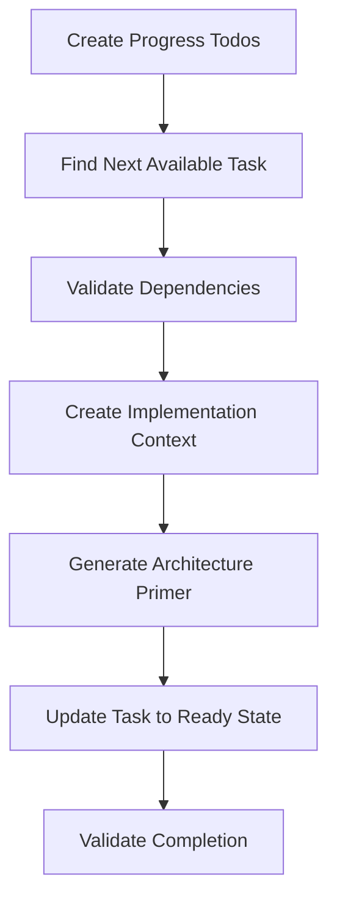

Prepare the next available Atlas task for implementation with architectural review: $ARGUMENTS

## Purpose

This command identifies the next available Atlas task, validates dependencies, creates comprehensive implementation context, conducts architectural review, and marks the task as "ready" for execution. It uses Claude Code TodoWrite for progress tracking and implements sophisticated state management to prevent duplicate work while providing clear progress visibility.

## **CRITICAL REQUIREMENTS**

1. **MUST use Atlas MCP tools exclusively** - All task queries and updates through Atlas
2. **MUST use TodoWrite for progress tracking** - Create todos immediately and update throughout
3. **MUST validate dependencies** before task preparation
4. **MUST create categorized knowledge** for task context and architecture primer
5. **MUST spawn architecture agent** for comprehensive pre-implementation review
6. **MUST use atomic state updates** to prevent race conditions and duplicate work
7. **MUST handle state conflicts** gracefully with clear user options

## **Implementation Strategy Overview**



## Implementation Steps

### **Step 1: Progress Tracking Initialization**

**CRITICAL**: Create TodoWrite tracking immediately for all major steps:

```javascript
// **MUST CREATE TODOS FIRST** - Provides progress visibility and prevents duplicate work
const preparationTodos = [
  {
    id: "task-selection",
    content: "Find next available Atlas task and validate dependencies",
    status: "pending",
    priority: "high"
  },
  {
    id: "context-creation", 
    content: "Create implementation context and store as Atlas knowledge",
    status: "pending",
    priority: "high"
  },
  {
    id: "architecture-primer",
    content: "Generate architecture primer using architect subagent",
    status: "pending", 
    priority: "high"
  },
  {
    id: "task-finalization",
    content: "Update task status to ready and validate preparation",
    status: "pending",
    priority: "high"
  }
]

await TodoWrite({ todos: preparationTodos })
```

### **Step 2: Project Resolution and Task Selection**

**CRITICAL**: Mark task-selection todo as in_progress, then proceed:

```javascript
// Update TodoWrite to show progress
await TodoWrite({ 
  todos: preparationTodos.map(t => 
    t.id === "task-selection" ? {...t, status: "in_progress"} : t
  )
})

// Resolve project ID from arguments or last-plan.json
let projectId = extractProjectIdFromArguments($ARGUMENTS)
if (!projectId) {
  const lastPlan = await readLastPlanReference()
  projectId = lastPlan?.atlas_project_id
}

if (!projectId) {
  throw new Error("No project specified. Run /plan-execution-init first.")
}

// **CRITICAL**: Find next available task using Atlas unified search
const availableTasks = await atlas_task_list({
  projectId: projectId,
  status: "todo",
  limit: 50,
  sortBy: "priority",
  sortDirection: "desc"
})

if (availableTasks.length === 0) {
  throw new Error("No tasks available for preparation. All tasks may be completed or blocked by dependencies.")
}

// Select best task based on dependency satisfaction and priority
const selectedTask = await selectOptimalTask(availableTasks, projectId)

if (!selectedTask) {
  throw new Error("No tasks are ready for preparation. Check dependency status with /plan-status.")
}

async function selectOptimalTask(candidates, projectId) {
  // Get all project tasks to validate dependencies
  const allProjectTasks = await atlas_task_list({
    projectId: projectId,
    limit: 200
  })
  
  const completedTaskIds = new Set(
    allProjectTasks.filter(t => t.status === "completed").map(t => t.id)
  )
  
  for (const task of candidates) {
    // Check if all dependencies are satisfied
    const dependenciesSatisfied = (task.dependencies || []).every(depId => 
      completedTaskIds.has(depId)
    )
    
    if (dependenciesSatisfied) {
      return task
    }
  }
  
  return null // No tasks have satisfied dependencies
}
```

### **Step 3: State Conflict Management**

**CRITICAL**: Handle existing task states and prevent duplicate preparation:

```javascript
// Check current task state and handle conflicts
if (selectedTask.tags?.includes("status-preparing")) {
  console.log("⚠️  Task is already being prepared")
  console.log("Options:")
  console.log("1. Continue (override previous preparation)")
  console.log("2. Reset to todo state (clear previous preparation)")
  console.log("3. Exit without changes")
  
  const userChoice = await promptUser("Choose option (1/2/3): ")
  
  switch (userChoice) {
    case "1":
      console.log("Continuing with override...")
      break
    case "2":
      console.log("🔄 Resetting task to todo state...")
      await atlas_task_update({
        mode: "single",
        id: selectedTask.id,
        updates: {
          status: "todo",
          tags: selectedTask.tags.filter(tag => !tag.startsWith("status-"))
        }
      })
      break
    case "3":
      console.log("Exiting without changes")
      return
    default:
      throw new Error("Invalid choice")
  }
} else if (selectedTask.tags?.includes("status-ready")) {
  console.log("✅ Task is already prepared and ready for implementation")
  console.log(`Run: /plan-implement-task to execute task ${selectedTask.id}`)
  return
}

// **CRITICAL**: Atomically update task status to preparing
await atlas_task_update({
  mode: "single", 
  id: selectedTask.id,
  updates: {
    status: "todo",
    tags: [...(selectedTask.tags || []), "status-preparing"]
  }
})
```

### **Step 4: Implementation Context Creation**

**CRITICAL**: Mark context-creation todo as in_progress and create comprehensive context:

```javascript
// Update TodoWrite progress
await TodoWrite({
  todos: preparationTodos.map(t => 
    t.id === "task-selection" ? {...t, status: "completed"} :
    t.id === "context-creation" ? {...t, status: "in_progress"} : t
  )
})

// Gather comprehensive context from Atlas knowledge
const projectKnowledge = await atlas_knowledge_list({
  projectId: projectId,
  tags: ["doc-type-plan-overview", "doc-type-execution-plan"],
  limit: 20
})

const phaseKnowledge = await atlas_knowledge_list({
  projectId: projectId, 
  tags: [`scope-phase-${selectedTask.id.substring(0, 2)}`],
  limit: 10
})

// Build comprehensive implementation context
const implementationContext = generateImplementationContext(
  selectedTask, 
  projectKnowledge,
  phaseKnowledge,
  projectId
)

// **CRITICAL**: Store implementation context as categorized Atlas knowledge
const contextKnowledge = {
  mode: "single",
  projectId: projectId,
  text: implementationContext,
  domain: "technical", // KnowledgeDomain.TECHNICAL
  tags: [
    "doc-type-task-context",
    "lifecycle-execution", 
    `scope-task-${selectedTask.id}`,
    "quality-draft"
  ]
}

await atlas_knowledge_add(contextKnowledge)

function generateImplementationContext(task, projectKnowledge, phaseKnowledge, projectId) {
  const planOverview = projectKnowledge.find(k => k.tags.includes("doc-type-plan-overview"))
  const phaseDetails = phaseKnowledge.find(k => k.tags.includes("doc-type-execution-plan"))
  
  return `# Task Implementation Context

## Task Information
- **Task ID**: ${task.id}
- **Title**: ${task.title}
- **Phase**: ${task.id.substring(0, 2)}
- **Priority**: ${task.priority}
- **Type**: ${task.taskType}
- **Status**: preparing → ready (after architecture primer)

## Task Description
${task.description}

## Acceptance Criteria
${task.completionRequirements}

## Dependencies Status
**Satisfied Dependencies**: ${(task.dependencies || []).join(", ") || "None"}
**Dependency Status**: All dependencies completed ✅

## Relevant Project Context

### Plan Overview
${planOverview ? extractRelevantSections(planOverview.text, task) : "Plan overview not available"}

### Phase Context  
${phaseDetails ? extractRelevantSections(phaseDetails.text, task) : "Phase details not available"}

### Architecture Documentation
**CRITICAL**: Read these architecture files entirely before implementation:
- Search Atlas knowledge for: doc-type-architecture-docs
- Search Atlas knowledge for: doc-type-standards
- Review architecture primer (will be generated next)

## Implementation Guidelines
- Follow existing code patterns discovered in project analysis
- Ensure all acceptance criteria are validated before completion
- Update task status through Atlas MCP tools
- Store implementation notes as Atlas knowledge
- Consider architectural constraints from primer

## Expected Deliverables
${task.outputFormat}

## Next Steps
1. Architecture primer generation (automatic)
2. Task implementation preparation validation
3. Status update to "ready" for /plan-implement-task
`
}
```

### **Step 5: Architecture Primer Generation**

**CRITICAL**: Mark architecture-primer todo as in_progress and spawn architect subagent:

```javascript
// Update TodoWrite progress
await TodoWrite({
  todos: preparationTodos.map(t => 
    t.id === "context-creation" ? {...t, status: "completed"} :
    t.id === "architecture-primer" ? {...t, status: "in_progress"} : t
  )
})

// Check for existing architecture primer (reuse if recent)
const existingPrimer = await atlas_knowledge_list({
  projectId: projectId,
  tags: [`scope-task-${selectedTask.id}`, "doc-type-architecture-primer"],
  limit: 1
})

let architecturePrimer
if (existingPrimer.length > 0) {
  const primerAge = Date.now() - new Date(existingPrimer[0].createdAt).getTime()
  const hoursOld = primerAge / (1000 * 60 * 60)
  
  if (hoursOld < 24) {
    console.log(`📄 Found recent architecture primer (${hoursOld.toFixed(1)}h old)`)
    const reuseChoice = await promptUser("Reuse existing primer? (y/n): ")
    
    if (reuseChoice === "y") {
      architecturePrimer = existingPrimer[0].text
    }
  }
}

// Generate new architecture primer if not reusing
if (!architecturePrimer) {
  console.log("🤖 Generating architecture primer with architect subagent...")
  
  // **CRITICAL**: Spawn architect subagent with comprehensive context
  const architectPrompt = `You are an expert software architect creating an architecture primer for task implementation.

**Context:**
- Project: ${projectId}
- Task: ${selectedTask.id} - ${selectedTask.title}
- Task Type: ${selectedTask.taskType}
- Priority: ${selectedTask.priority}

**Analysis Required:**
1. Search Atlas knowledge for relevant architecture documentation
2. Review completed tasks and their architectural implications  
3. Analyze current system state and existing code patterns
4. Examine this specific task requirements in architectural context
5. Identify integration points and potential conflicts
6. Provide implementation guidance and constraints

**Use These Atlas MCP Commands:**
- atlas_knowledge_list to find architecture docs: tags=["doc-type-architecture-docs", "doc-type-standards"]
- atlas_knowledge_list to find similar completed tasks: tags=["doc-type-implementation-notes"]
- atlas_task_list to review completed tasks in this project

**Output Requirements:**
Create a structured JSON architecture primer with:
{
  "primer_metadata": {
    "timestamp": "${new Date().toISOString()}",
    "task_id": "${selectedTask.id}",
    "architect": "architect-subagent"
  },
  "current_state_analysis": {
    "completed_tasks_summary": "Analysis of completed work",
    "architectural_patterns": ["Existing patterns to follow"],
    "integration_points": ["Systems that will be affected"]
  },
  "task_analysis": {
    "architectural_significance": "high|medium|low",
    "complexity_assessment": "Implementation complexity description",
    "risk_factors": ["Implementation risks"],
    "recommended_approach": "Recommended implementation strategy"
  },
  "implementation_guidance": {
    "architectural_constraints": ["Must-follow constraints"],
    "recommended_patterns": ["Patterns to use"],
    "integration_strategy": "How to integrate with existing systems",
    "validation_requirements": ["How to verify architectural compliance"]
  },
  "blocking_issues": ["Critical issues requiring human resolution"],
  "recommendations": ["Overall recommendations for this task"]
}

Store this as Atlas knowledge with tags: ["doc-type-architecture-primer", "scope-task-${selectedTask.id}", "lifecycle-execution", "quality-reviewed"]`

  architecturePrimer = await Task("Architecture Primer Generation", architectPrompt)
  
  // Validate primer generation
  try {
    const primerObj = JSON.parse(architecturePrimer)
    
    // Check for blocking issues
    if (primerObj.blocking_issues && primerObj.blocking_issues.length > 0) {
      console.log("🚨 CRITICAL: Architecture primer found blocking issues:")
      primerObj.blocking_issues.forEach(issue => console.log(`  - ${issue}`))
      
      // Update task status to needs-human-review
      await atlas_task_update({
        mode: "single",
        id: selectedTask.id, 
        updates: {
          status: "todo",
          tags: [...(selectedTask.tags || []).filter(t => t !== "status-preparing"), "status-blocked"]
        }
      })
      
      throw new Error("Task requires human resolution before implementation can proceed.")
    }
  } catch (parseError) {
    console.warn("⚠️  Architecture primer parsing failed, but continuing with raw content")
  }
}
```

### **Step 6: Task Finalization and Status Update**

**CRITICAL**: Complete preparation and mark task as ready:

```javascript
// Update TodoWrite progress
await TodoWrite({
  todos: preparationTodos.map(t => 
    t.id === "architecture-primer" ? {...t, status: "completed"} :
    t.id === "task-finalization" ? {...t, status: "in_progress"} : t
  )
})

// Validate all required context exists
const requiredContext = await atlas_knowledge_list({
  projectId: projectId,
  tags: [`scope-task-${selectedTask.id}`],
  limit: 10
})

const hasTaskContext = requiredContext.some(k => k.tags.includes("doc-type-task-context"))
const hasArchitecturePrimer = requiredContext.some(k => k.tags.includes("doc-type-architecture-primer"))

if (!hasTaskContext || !hasArchitecturePrimer) {
  throw new Error("Required context missing. Task preparation failed.")
}

// **CRITICAL**: Atomically update task to ready state
await atlas_task_update({
  mode: "single",
  id: selectedTask.id,
  updates: {
    status: "todo",
    tags: [
      ...(selectedTask.tags || []).filter(tag => !tag.startsWith("status-")),
      "status-ready"
    ]
  }
})

// Update coordination file
const lastPlan = await readLastPlanReference()
lastPlan.last_prepared_task = {
  id: selectedTask.id,
  title: selectedTask.title,
  prepared_at: new Date().toISOString()
}
lastPlan.last_updated = new Date().toISOString()
lastPlan.updated_by = "plan-prepare-next-task"

await writeFile('/planning/tasks/last-plan.json', JSON.stringify(lastPlan, null, 2))

// **CRITICAL**: Complete all todos
await TodoWrite({
  todos: preparationTodos.map(t => ({...t, status: "completed"}))
})
```

## **Usage Examples**

```bash
# Prepare next task for current project (uses last-plan.json)
/plan-prepare-next-task

# Prepare next task for specific project  
/plan-prepare-next-task "plan-web-customer-portal"

# Force re-preparation of current ready task
/plan-prepare-next-task --force-reprepare

# Check preparation status without making changes
/plan-prepare-next-task --status-only
```

## **Arguments Processing**

**Input Format**: `[project-id] [--option]`

**Optional Arguments**:
- `[project-id]`: Atlas project ID (defaults to last-plan.json)
- `--force-reprepare`: Re-prepare task even if already ready
- `--status-only`: Show next available tasks without preparing
- `--skip-architecture`: Skip architecture primer generation (not recommended)

## **Output and Confirmation**

```bash
🔄 Task Preparation Progress

✅ Task Selection: Found task 01-003
✅ Context Creation: Implementation context stored
✅ Architecture Primer: Generated by architect subagent
✅ Task Finalization: Status updated to ready

📋 Task Prepared Successfully

Task Details:
- ID: 01-003
- Title: Foundation: Setup Development Environment
- Priority: high  
- Type: integration
- Dependencies: All satisfied ✅

Context Knowledge Stored:
- Implementation Context: doc-type-task-context
- Architecture Primer: doc-type-architecture-primer

🎯 Task Ready for Implementation

Next Steps:
1. Run: /plan-implement-task (execute the prepared task)
2. Run: /plan-status (view overall project progress)

Last Plan Updated: /planning/tasks/last-plan.json
```

## **Error Handling and Recovery**

1. **No Available Tasks**: Clear guidance on dependency resolution
2. **State Conflicts**: Interactive resolution with rollback options
3. **Architecture Primer Failures**: Fallback mechanisms and manual options
4. **Knowledge Storage Failures**: Atomic rollback of task state changes
5. **Dependency Validation Errors**: Specific guidance on blocking dependencies

## **Quality Assurance**

- Atomic state updates prevent race conditions and inconsistent states
- Comprehensive dependency validation before task preparation
- TodoWrite progress tracking provides complete audit trail
- Architecture primer generation ensures implementation readiness
- Knowledge categorization enables efficient context retrieval

## **Integration Points**

- **Reads**: Atlas project, tasks, and knowledge from previous commands
- **Creates**: Task-specific implementation context and architecture primer as categorized knowledge
- **Updates**: Task status with proper state tags and coordination file
- **Enables**: `/plan-implement-task` execution with comprehensive preparation
- **Maintains**: Sophisticated preparation workflow with progress visibility