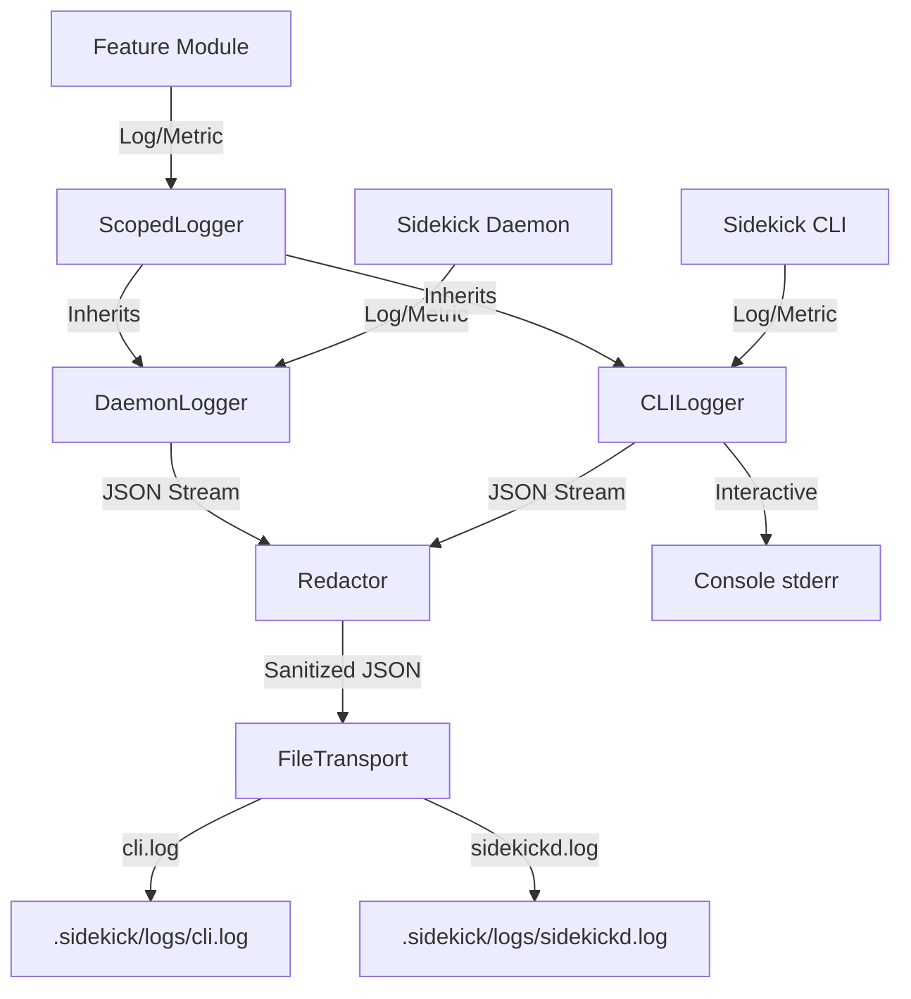

# Structured Logging & Telemetry LLD

## 1. Overview

This document details the design for the observability stack in Sidekick. The system uses **structured logging** (JSON) as the primary mechanism for both debug logs and telemetry (metrics), enabling a unified stream for debugging, performance analysis, and usage tracking.

This document aligns with and extends `docs/design/flow.md`, which defines the canonical event model and hook flows.

## 2. Architecture

The logging system is built on **Pino**, chosen for its low overhead and rich ecosystem. It is wrapped by `sidekick-core` to enforce schemas, redaction, and context management.

### 2.1 Core Components

1.  **`LogManager` (Singleton in `sidekick-core`)**:
    - Initializes the root Pino instance.
    - Configures transports (File, Console).
    - Manages global context (Service Name, Version, Environment).
    - Handles log rotation setup.

2.  **`Logger` Interface**:
    - The primary interface consumed by features and the CLI.
    - Provides standard methods: `debug`, `info`, `warn`, `error`, `fatal`.
    - Provides `child(bindings)` to create scoped loggers (e.g., for a specific feature or request).

3.  **`Telemetry` Interface**:
    - A specialized wrapper around the `Logger` for emitting metric events.
    - Methods: `increment(metric, tags)`, `gauge(metric, value, tags)`, `histogram(metric, value, tags)`.
    - Metrics are written to the _same_ log stream but with a specific `event_type="telemetry"` field.

### 2.2 Log File Strategy

CLI and Daemon each maintain **separate log files**. The Monitoring UI aggregates both for unified time-travel debugging.

- **CLI Log**: `.sidekick/logs/cli.log`
- **Daemon Log**: `.sidekick/logs/sidekickd.log`

This separation avoids concurrency issues from multiple processes writing to a single file and simplifies debugging when isolating CLI vs Daemon behavior.

### 2.3 Data Flow



## 3. Event Schema

All Sidekick events conform to the `SidekickEvent` schema defined in `docs/design/flow.md`. This section describes how events are serialized for logging.

### 3.1 SidekickEvent Schema (from docs/design/flow.md)

```typescript
interface SidekickEvent {
  type: string
  time: number // Unix timestamp (ms)
  source: 'cli' | 'daemon' | 'transcript'
  context: {
    session_id: string // Required: correlates all events in a session
    correlation_id?: string // Unique ID for the CLI command execution
    trace_id?: string // Optional: links causally-related events
    hook?: string // Optional: which hook triggered this event
    task_id?: string // Optional: background task identifier
  }
  payload: {
    state?: Record<string, unknown> // Entity state snapshot
    metadata?: Record<string, unknown> // Additional context
    reason?: string // Why this event occurred
  }
}
```

### 3.2 Event Types (from docs/design/flow.md)

| Type                | Source                 | Examples                                               | Behavior                    |
| ------------------- | ---------------------- | ------------------------------------------------------ | --------------------------- |
| **Hook Events**     | Claude Code (external) | `SessionStart`, `PostToolUse`, `Stop`                  | Trigger handler chains      |
| **Internal Events** | Handlers               | `ReminderStaged`, `ReminderConsumed`, `SummaryUpdated` | Logged only (non-recursive) |

Events posted by handlers are logged but do not trigger further handlers. This prevents infinite loops and keeps the system predictable.

### 3.3 Log Record Format

When a `SidekickEvent` is logged, Pino adds standard fields:

```json
{
  "level": 30,
  "time": 1678888888888,
  "pid": 12345,
  "hostname": "dev-machine",
  "name": "sidekick:cli",
  "msg": "Hook completed",

  "type": "HookCompleted",
  "source": "cli",
  "context": {
    "session_id": "sess-abc123",
    "correlation_id": "corr-456",
    "trace_id": "req-789",
    "hook": "UserPromptSubmit"
  },
  "payload": {
    "state": { "reminder_returned": true },
    "metadata": { "duration_ms": 12 }
  }
}
```

### 3.4 CLI-Logged Events

| Event              | When                          |
| ------------------ | ----------------------------- |
| `HookReceived`     | Hook invocation starts        |
| `ReminderConsumed` | CLI returns a staged reminder |
| `HookCompleted`    | Hook invocation ends          |

### 3.5 Daemon-Logged Events

| Event              | When                                   |
| ------------------ | -------------------------------------- |
| `EventReceived`    | IPC event arrives from CLI             |
| `EventProcessed`   | Handler completes (success or failure) |
| `ReminderStaged`   | Reminder file created/updated          |
| `SummaryUpdated`   | Session summary recalculated           |
| `RemindersCleared` | Stage directory cleaned (SessionStart) |

### 3.6 Telemetry Schema

Telemetry events use a specialized format for metrics collection. They are written to the same log stream with `event_type="telemetry"`.

```json
{
  "level": 30,
  "time": 1678888888888,
  "event_type": "telemetry",
  "source": "daemon",
  "context": {
    "session_id": "sess-abc123"
  },
  "metric": {
    "name": "llm_request_duration_ms",
    "type": "histogram",
    "value": 450,
    "unit": "ms",
    "tags": {
      "provider": "claude-cli",
      "model": "claude-3-5-sonnet"
    }
  }
}
```

### 3.7 Context Logger Wrapper

Pino's built-in `child()` method performs a **shallow merge** of bindings, which means nested objects like `context` get replaced entirely rather than merged:

```typescript
const parent = logger.child({ context: { session_id: "sess-123" } });
const child = parent.child({ context: { trace_id: "req-456" } });

// ❌ PROBLEM: child only has trace_id, session_id is lost
child.info("Task started");
// Output: { "context": { "trace_id": "req-456" } }
```

To preserve context across the call chain, Sidekick provides a **thin wrapper** around Pino's logger that deep-merges the `context` object:

```typescript
// packages/sidekick-core/src/logger/context-logger.ts
export class ContextLogger {
  constructor(private pinoLogger: pino.Logger) {}

  child(bindings: pino.Bindings): ContextLogger {
    const mergedBindings = { ...bindings };

    if (bindings.context && this.pinoLogger.bindings().context) {
      mergedBindings.context = {
        ...this.pinoLogger.bindings().context,
        ...bindings.context
      };
    }

    return new ContextLogger(this.pinoLogger.child(mergedBindings));
  }

  // Proxy all standard Pino methods
  debug(obj: object, msg?: string): void { this.pinoLogger.debug(obj, msg); }
  info(obj: object, msg?: string): void { this.pinoLogger.info(obj, msg); }
  warn(obj: object, msg?: string): void { this.pinoLogger.warn(obj, msg); }
  error(obj: object, msg?: string): void { this.pinoLogger.error(obj, msg); }
  fatal(obj: object, msg?: string): void { this.pinoLogger.fatal(obj, msg); }
}
```

#### Usage: Building Context Through the Call Chain

```typescript
// 1. Root logger
const rootLogger = new ContextLogger(pino());

// 2. CLI initializes with session context
const sessionLogger = rootLogger.child({
  source: "cli",
  context: {
    session_id: "sess-abc123",
    correlation_id: "corr-456"
  }
});

// 3. Hook handler adds trace_id and hook name
const hookLogger = sessionLogger.child({
  context: { trace_id: "req-789", hook: "UserPromptSubmit" }
});

// ✅ CORRECT: hookLogger has all context fields
hookLogger.info({ type: "ReminderConsumed" }, "Reminder returned to Claude");
// Output includes full merged context
```

#### Design Rationale

- **Minimal Wrapper**: Only override `child()` for deep merge; all logging methods delegate directly to Pino
- **No Performance Impact**: Deep merge only happens on logger creation (rare), not on every log call (frequent)
- **Type Safety**: Wrapper implements the same interface as Pino's logger
- **Migration Path**: Can be dropped if Pino adds native deep-merge support in the future

## 4. Configuration & Routing

### 4.1 Log Levels

- **Default**: `info`
- **Configuration**: Controlled via `config.logging.level` or `SIDEKICK_LOG_LEVEL` env var.
- **Production**: Typically `info`.
- **Debug**: `debug` or `trace` for verbose output.

### 4.2 Destinations

1.  **Log Files** (separate per component):
    - **Paths**:
      - Project Scope:
        - CLI: `<project_root>/.sidekick/logs/cli.log`
        - Daemon: `<project_root>/.sidekick/logs/sidekickd.log`
      - User Scope:
        - CLI: `~/.sidekick/logs/cli.log`
        - Daemon: `~/.sidekick/logs/sidekickd.log`
    - **Format**: JSON Lines (NDJSON).
    - **Rotation**:
      - **Mechanism**: Use `pino-roll` as the file transport. This handles rotation within the Node.js process, ensuring cross-platform compatibility (Windows/Linux) without external dependencies like `logrotate`.
      - **Policy**: Rotate when file size exceeds **10MB**. Keep a maximum of **5 rotated files** (e.g., `cli.1.log`, `cli.2.log`).
    - **Concurrency**: Each component writes to its own file, eliminating concurrency concerns. The Monitoring UI reads both files and merges by timestamp for unified debugging.

2.  **Console (Stderr)**:
    - **Interactive Mode**: When running interactively (e.g., `sidekick config`), pretty-print logs using `pino-pretty` (or a lightweight custom formatter) to stderr.
    - **Hook Mode**: **SILENT** or strictly errors only to stderr to avoid polluting the shell hook output (which often captures stdout).
    - **Control**: `SIDEKICK_INTERACTIVE=1` enables console logging.

## 5. Redaction & Privacy

Privacy is critical. We must not log PII or sensitive user content by default.

### 5.1 Redaction Rules (Pino Redact)

- **Keys to Redact**: `["apiKey", "token", "secret", "authorization", "password", "key"]`.
- **Strategy**: Replace with `"[Redacted]"`.

### 5.2 Content Policy

- **User Prompts/Transcripts**:
  - **Default**: Do NOT log full user prompts or LLM responses.
  - **Debug Mode**: If `SIDEKICK_LOG_CONTENT=1` is set, log truncated versions (e.g., first 50 chars).
  - **Telemetry**: Log metadata only (token counts, duration, finish reason), never content.

## 6. Implementation Plan

### 6.1 `sidekick-core`

- Install `pino`, `pino-roll`, `pino-pretty` (dev dependency or bundled for CLI).
- Implement `src/logger/index.ts`:
  - `createLogger(config)` factory accepting `source: 'cli' | 'daemon'`.
  - `ContextLogger` wrapper for deep-merging context.
  - `Telemetry` class wrapper.
- Implement `src/logger/redaction.ts`:
  - Define redaction paths.

### 6.2 `sidekick-cli`

- Initialize logger at startup with `source: 'cli'`, writing to `cli.log`.
- Generate `correlation_id` for each hook invocation.
- Set `scope` based on execution context (project vs user).
- Ensure `uncaughtException` and `unhandledRejection` are caught and logged.

### 6.3 `sidekickd`

- Initialize logger at startup with `source: 'daemon'`, writing to `sidekickd.log`.
- Inherit `session_id` from CLI events.
- Generate `task_id` for background tasks.

### 6.4 Feature Integration

- Features receive a `logger` instance in their `register` method (or context).
- Example:
  ```typescript
  export function register(ctx: Context) {
    const log = ctx.logger.child({
      context: { component: 'my-feature' }
    })
    log.info({ type: 'FeatureInitialized' }, 'Feature initialized')
  }
  ```
