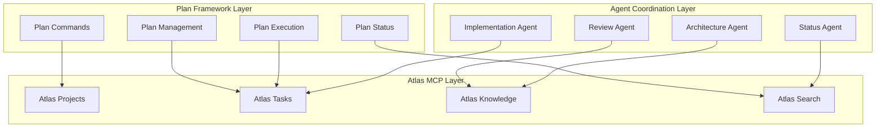
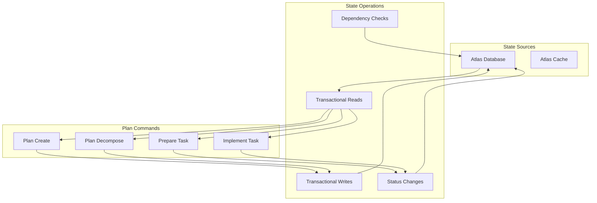

# Claude Code Planning & Execution System Architecture v2.0

**Atlas-Based Work Tracking Implementation**

Generated: 2025-06-22  
Replaces: architecture.md (filesystem-based approach)

## Executive Summary

The Claude Code Planning & Execution System v2.0 represents a fundamental shift from filesystem-based task tracking to a robust, Atlas MCP-powered work management system. This architecture leverages Atlas's project and task management capabilities while preserving the sophisticated multi-agent coordination, automated review cycles, and progressive decomposition that define the original system.

**Key Architectural Changes:**
- **Work Tracking**: Filesystem JSON → Atlas MCP (Projects, Tasks, Knowledge)
- **Hierarchy**: Deep nesting → Flattened tasks with tags and dependencies
- **State Management**: File-based → Database-backed with transactional consistency
- **Search & Query**: File parsing → Atlas unified search across all entities
- **Coordination**: File locks → Database transactions and status management

## Architectural Principles

1. **Atlas-First Design**: All work tracking flows through Atlas MCP, treating it as the single source of truth
2. **Hierarchy Preservation**: Maintain logical planning hierarchy through tags, naming conventions, and dependencies
3. **Backward Compatibility**: Support migration from existing filesystem-based plans
4. **Enhanced Search**: Leverage Atlas unified search for cross-project insights and dependency analysis
5. **Transactional Consistency**: Use Atlas's database backing for reliable state management
6. **Knowledge Integration**: Store execution context, reviews, and documentation as searchable knowledge

## Core Component Architecture

### 1. Work Tracking Foundation



### 2. Entity Mapping Strategy

#### Plan → Atlas Project
```json
{
  "id": "plan-web-app-redesign",
  "name": "Web Application Redesign",
  "description": "Complete redesign of customer portal with modern UX",
  "taskType": "integration",
  "status": "in-progress",
  "completionRequirements": "All user stories implemented, performance tests pass, security audit complete",
  "outputFormat": "Deployed web application with documentation",
  "dependencies": [],
  "urls": [
    {"title": "Original Requirements", "url": "file://requirements.md"},
    {"title": "Design Mockups", "url": "https://figma.com/mockups"}
  ]
}
```

#### Hierarchical Task Flattening
```
Original Hierarchy:
├── Phase 1: Foundation
│   ├── Task 1.1: Setup Development Environment
│   │   ├── Subtask 1.1.1: Configure build tools
│   │   └── Subtask 1.1.2: Setup testing framework
│   └── Task 1.2: Database Schema Design
├── Phase 2: Core Features
│   └── Task 2.1: User Authentication

Flattened Atlas Tasks:
├── 01-001: "Foundation: Setup Development Environment" 
├── 01-001-01: "Foundation: Configure build tools" (depends on 01-001)
├── 01-001-02: "Foundation: Setup testing framework" (depends on 01-001)
├── 01-002: "Foundation: Database Schema Design"
├── 02-001: "Core Features: User Authentication" (depends on 01-002)
```

#### Atlas Task Structure
```json
{
  "id": "01-003",
  "title": "Foundation: Setup Development Environment",
  "description": "Configure development tools, build systems, and testing framework for the project",
  "projectId": "plan-web-app-redesign", 
  "taskType": "integration",
  "status": "todo",
  "priority": "critical",
  "tags": ["phase-01", "task-type-setup", "status-ready"],
  "dependencies": ["01-001", "01-002"],
  "completionRequirements": "Development environment ready, all tools configured, initial test passes",
  "outputFormat": "Working development setup with documentation",
  "urls": [
    {"title": "Setup Guide", "url": "file://setup-guide.md"}
  ]
}
```

### 3. Enhanced ID and Naming Conventions

#### Project Naming
- **Format**: `plan-[kebab-case-name]`
- **Examples**: 
  - `plan-web-app-redesign`
  - `plan-customer-portal-v2`
  - `plan-api-migration-2025`

#### Task Naming & IDs
- **ID Format**: `[phase-num]-[task-num][-subtask-num]`
- **Name Format**: `"[Phase Name]: [Task Name]"`
- **Examples**:
  ```
  ID: 01-003    Name: "Foundation: Setup Development Environment"
  ID: 01-003-01 Name: "Foundation: Configure build tools"
  ID: 02-007    Name: "Core Features: Implement user authentication"
  ID: 03-001-02 Name: "Integration: Setup API Gateway"
  ```

#### Tag Taxonomy
```yaml
Hierarchy Tags:
  - phase-01, phase-02, phase-03, etc.
  
Type Tags:
  - task-type-setup, task-type-implementation, task-type-testing
  - task-type-deployment, task-type-documentation, task-type-review
  
State Tracking Tags:
  - status-ready, status-blocked, status-review, status-preparing
  
Context Tags:
  - has-context, has-architecture-primer, has-dependencies
```

### 6. **Atlas Enum Conformance**

#### Project Status Mapping
```
Plan Status    → Atlas ProjectStatus
pending        → pending
in_progress    → in-progress  
completed      → completed
blocked        → active (with blocked tag)
archived       → archived
```

#### Task Status Mapping  
```
Plan Task Status    → Atlas TaskStatus
pending            → backlog
preparing          → todo (with status-preparing tag)
ready              → todo (with status-ready tag)  
in_progress        → in-progress
ready-for-review   → in-progress (with status-review tag)
completed          → completed
blocked            → todo (with status-blocked tag)
```

#### Priority Mapping
```
Plan Priority    → Atlas PriorityLevel
low             → low
medium          → medium  
high            → high
critical        → critical
```

#### Task Type Mapping
```
Plan Task Type       → Atlas TaskType
setup/configuration → integration
implementation      → generation
testing/validation  → analysis
research/analysis   → research
documentation       → generation
review              → analysis
```

#### Knowledge Domain Mapping
```
Context Type        → Atlas KnowledgeDomain
technical content  → technical
business logic     → business  
research findings  → scientific
```

**Note**: Atlas has limited enum values, so we use tags for substates and more granular categorization.

### 7. **Enum Mapping Functions**

```javascript
// Utility functions for mapping between plan types and Atlas enums

function mapToAtlasTaskType(planTaskType) {
  const mapping = {
    'setup': 'integration',
    'configuration': 'integration', 
    'implementation': 'generation',
    'coding': 'generation',
    'testing': 'analysis',
    'validation': 'analysis',
    'research': 'research',
    'analysis': 'research',
    'documentation': 'generation',
    'review': 'analysis'
  }
  return mapping[planTaskType] || 'generation'
}

function mapToAtlasPriority(planPriority) {
  const mapping = {
    'low': 'low',
    'medium': 'medium',
    'high': 'high', 
    'critical': 'critical',
    'urgent': 'critical'
  }
  return mapping[planPriority] || 'medium'
}

function mapToAtlasProjectStatus(planStatus) {
  const mapping = {
    'pending': 'pending',
    'in_progress': 'in-progress',
    'completed': 'completed',
    'blocked': 'active', // Use tags for blocked state
    'archived': 'archived'
  }
  return mapping[planStatus] || 'active'
}

function mapToAtlasTaskStatus(planTaskStatus) {
  const mapping = {
    'pending': 'backlog',
    'preparing': 'todo', // Use status-preparing tag
    'ready': 'todo', // Use status-ready tag
    'in_progress': 'in-progress',
    'ready-for-review': 'in-progress', // Use status-review tag
    'completed': 'completed',
    'blocked': 'todo' // Use status-blocked tag
  }
  return mapping[planTaskStatus] || 'backlog'
}

function mapToKnowledgeDomain(contextType) {
  const mapping = {
    'technical': 'technical',
    'architecture': 'technical',
    'implementation': 'technical',
    'business': 'business',
    'requirements': 'business',
    'research': 'scientific',
    'analysis': 'scientific'
  }
  return mapping[contextType] || 'technical'
}
```

## Command Architecture Transformation

### 1. Plan Creation (`/plan-create`)

**Atlas Integration Changes:**
```javascript
// Before: Create filesystem directory and files
createDirectory(`/planning/tasks/${planName}/`)
writeFile(`${planName}/PLAN.md`, planContent)
writeFile(`${planName}/README.md`, readme)

// After: Create Atlas project and knowledge
const project = await atlas.createProject({
  id: `plan-${kebabCase(planName)}`,
  name: planName,
  description: extractedDescription,
  completionRequirements: extractedCriteria,
  outputFormat: extractedDeliverables,
  taskType: mapToAtlasTaskType(determinedType), // Uses TaskType enum
  status: "active" // Uses ProjectStatus enum
})

// Store plan documentation as knowledge
await atlas.addKnowledge({
  projectId: project.id,
  text: planContent,
  domain: "business", // Uses KnowledgeDomain.BUSINESS for plan overview
  tags: ["doc-type-plan-overview", "lifecycle-planning", "scope-project", "quality-approved"]
})
```

### 2. Plan Decomposition (`/plan-decompose`)

**Atlas Integration Changes:**
```javascript
// Before: Create phase files with tasks
for (const phase of phases) {
  writeFile(`phase-${phase.number}-${phase.name}.md`, phaseContent)
}

// After: Create flattened Atlas tasks with hierarchy preservation
for (const phase of phases) {
  for (const task of phase.tasks) {
    const atlasTask = await atlas.createTask({
      id: `${phase.number.padStart(2, '0')}-${task.number.padStart(3, '0')}`,
      title: `${phase.name}: ${task.name}`,
      projectId: projectId,
      taskType: mapToAtlasTaskType(task.type), // Uses TaskType enum
      status: "backlog", // Uses TaskStatus enum  
      priority: mapToAtlasPriority(task.priority), // Uses PriorityLevel enum
      tags: [`phase-${phase.number.padStart(2, '0')}`, `task-type-${task.type}`],
      dependencies: calculateDependencies(task),
      completionRequirements: task.acceptanceCriteria.join('; ')
    })
    
    // Create subtasks as dependent tasks
    for (const subtask of task.subtasks) {
      await atlas.createTask({
        id: `${atlasTask.id}-${subtask.number.padStart(2, '0')}`,
        title: `${phase.name}: ${subtask.name}`,
        projectId: projectId,
        taskType: "generation", // Uses TaskType enum for subtasks
        status: "backlog", // Uses TaskStatus enum
        priority: atlasTask.priority, // Inherit parent priority
        dependencies: [atlasTask.id],
        tags: [`phase-${phase.number.padStart(2, '0')}`, "subtask"]
      })
    }
  }
}
```

### 3. Execution Initialization (`/plan-execution-init`)

**Atlas Integration Changes:**
```javascript
// Before: Parse files and create plan-tracker.json
const tracker = parseAllPlanFiles(planDirectory)
writeFile(`${planDirectory}/plan-tracker.json`, tracker)

// After: Verify Atlas entities and sync status
const project = await atlas.getProject(projectId)
const tasks = await atlas.listTasks(projectId)

// Validate structure and dependencies
const dependencyGraph = buildDependencyGraph(tasks)
validateNoCycles(dependencyGraph)

// Sync any status discrepancies
for (const task of tasks) {
  if (needsStatusSync(task)) {
    await atlas.updateTask(task.id, { status: "todo" })
  }
}
```

### 4. Task Preparation (`/plan-prepare-next-task`)

**Atlas Integration Changes:**
```javascript
// Before: Find next task in plan-tracker.json
const nextTask = findNextPendingTask(tracker)
updateTaskStatus(tracker, nextTask.id, "preparing")

// After: Find next task via Atlas search and update
const nextTask = await findNextAvailableAtlasTask(projectId)
await atlas.updateTask(nextTask.id, { 
  status: "todo", // Uses TaskStatus enum
  tags: [...nextTask.tags, "status-preparing"] 
})

// Store preparation context as knowledge
await atlas.addKnowledge({
  projectId: projectId,
  text: contextSummary,
  domain: "technical", // Uses KnowledgeDomain.TECHNICAL
  tags: ["doc-type-task-context", "lifecycle-execution", `scope-task-${nextTask.id}`, "quality-draft"]
})

// Store architecture primer as knowledge
await atlas.addKnowledge({
  projectId: projectId,
  text: JSON.stringify(architectPrimer),
  domain: "technical", // Uses KnowledgeDomain.TECHNICAL
  tags: ["doc-type-architecture-primer", "lifecycle-execution", `scope-task-${nextTask.id}`, "quality-reviewed"]
})
```

### 5. Task Implementation (`/plan-implement-task`)

**Atlas Integration Changes:**
```javascript
// Before: Find ready task and manage via files
const readyTask = findReadyTask(tracker)
updateTaskStatus(tracker, readyTask.id, "in_progress")

// After: Find ready task via Atlas and update atomically
const readyTasks = await atlas.listTasks(projectId, {
  tags: ["status-ready"], 
  status: "todo" // Uses TaskStatus enum
})
const taskToImplement = readyTasks[0]
await atlas.updateTask(taskToImplement.id, { 
  status: "in-progress" // Uses TaskStatus enum
})

// Store review audit as knowledge instead of files
await atlas.addKnowledge({
  projectId: projectId,
  text: JSON.stringify(reviewData),
  domain: "technical", // Uses KnowledgeDomain.TECHNICAL
  tags: ["doc-type-audit-trail", "lifecycle-review", `scope-task-${taskToImplement.id}`, `review-iteration-${iteration}`, "quality-reviewed"]
})
```

## State Management Architecture

### 1. Atlas-Backed State Consistency



### 2. Migration Strategy

#### Phase 1: Dual-Mode Operation
- Commands read from filesystem, write to both filesystem and Atlas
- Gradual validation of Atlas integration
- Fallback mechanisms to filesystem on Atlas failures

#### Phase 2: Atlas-Primary Operation  
- Commands read from Atlas, maintain filesystem for backup
- Full feature parity with filesystem version
- Performance optimization and error handling

#### Phase 3: Atlas-Only Operation
- Remove filesystem dependencies
- Full Atlas integration with enhanced features
- Advanced search and cross-project analytics

## Enhanced Capabilities

### 1. Cross-Project Analytics
```javascript
// Find similar tasks across all projects
const similarTasks = await atlas.unifiedSearch({
  value: "authentication implementation",
  entityTypes: ["task"],
  fuzzy: true
})

// Find knowledge patterns
const authPatterns = await atlas.unifiedSearch({
  value: "authentication patterns",
  entityTypes: ["knowledge"],
  tags: ["doc-type-patterns", "doc-type-architecture-docs"]
})
```

### 2. Advanced Dependency Management
```javascript
// Find dependency chains across projects
const dependencyChain = await findTaskDependencyChain(taskId)

// Identify cross-project blockers
const crossProjectBlockers = await atlas.listTasks(null, {
  status: "todo",
  tags: ["blocked", "dependency-external"]
})
```

### 3. Knowledge Discovery
```javascript
// Find relevant implementation patterns
const patterns = await atlas.searchNodes({
  query: "error handling patterns microservices"
})

// Discover architectural insights across projects
const architecturalInsights = await atlas.unifiedSearch({
  value: "microservices communication",
  entityTypes: ["knowledge"],
  tags: ["doc-type-architecture-docs", "doc-type-architecture-primer"]
})
```

## Agent Coordination Architecture

### 1. Enhanced Agent Context

**Before: File-based context loading**
```javascript
const context = readFile(`${scratchDir}/initial-context-summary.md`)
const architectReview = readFile(`${scratchDir}/architect-review-${timestamp}.json`)
```

**After: Atlas knowledge integration**
```javascript
const contextKnowledge = await atlas.searchNodes({
  query: `task-${taskId} doc-type-task-context`
})
const architectReview = await atlas.searchNodes({
  query: `task-${taskId} doc-type-architecture-primer`
})
const projectKnowledge = await atlas.listKnowledge(projectId, {
  tags: ["doc-type-plan-overview", "doc-type-architecture-docs", "doc-type-patterns"]
})
```

### 2. Cross-Project Learning

```javascript
// Implementation Agent can access patterns from similar tasks
const implementationAgent = new Agent({
  context: {
    currentTask: task,
    projectContext: projectKnowledge,
    similarImplementations: await findSimilarImplementations(task.description),
    organizationalPatterns: await getOrganizationalPatterns(task.taskType)
  }
})
```

## Quality Assurance Integration

### 1. Knowledge-Backed Reviews
```javascript
// Review Agent access to historical review patterns
const reviewPatterns = await atlas.unifiedSearch({
  value: task.taskType + " common issues",
  entityTypes: ["knowledge"],
  tags: ["doc-type-review-findings", "doc-type-patterns"]
})

// Store review findings as searchable knowledge
await atlas.addKnowledge({
  projectId: projectId,
  text: JSON.stringify(reviewFindings),
  domain: "technical",
  tags: ["doc-type-review-findings", "lifecycle-review", `scope-task-${task.id}`, `severity-${severity}`, "quality-reviewed"]
})
```

### 2. Organizational Learning

```javascript
// Identify recurring issues across projects
const recurringIssues = await atlas.unifiedSearch({
  value: "blocker severity-major",
  entityTypes: ["knowledge"],
  tags: ["doc-type-review-findings"]
})

// Build knowledge base of solutions
const solutionPatterns = await atlas.unifiedSearch({
  value: "resolution-successful",
  entityTypes: ["knowledge"],
  tags: ["doc-type-patterns", "doc-type-lessons-learned"]
})
```

## Error Handling & Recovery

### 1. Atlas Connection Management
```javascript
class AtlasConnectionManager {
  async executeWithRetry(operation, maxRetries = 3) {
    for (let attempt = 1; attempt <= maxRetries; attempt++) {
      try {
        return await operation()
      } catch (error) {
        if (attempt === maxRetries) throw error
        await this.backoff(attempt)
      }
    }
  }
  
  async fallbackToFileSystem(operation) {
    // Temporary fallback during transition
    return await fileSystemOperation(operation)
  }
}
```

### 2. State Recovery Mechanisms
```javascript
// Detect and recover from inconsistent state
async function validateAndRepairProjectState(projectId) {
  const project = await atlas.getProject(projectId)
  const tasks = await atlas.listTasks(projectId)
  
  // Check for orphaned tasks
  const orphanedTasks = tasks.filter(task => !task.dependencies.every(dep => 
    tasks.some(t => t.id === dep)
  ))
  
  // Repair dependency references
  for (const task of orphanedTasks) {
    await repairTaskDependencies(task)
  }
}
```

## Performance Optimization

### 1. Efficient Querying
```javascript
// Batch operations for better performance
const batchOperations = tasks.map(task => ({
  operation: 'update',
  id: task.id,
  updates: { status: 'completed' }
}))

await atlas.taskUpdateBulk(batchOperations)

// Use Atlas unified search for complex queries instead of multiple API calls
const complexQuery = await atlas.unifiedSearch({
  value: searchTerm,
  entityTypes: ["task", "knowledge"],
  projectId: projectId,
  limit: 50
})
```

### 2. Caching Strategy
```javascript
class PlanCache {
  constructor() {
    this.projectCache = new Map()
    this.taskCache = new Map()
    this.knowledgeCache = new Map()
  }
  
  async getProject(projectId) {
    if (!this.projectCache.has(projectId)) {
      const project = await atlas.getProject(projectId)
      this.projectCache.set(projectId, project)
    }
    return this.projectCache.get(projectId)
  }
}
```

## Future Architecture Considerations

### 1. Enhanced Intelligence
- **Pattern Recognition**: ML-based analysis of successful implementation patterns
- **Predictive Analytics**: Estimated completion times based on historical data
- **Risk Prediction**: Early identification of potential blockers based on task patterns

### 2. Collaboration Features
- **Multi-User Coordination**: Support for multiple team members working on same project
- **Real-time Updates**: Live synchronization of status changes across team members
- **Conflict Resolution**: Automatic handling of concurrent modifications

### 3. Integration Expansion
- **External Tool Integration**: Connect with Jira, GitHub, linear for unified work tracking
- **API Development**: RESTful APIs for external integrations
- **Webhook Support**: Real-time notifications for status changes

## Knowledge Categorization System

### Document Type Taxonomy

Atlas knowledge items are categorized using a structured tagging system that distinguishes between different document types and their roles in the planning workflow:

#### 1. **Imperative Documents** (Action-Oriented)
These documents drive execution and require updates as work progresses:

```yaml
Planning Documents:
  - doc-type-plan-overview     # High-level plan structure (PLAN.md)
  - doc-type-execution-plan    # Detailed phase breakdowns
  - doc-type-task-context      # Task-specific implementation context
  - doc-type-status-report     # Progress and status updates

Review & Quality:
  - doc-type-review-findings   # Code review results and feedback
  - doc-type-audit-trail       # Review iteration history
  - doc-type-implementation-notes # Developer implementation decisions

Architecture Planning:
  - doc-type-architecture-primer # Pre-task architecture analysis
  - doc-type-integration-plan    # System integration specifications
```

#### 2. **Reference Documents** (Information-Oriented)
These documents provide stable reference information:

```yaml
Requirements & Standards:
  - doc-type-requirements      # Business/functional requirements
  - doc-type-architecture-docs # System architecture documentation
  - doc-type-standards         # Coding and process standards
  - doc-type-specifications    # Technical specifications

Knowledge & Research:
  - doc-type-research          # Investigation findings and analysis
  - doc-type-patterns          # Reusable implementation patterns
  - doc-type-lessons-learned   # Post-implementation insights
  - doc-type-reference         # General reference material
```

#### 3. **Contextual Metadata Tags**
Additional tags provide search and filtering capabilities:

```yaml
Lifecycle Stage:
  - lifecycle-planning         # Created during planning phase
  - lifecycle-execution        # Created during implementation
  - lifecycle-review          # Created during review cycles
  - lifecycle-completion      # Created after task completion

Content Scope:
  - scope-project             # Applies to entire project
  - scope-phase               # Applies to specific phase
  - scope-task                # Applies to specific task
  - scope-cross-project       # Applies across multiple projects

Quality Level:
  - quality-draft             # Work in progress
  - quality-reviewed          # Has been reviewed
  - quality-approved          # Officially approved
  - quality-archived          # Historical/deprecated
```

### Knowledge Storage Examples

```javascript
// Plan overview (imperative)
await atlas.addKnowledge({
  projectId: projectId,
  text: planOverviewContent,
  domain: "business",
  tags: [
    "doc-type-plan-overview",
    "lifecycle-planning", 
    "scope-project",
    "quality-approved"
  ]
})

// Architecture documentation (reference)
await atlas.addKnowledge({
  projectId: projectId,
  text: architectureDocumentation,
  domain: "technical",
  tags: [
    "doc-type-architecture-docs",
    "lifecycle-planning",
    "scope-project", 
    "quality-reviewed"
  ]
})

// Task implementation context (imperative)
await atlas.addKnowledge({
  projectId: projectId,
  text: contextSummary,
  domain: "technical",
  tags: [
    "doc-type-task-context",
    "lifecycle-execution",
    `scope-task-${taskId}`,
    "quality-draft"
  ]
})

// Review findings (imperative)
await atlas.addKnowledge({
  projectId: projectId,
  text: JSON.stringify(reviewFindings),
  domain: "technical",
  tags: [
    "doc-type-review-findings",
    "lifecycle-review",
    `scope-task-${taskId}`,
    `review-iteration-${iteration}`,
    "quality-reviewed"
  ]
})

// Research findings (reference)
await atlas.addKnowledge({
  projectId: projectId,
  text: researchContent,
  domain: "scientific",
  tags: [
    "doc-type-research",
    "lifecycle-planning",
    "scope-cross-project",
    "quality-approved"
  ]
})
```

## Migration Strategy

### Direct Migration to Atlas

The migration strategy uses a dedicated command to read existing filesystem-based plans and convert them directly to Atlas entities. No dual-mode operation is required.

### 1. Migration Command: `/plan-migrate-to-atlas`

```bash
# Migrate specific plan from filesystem to Atlas
/plan-migrate-to-atlas "existing-plan-name"

# Migrate all plans in /planning/tasks/
/plan-migrate-to-atlas --all

# Dry run to preview migration changes
/plan-migrate-to-atlas "plan-name" --dry-run

# Force migration (overwrite existing Atlas project)
/plan-migrate-to-atlas "plan-name" --force
```

### 2. Migration Process

The migration command performs the following operations:

#### Phase 1: Discovery and Validation
```javascript
async function migratePlanToAtlas(planName, options = {}) {
  // 1. Discover filesystem plan structure
  const planPath = `/planning/tasks/${planName}/`
  const planFiles = await discoverPlanFiles(planPath)
  
  // 2. Validate completeness
  validatePlanStructure(planFiles)
  
  // 3. Check for existing Atlas project
  const existingProject = await atlas.getProject(`plan-${kebabCase(planName)}`)
  if (existingProject && !options.force) {
    throw new Error(`Atlas project already exists. Use --force to overwrite.`)
  }
}
```

#### Phase 2: Project Creation
```javascript
// Parse PLAN.md and README.md for project metadata
const planMetadata = parsePlanOverview(planFiles['PLAN.md'])
const projectData = {
  id: `plan-${kebabCase(planName)}`,
  name: planMetadata.title,
  description: planMetadata.description,
  taskType: mapToAtlasTaskType(planMetadata.type),
  status: mapToAtlasProjectStatus(planMetadata.status),
  completionRequirements: planMetadata.successCriteria.join('; '),
  outputFormat: planMetadata.deliverables.join(', ')
}

const atlasProject = await atlas.createProject(projectData)
```

#### Phase 3: Knowledge Migration
```javascript
// Migrate plan documentation as categorized knowledge
const knowledgeItems = []

// Plan overview (imperative)
knowledgeItems.push({
  text: planFiles['PLAN.md'],
  domain: "business",
  tags: ["doc-type-plan-overview", "lifecycle-planning", "scope-project", "quality-approved"]
})

// Phase documentation (imperative)
for (const phaseFile of planFiles.phases) {
  knowledgeItems.push({
    text: phaseFile.content,
    domain: "technical", 
    tags: ["doc-type-execution-plan", "lifecycle-planning", `scope-phase-${phaseFile.number}`, "quality-approved"]
  })
}

// Architecture documentation (reference)
if (planFiles['architecture.md']) {
  knowledgeItems.push({
    text: planFiles['architecture.md'],
    domain: "technical",
    tags: ["doc-type-architecture-docs", "lifecycle-planning", "scope-project", "quality-reviewed"]
  })
}

// Standards documentation (reference)  
if (planFiles['standards.md']) {
  knowledgeItems.push({
    text: planFiles['standards.md'],
    domain: "technical",
    tags: ["doc-type-standards", "lifecycle-planning", "scope-project", "quality-reviewed"]
  })
}

// Bulk create knowledge items
await atlas.addKnowledge(atlasProject.id, { mode: "bulk", knowledge: knowledgeItems })
```

#### Phase 4: Task Migration
```javascript
// Parse plan-tracker.json if it exists
const tracker = planFiles['plan-tracker.json'] ? JSON.parse(planFiles['plan-tracker.json']) : null
const tasks = []

if (tracker) {
  // Migrate existing tasks from tracker
  for (const phase of tracker.phases) {
    for (const task of phase.tasks) {
      tasks.push({
        id: task.id,
        title: `${phase.name}: ${task.name}`,
        description: task.description,
        projectId: atlasProject.id,
        taskType: mapToAtlasTaskType(task.type),
        status: mapToAtlasTaskStatus(task.status),
        priority: mapToAtlasPriority(task.priority),
        tags: [`phase-${phase.id}`, ...generateTaskTags(task)],
        dependencies: task.dependencies,
        completionRequirements: task.acceptanceCriteria?.join('; ') || '',
        outputFormat: task.deliverables?.join(', ') || ''
      })
      
      // Migrate subtasks
      for (const subtask of task.subtasks || []) {
        tasks.push({
          id: `${task.id}-${subtask.id}`,
          title: `${phase.name}: ${subtask.name}`,
          description: subtask.description,
          projectId: atlasProject.id,
          taskType: "generation",
          status: mapToAtlasTaskStatus(subtask.status),
          priority: task.priority, // Inherit from parent
          dependencies: [task.id],
          tags: [`phase-${phase.id}`, "subtask"]
        })
      }
    }
  }
} else {
  // Parse phase files for task structure
  tasks = parseTasksFromPhaseFiles(planFiles.phases)
}

// Bulk create tasks
await atlas.createTask(atlasProject.id, { mode: "bulk", tasks: tasks })
```

#### Phase 5: Execution Context Migration
```javascript
// Migrate scratch directory contents if they exist
const scratchPath = `${planPath}/scratch/`
if (await exists(scratchPath)) {
  const contextItems = await migrateScratchContents(scratchPath, atlasProject.id)
  await atlas.addKnowledge(atlasProject.id, { mode: "bulk", knowledge: contextItems })
}

async function migrateScratchContents(scratchPath, projectId) {
  const contextItems = []
  
  // Find all task directories
  const taskDirs = await glob(`${scratchPath}/**/task-*`)
  
  for (const taskDir of taskDirs) {
    const taskId = extractTaskIdFromPath(taskDir)
    
    // Migrate context files
    if (await exists(`${taskDir}/initial-context-summary.md`)) {
      contextItems.push({
        text: await readFile(`${taskDir}/initial-context-summary.md`),
        domain: "technical",
        tags: ["doc-type-task-context", "lifecycle-execution", `scope-task-${taskId}`, "quality-draft"]
      })
    }
    
    // Migrate architecture reviews
    const archFiles = await glob(`${taskDir}/architect-review-*.json`)
    for (const archFile of archFiles) {
      contextItems.push({
        text: await readFile(archFile),
        domain: "technical", 
        tags: ["doc-type-architecture-primer", "lifecycle-execution", `scope-task-${taskId}`, "quality-reviewed"]
      })
    }
    
    // Migrate review audit trails
    const auditPath = `${taskDir}/review-audit/`
    if (await exists(auditPath)) {
      const auditItems = await migrateReviewAudit(auditPath, taskId)
      contextItems.push(...auditItems)
    }
  }
  
  return contextItems
}
```

### 3. Migration Validation

```javascript
// Verify migration completeness
async function validateMigration(planName) {
  const originalPlan = await parseFilesystemPlan(planName)
  const migratedProject = await atlas.getProject(`plan-${kebabCase(planName)}`)
  
  // Validate project metadata
  assert(migratedProject.name === originalPlan.name)
  
  // Validate task count and structure
  const atlasTasks = await atlas.listTasks(migratedProject.id)
  assert(atlasTasks.length === originalPlan.totalTasks)
  
  // Validate knowledge items
  const atlasKnowledge = await atlas.listKnowledge(migratedProject.id)
  assert(atlasKnowledge.length >= originalPlan.documentCount)
  
  // Validate dependencies
  const dependencyGraph = buildAtlasDependencyGraph(atlasTasks)
  const originalGraph = buildOriginalDependencyGraph(originalPlan)
  assert(dependencyGraphsEqual(dependencyGraph, originalGraph))
  
  return {
    status: "success",
    summary: {
      project: migratedProject.name,
      tasks: atlasTasks.length,
      knowledge: atlasKnowledge.length,
      dependencies: dependencyGraph.edges.length
    }
  }
}
```

### 4. Post-Migration

After successful migration:

1. **Archive Filesystem Plan**: Move original plan to `/planning/archive/`
2. **Update Commands**: All plan commands automatically work with Atlas backend
3. **Verification**: Use `/plan-status` to verify migration integrity

```bash
# Post-migration workflow
/plan-migrate-to-atlas "web-app-redesign"
/plan-status "web-app-redesign"  # Verify migration
/plan-prepare-next-task          # Continue with Atlas-based execution
```

## Conclusion

The Atlas-based architecture represents a significant evolution of the Claude Code Planning & Execution System. By leveraging Atlas's robust project and task management capabilities, the system gains:

- **Reliability**: Database-backed state management with transactional consistency
- **Searchability**: Advanced search across all projects, tasks, and knowledge
- **Scalability**: Support for larger projects and multiple concurrent projects  
- **Intelligence**: Cross-project learning and pattern recognition
- **Collaboration**: Foundation for multi-user and team-based workflows

The architectural transformation preserves the sophisticated agent coordination and quality assurance features that define the system while providing a more robust and extensible foundation for future enhancements.