# Claude Code Planning & Execution System Architecture

Generated: 2025-06-21

## Executive Summary

The Claude Code Planning & Execution System is a comprehensive AI-assisted project management and development orchestration platform. It implements a structured workflow from high-level ideation through detailed task execution, featuring automated code review cycles, intelligent dependency management, and multi-agent coordination.

## Core Architectural Principles

1. **Progressive Decomposition**: High-level plans are iteratively broken down into executable tasks
2. **Dependency-Aware Execution**: Tasks execute in proper order based on dependency graphs
3. **Multi-Agent Orchestration**: Specialized agents handle implementation, review, and coordination
4. **Audit Trail Preservation**: Complete history of decisions, reviews, and iterations
5. **State Persistence**: All progress tracked in structured JSON with file-based coordination
6. **Smart Update Detection**: Timestamp-based incremental updates to avoid redundant work

## System Components Overview

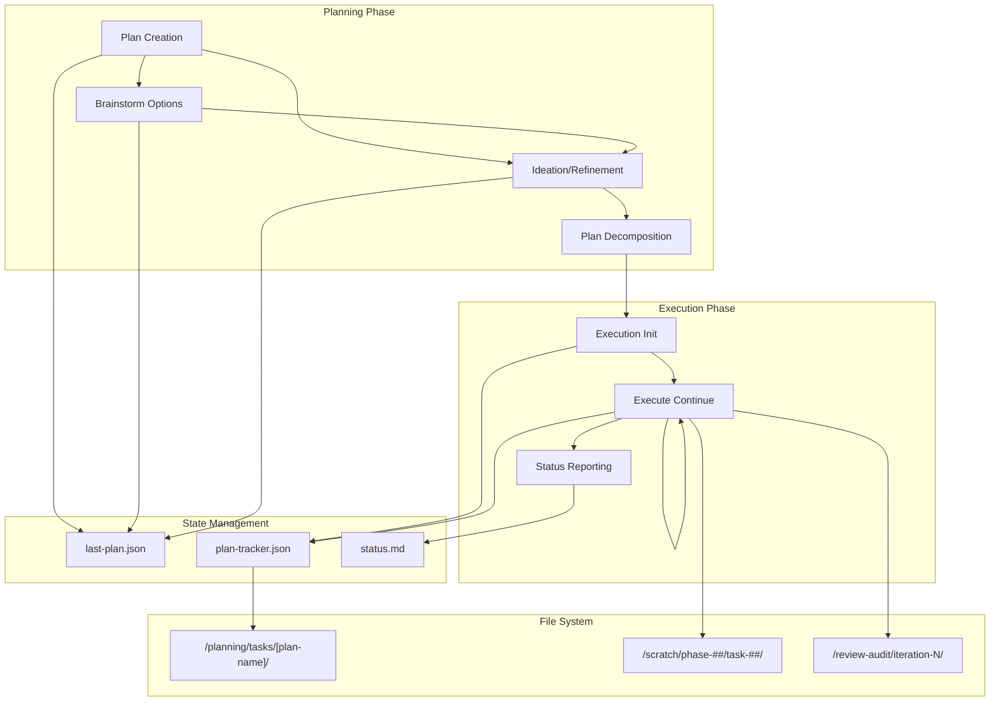
```mermaid
graph TB
    subgraph "Planning Phase"
        PC[Plan Creation] --> BO[Brainstorm Options]
        PC --> ID[Ideation/Refinement]
        BO --> ID
        ID --> DC[Plan Decomposition]
    end
    
    subgraph "Execution Phase"
        EI[Execution Init] --> EC[Execute Continue]
        EC --> ST[Status Reporting]
        EC --> EC
    end
    
    subgraph "State Management"
        LP[last-plan.json]
        PT[plan-tracker.json]
        SM[status.md]
    end
    
    subgraph "File System"
        PD["/planning/tasks/[plan-name]/"]
        SC["/scratch/phase-##/task-##/"]
        RA["/review-audit/iteration-N/"]
    end
    
    DC --> EI
    PC --> LP
    BO --> LP
    ID --> LP
    EI --> PT
    EC --> PT
    ST --> SM
    
    PT --> PD
    EC --> SC
    EC --> RA
```

## Data Flow Architecture

### 1. Planning Data Flow

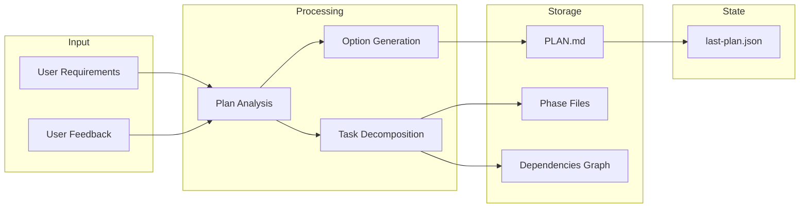
```mermaid
flowchart LR
    subgraph Input
        UR[User Requirements]
        FB[User Feedback]
    end
    
    subgraph Processing
        PA[Plan Analysis]
        OG[Option Generation]
        TD[Task Decomposition]
    end
    
    subgraph Storage
        PM[PLAN.md]
        PF[Phase Files]
        DG[Dependencies Graph]
    end
    
    subgraph State
        LP[last-plan.json]
    end
    
    UR --> PA
    FB --> PA
    PA --> OG
    PA --> TD
    OG --> PM
    TD --> PF
    TD --> DG
    PM --> LP
```

### 2. Execution Data Flow

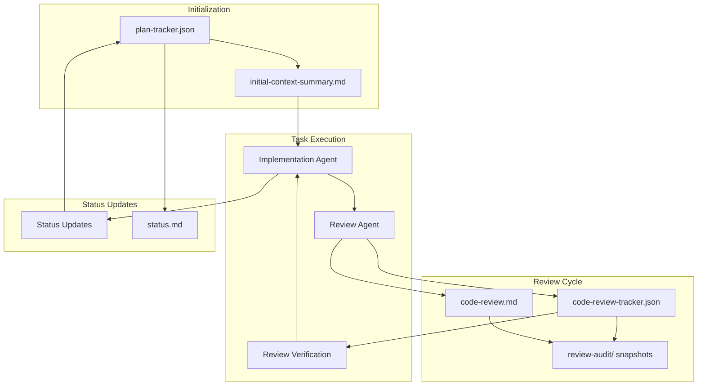
```mermaid
flowchart TD
    subgraph Initialization
        PT[plan-tracker.json]
        IC[initial-context-summary.md]
    end
    
    subgraph Task Execution
        IA[Implementation Agent]
        RA[Review Agent]
        RV[Review Verification]
    end
    
    subgraph Review Cycle
        CR[code-review.md]
        CT[code-review-tracker.json]
        AS[review-audit/ snapshots]
    end
    
    subgraph Status Updates
        SU[Status Updates]
        SM[status.md]
    end
    
    PT --> IC
    IC --> IA
    IA --> RA
    RA --> CR
    RA --> CT
    CR --> AS
    CT --> AS
    CT --> RV
    RV --> IA
    IA --> SU
    SU --> PT
    PT --> SM
```

## Component Architecture

### 1. Plan Creation (`/plan-create`)

**Purpose**: Transform user requirements into structured high-level plans

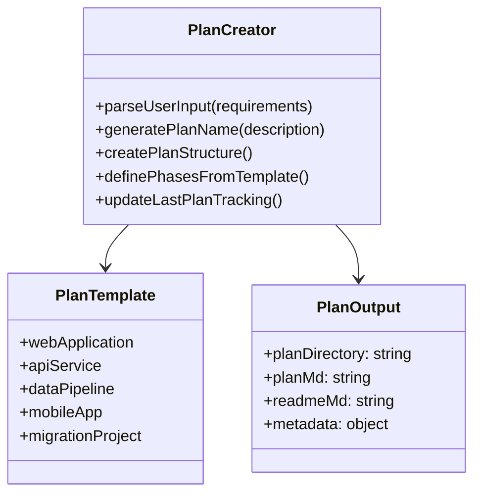
```mermaid
classDiagram
    class PlanCreator {
        +parseUserInput(requirements)
        +generatePlanName(description)
        +createPlanStructure()
        +definePhasesFromTemplate()
        +updateLastPlanTracking()
    }
    
    class PlanTemplate {
        +webApplication
        +apiService
        +dataPipeline
        +mobileApp
        +migrationProject
    }
    
    class PlanOutput {
        +planDirectory: string
        +planMd: string
        +readmeMd: string
        +metadata: object
    }
    
    PlanCreator --> PlanTemplate
    PlanCreator --> PlanOutput
```

**Key Features**:
- Automatic plan name generation from user input
- Template-based phase creation for different project types
- Last plan tracking via `/planning/tasks/last-plan.json`
- Risk assessment integration

### 2. Strategic Options (`/plan-brainstorm-options`)

**Purpose**: Generate and analyze strategic implementation alternatives

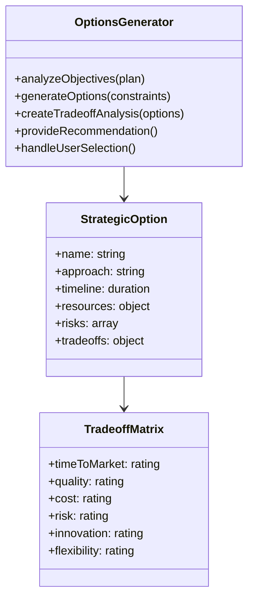
```mermaid
classDiagram
    class OptionsGenerator {
        +analyzeObjectives(plan)
        +generateOptions(constraints)
        +createTradeoffAnalysis(options)
        +provideRecommendation()
        +handleUserSelection()
    }
    
    class StrategicOption {
        +name: string
        +approach: string
        +timeline: duration
        +resources: object
        +risks: array
        +tradeoffs: object
    }
    
    class TradeoffMatrix {
        +timeToMarket: rating
        +quality: rating
        +cost: rating
        +risk: rating
        +innovation: rating
        +flexibility: rating
    }
    
    OptionsGenerator --> StrategicOption
    StrategicOption --> TradeoffMatrix
```

**Decision Framework**:
- Business factors (time to market, competitive advantage)
- Technical factors (architecture quality, maintainability)
- Team factors (skill requirements, satisfaction)
- Risk factors (technical, market, execution risks)

### 3. Plan Ideation (`/plan-ideate`)

**Purpose**: Incorporate feedback and refine existing plans

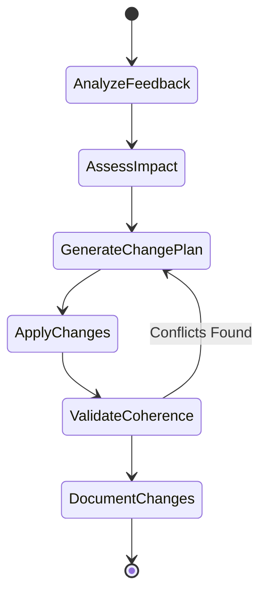
```mermaid
stateDiagram-v2
    [*] --> AnalyzeFeedback
    AnalyzeFeedback --> AssessImpact
    AssessImpact --> GenerateChangePlan
    GenerateChangePlan --> ApplyChanges
    ApplyChanges --> ValidateCoherence
    ValidateCoherence --> DocumentChanges
    DocumentChanges --> [*]
    
    ValidateCoherence --> GenerateChangePlan : Conflicts Found
```

**Change Categories**:
- Feature Addition
- Approach Modification
- Scope Adjustment
- Priority Shift

### 4. Plan Decomposition (`/plan-decompose`)

**Purpose**: Break high-level phases into detailed, executable tasks

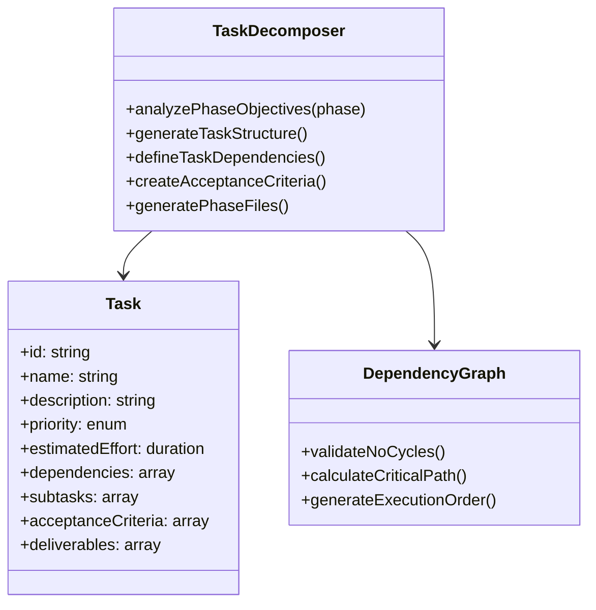
```mermaid
classDiagram
    class TaskDecomposer {
        +analyzePhaseObjectives(phase)
        +generateTaskStructure()
        +defineTaskDependencies()
        +createAcceptanceCriteria()
        +generatePhaseFiles()
    }
    
    class Task {
        +id: string
        +name: string
        +description: string
        +priority: enum
        +estimatedEffort: duration
        +dependencies: array
        +subtasks: array
        +acceptanceCriteria: array
        +deliverables: array
    }
    
    class DependencyGraph {
        +validateNoCycles()
        +calculateCriticalPath()
        +generateExecutionOrder()
    }
    
    TaskDecomposer --> Task
    TaskDecomposer --> DependencyGraph
```

**Task Patterns by Phase Type**:
- Development: Setup → Implementation → Testing → Review → Documentation
- Infrastructure: Provisioning → Configuration → Security → Monitoring → Deployment
- Data: Schema Design → Modeling → ETL → Validation → Optimization

### 5. Execution Initialization (`/plan-execution-init`)

**Purpose**: Create comprehensive tracking structure from plan files

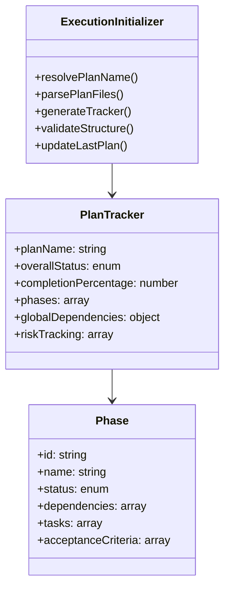
```mermaid
classDiagram
    class ExecutionInitializer {
        +resolvePlanName()
        +parsePlanFiles()
        +generateTracker()
        +validateStructure()
        +updateLastPlan()
    }
    
    class PlanTracker {
        +planName: string
        +overallStatus: enum
        +completionPercentage: number
        +phases: array
        +globalDependencies: object
        +riskTracking: array
    }
    
    class Phase {
        +id: string
        +name: string
        +status: enum
        +dependencies: array
        +tasks: array
        +acceptanceCriteria: array
    }
    
    ExecutionInitializer --> PlanTracker
    PlanTracker --> Phase
```

### 6. Execution Engine (`/plan-execute-continue`)

**Purpose**: Orchestrate task execution with automated review cycles

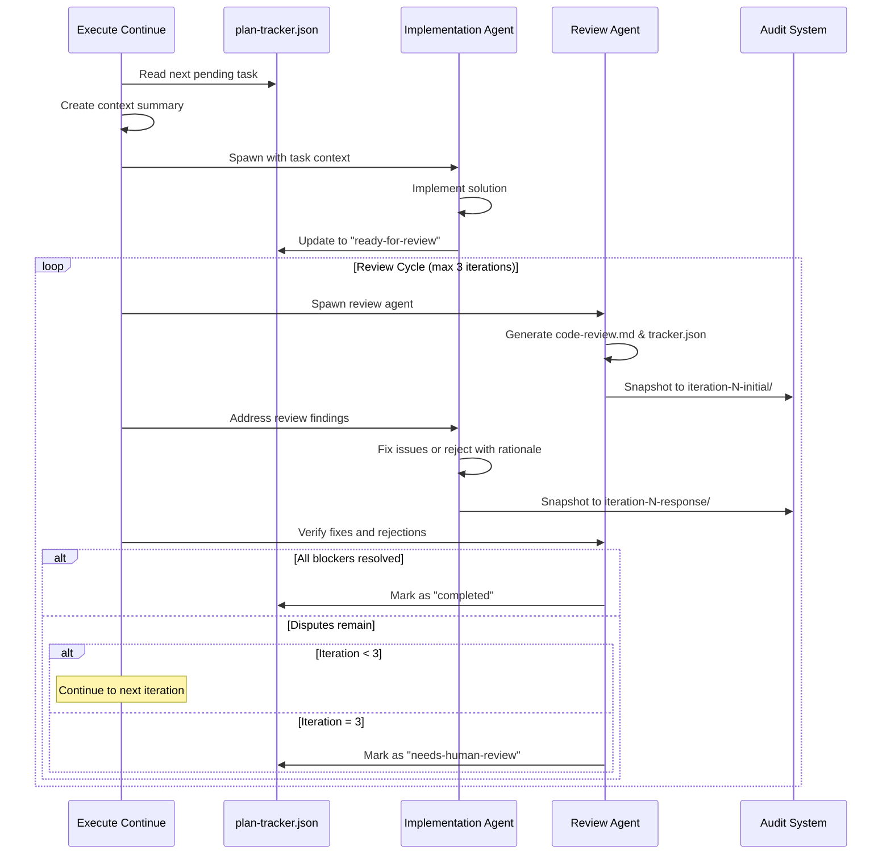
```mermaid
sequenceDiagram
    participant EC as Execute Continue
    participant PT as plan-tracker.json
    participant IA as Implementation Agent
    participant RA as Review Agent
    participant AS as Audit System
    
    EC->>PT: Read next pending task
    EC->>EC: Create context summary
    EC->>IA: Spawn with task context
    IA->>IA: Implement solution
    IA->>PT: Update to "ready-for-review"
    
    loop Review Cycle (max 3 iterations)
        EC->>RA: Spawn review agent
        RA->>RA: Generate code-review.md & tracker.json
        RA->>AS: Snapshot to iteration-N-initial/
        EC->>IA: Address review findings
        IA->>IA: Fix issues or reject with rationale
        IA->>AS: Snapshot to iteration-N-response/
        EC->>RA: Verify fixes and rejections
        
        alt All blockers resolved
            RA->>PT: Mark as "completed"
        else Disputes remain
            alt Iteration < 3
                Note over EC: Continue to next iteration
            else Iteration = 3
                RA->>PT: Mark as "needs-human-review"
            end
        end
    end
```

**Review Audit Architecture**:

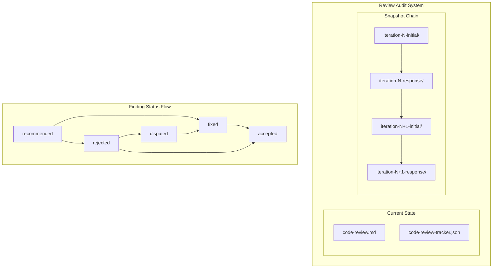
```mermaid
graph TD
    subgraph "Review Audit System"
        II[iteration-N-initial/]
        IR[iteration-N-response/]
        
        subgraph "Current State"
            CR[code-review.md]
            CRT[code-review-tracker.json]
        end
        
        subgraph "Snapshot Chain"
            II --> IR
            IR --> II2[iteration-N+1-initial/]
            II2 --> IR2[iteration-N+1-response/]
        end
    end
    
    subgraph "Finding Status Flow"
        REC[recommended] --> FIXED[fixed]
        REC --> REJ[rejected]
        FIXED --> ACC[accepted]
        REJ --> ACC
        REJ --> DISP[disputed]
        DISP --> FIXED
    end
```

### 7. Status Reporting (`/plan-status`)

**Purpose**: Generate comprehensive progress reports with smart updates

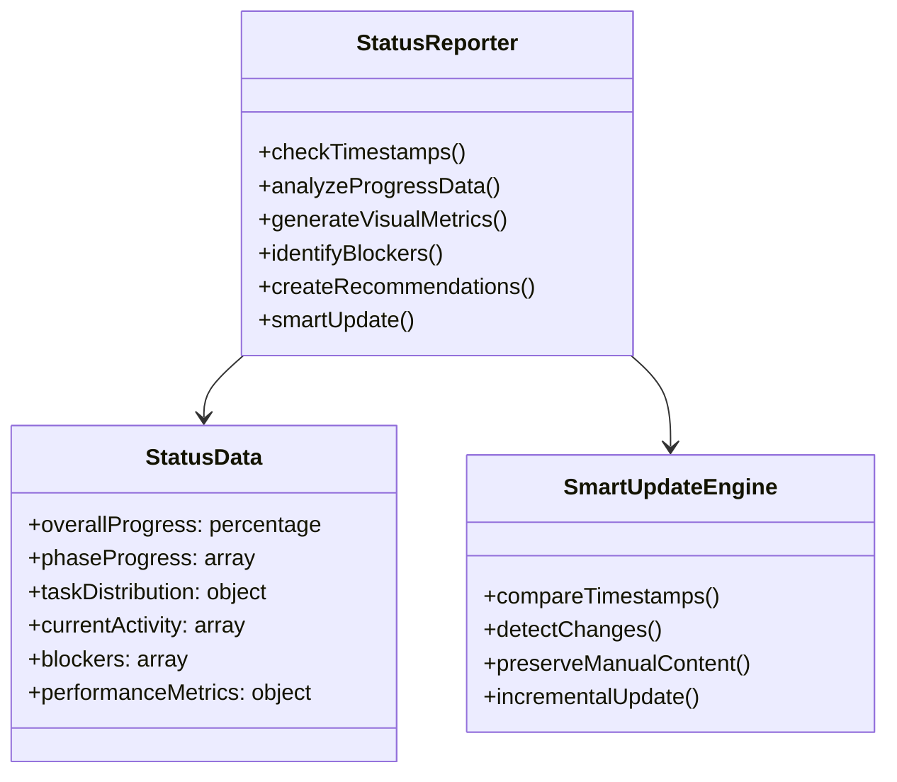
```mermaid
classDiagram
    class StatusReporter {
        +checkTimestamps()
        +analyzeProgressData()
        +generateVisualMetrics()
        +identifyBlockers()
        +createRecommendations()
        +smartUpdate()
    }
    
    class StatusData {
        +overallProgress: percentage
        +phaseProgress: array
        +taskDistribution: object
        +currentActivity: array
        +blockers: array
        +performanceMetrics: object
    }
    
    class SmartUpdateEngine {
        +compareTimestamps()
        +detectChanges()
        +preserveManualContent()
        +incrementalUpdate()
    }
    
    StatusReporter --> StatusData
    StatusReporter --> SmartUpdateEngine
```

## State Management Architecture

### 1. Plan State Hierarchy

```
/planning/tasks/[plan-name]/
├── PLAN.md                     # High-level plan structure
├── README.md                   # Project overview
├── phase-01-[name].md          # Detailed phase breakdown
├── phase-02-[name].md
├── dependencies.md             # Dependency graph
├── plan-tracker.json          # Execution state
├── status.md                   # Progress reports
└── scratch/                    # Execution workspace
    └── phase-[##]/
        └── task-[##]/
            ├── initial-context-summary.md
            ├── implementation-notes.md
            ├── code-review.md
            ├── code-review-tracker.json
            └── review-audit/
                ├── iteration-1-initial/
                ├── iteration-1-response/
                ├── iteration-2-initial/
                └── iteration-2-response/
```

### 2. State Synchronization

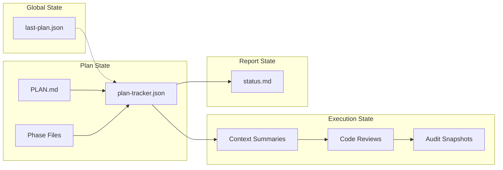
```mermaid
graph LR
    subgraph "Global State"
        LP[last-plan.json]
    end
    
    subgraph "Plan State"
        PT[plan-tracker.json]
        PM[PLAN.md]
        PF[Phase Files]
    end
    
    subgraph "Execution State"
        CS[Context Summaries]
        CR[Code Reviews]
        AS[Audit Snapshots]
    end
    
    subgraph "Report State"
        SM[status.md]
    end
    
    LP -.-> PT
    PT --> CS
    CS --> CR
    CR --> AS
    PT --> SM
    PM --> PT
    PF --> PT
```

## Multi-Agent Coordination

### 1. Agent Responsibilities

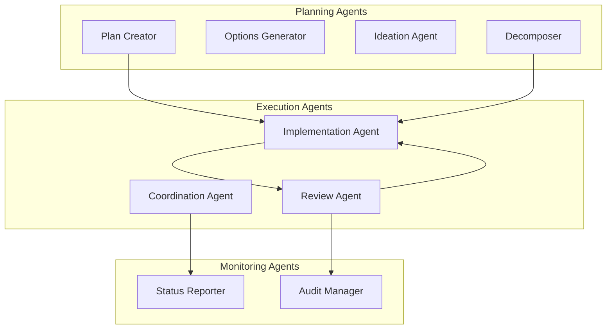
```mermaid
graph TD
    subgraph "Planning Agents"
        PC[Plan Creator]
        OG[Options Generator]
        ID[Ideation Agent]
        DC[Decomposer]
    end
    
    subgraph "Execution Agents"
        IA[Implementation Agent]
        RA[Review Agent]
        CO[Coordination Agent]
    end
    
    subgraph "Monitoring Agents"
        ST[Status Reporter]
        AU[Audit Manager]
    end
    
    PC --> IA
    DC --> IA
    IA --> RA
    RA --> IA
    CO --> ST
    RA --> AU
```

### 2. Agent Communication Protocol

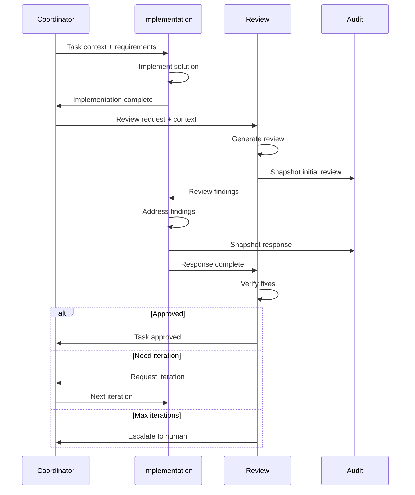
```mermaid
sequenceDiagram
    participant CO as Coordinator
    participant IA as Implementation
    participant RA as Review
    participant AU as Audit
    
    CO->>IA: Task context + requirements
    IA->>IA: Implement solution
    IA->>CO: Implementation complete
    CO->>RA: Review request + context
    RA->>RA: Generate review
    RA->>AU: Snapshot initial review
    RA->>IA: Review findings
    IA->>IA: Address findings
    IA->>AU: Snapshot response
    IA->>RA: Response complete
    RA->>RA: Verify fixes
    
    alt Approved
        RA->>CO: Task approved
    else Need iteration
        RA->>CO: Request iteration
        CO->>IA: Next iteration
    else Max iterations
        RA->>CO: Escalate to human
    end
```

## Quality Assurance Architecture

### 1. Multi-Layer Quality Checks

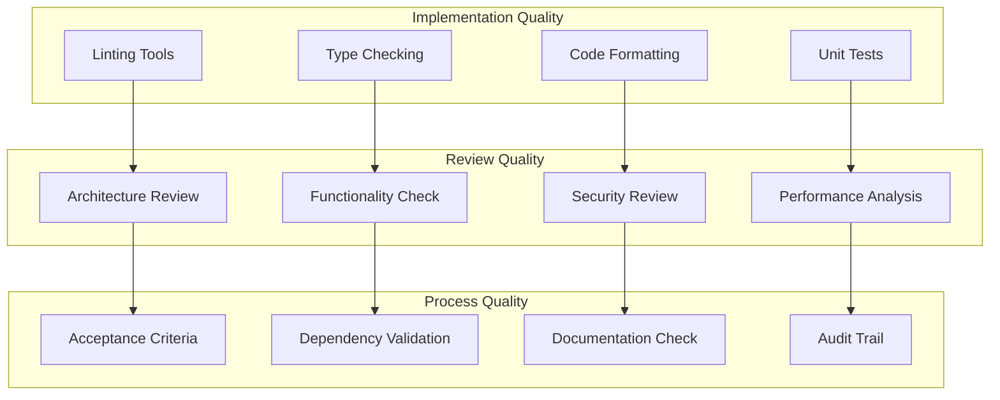
```mermaid
graph TD
    subgraph "Implementation Quality"
        LINT[Linting Tools]
        TYPE[Type Checking]
        TEST[Unit Tests]
        FORMAT[Code Formatting]
    end
    
    subgraph "Review Quality"
        ARCH[Architecture Review]
        FUNC[Functionality Check]
        SEC[Security Review]
        PERF[Performance Analysis]
    end
    
    subgraph "Process Quality"
        CRIT[Acceptance Criteria]
        DEP[Dependency Validation]
        DOC[Documentation Check]
        AUDIT[Audit Trail]
    end
    
    LINT --> ARCH
    TYPE --> FUNC
    TEST --> PERF
    FORMAT --> SEC
    ARCH --> CRIT
    FUNC --> DEP
    SEC --> DOC
    PERF --> AUDIT
```

### 2. Review Finding Classification

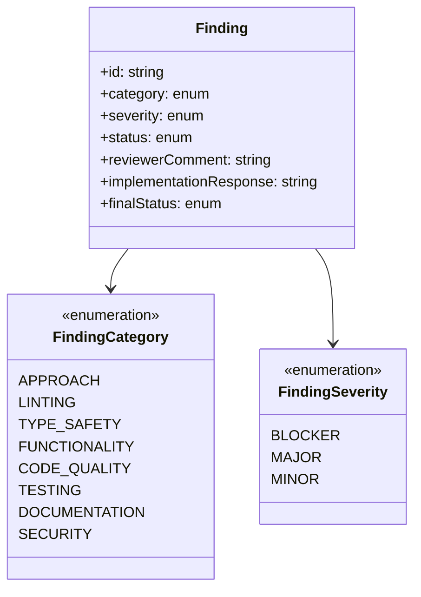
```mermaid
classDiagram
    class Finding {
        +id: string
        +category: enum
        +severity: enum
        +status: enum
        +reviewerComment: string
        +implementationResponse: string
        +finalStatus: enum
    }
    
    class FindingCategory {
        <<enumeration>>
        APPROACH
        LINTING
        TYPE_SAFETY
        FUNCTIONALITY
        CODE_QUALITY
        TESTING
        DOCUMENTATION
        SECURITY
    }
    
    class FindingSeverity {
        <<enumeration>>
        BLOCKER
        MAJOR
        MINOR
    }
    
    Finding --> FindingCategory
    Finding --> FindingSeverity
```

## Scalability & Performance Considerations

### 1. File System Optimization

- **Timestamp-based Smart Updates**: Avoid regenerating unchanged content
- **Incremental Status Updates**: Update only modified sections
- **Audit Trail Compression**: Archive old iterations beyond configurable threshold
- **Parallel Task Analysis**: Support concurrent task execution when dependencies allow

### 2. State Management Optimization

- **JSON Schema Validation**: Ensure data integrity in tracker files
- **Atomic Updates**: Prevent corruption during concurrent access
- **Backup Strategies**: Automatic backup before major state changes
- **Recovery Mechanisms**: Handle corrupted state files gracefully

## Integration Points

### 1. External Tool Integration

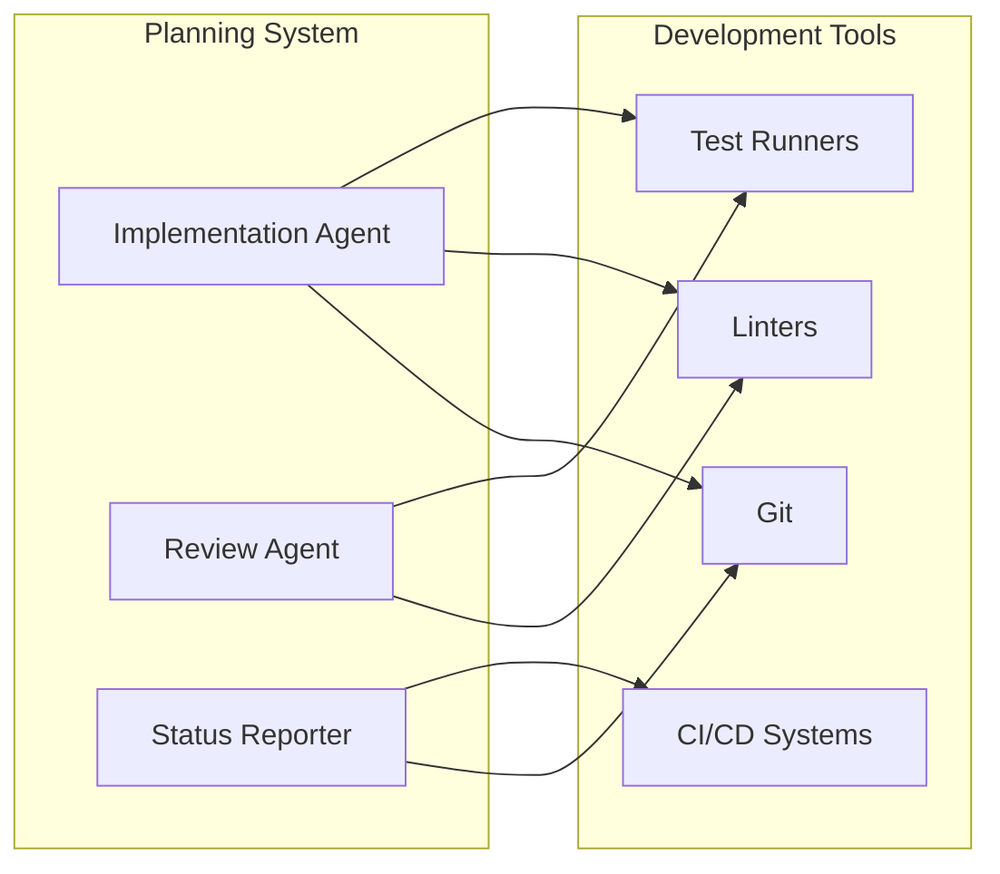
```mermaid
graph LR
    subgraph "Development Tools"
        GIT[Git]
        LINT[Linters]
        TEST[Test Runners]
        CI[CI/CD Systems]
    end
    
    subgraph "Planning System"
        IA[Implementation Agent]
        RA[Review Agent]
        ST[Status Reporter]
    end
    
    IA --> GIT
    IA --> LINT
    IA --> TEST
    RA --> LINT
    RA --> TEST
    ST --> GIT
    ST --> CI
```

### 2. Human-AI Collaboration

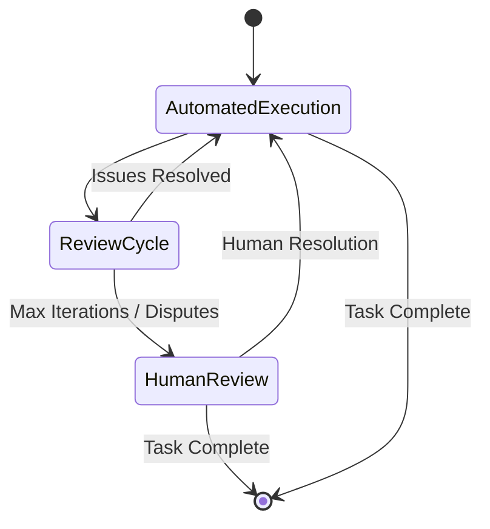
```mermaid
stateDiagram-v2
    [*] --> AutomatedExecution
    AutomatedExecution --> ReviewCycle
    ReviewCycle --> AutomatedExecution : Issues Resolved
    ReviewCycle --> HumanReview : Max Iterations / Disputes
    HumanReview --> AutomatedExecution : Human Resolution
    HumanReview --> [*] : Task Complete
    AutomatedExecution --> [*] : Task Complete
```

## Future Architecture Considerations

### 1. Planned Enhancements

- **Architect Agent**: Maintain architecture standards and baseline understanding
- **Multi-Agent Coordination**: Enhanced synchronization for parallel development
- **Machine Learning Integration**: Learn from execution patterns to improve planning
- **Real-time Collaboration**: Support multiple concurrent plan executions

### 2. Extensibility Points

- **Plugin Architecture**: Support custom review agents and quality checks
- **Template System**: Extensible project type templates
- **Integration APIs**: Connect with external project management tools
- **Custom Workflow Definitions**: User-defined execution patterns

## Conclusion

The Claude Code Planning & Execution System represents a sophisticated approach to AI-assisted software development, combining structured planning methodologies with intelligent automation. The architecture prioritizes maintainability, auditability, and human-AI collaboration while providing comprehensive tracking and quality assurance throughout the development lifecycle.

The system's modular design and clear separation of concerns enable both current functionality and future enhancements, making it a robust foundation for AI-driven development workflows.