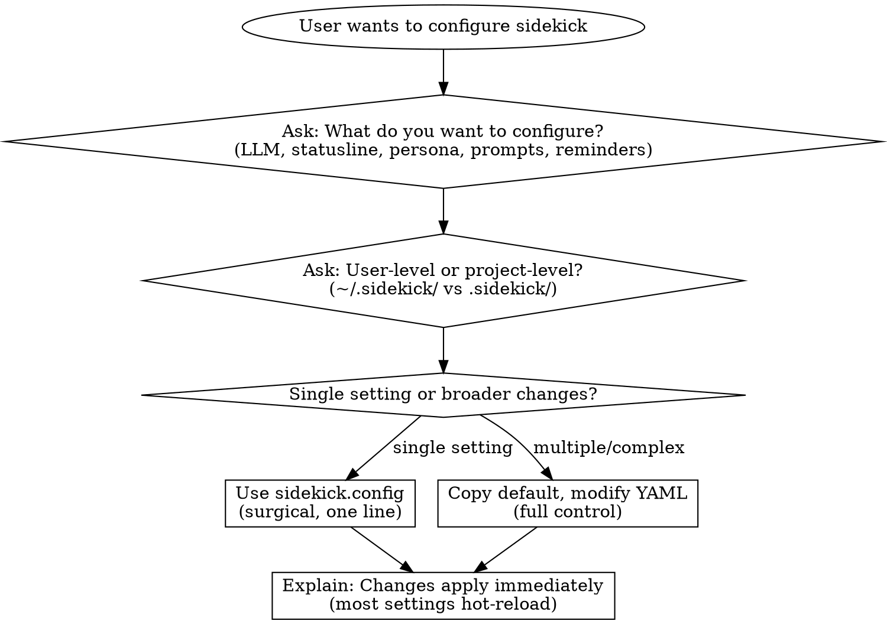

# Sidekick Configuration

## Overview

Guide users through configuring sidekick interactively. Ask what they want to configure, help them choose the right scope and method, and create files in the correct locations.

**Key principle:** Always ask before assuming. Configuration choices depend on user intent.

## When to Use

- User mentions "configure sidekick", "customize sidekick", "set up sidekick"
- User wants to change LLM models/profiles
- User wants to customize the statusline format
- User wants to add or change personas
- User wants to change/set/switch the session persona (e.g., "change persona to marvin", "set persona", "switch to GLaDOS")
- User wants to adjust reminders or other features
- User wants to modify prompt templates
- User asks about sidekick configuration options

## Interactive Flow



**CRITICAL: Always ask these questions before creating files:**
1. What do you want to configure?
2. Should this be user-level (~/.sidekick/) or project-level (.sidekick/)?
3. Single setting change or broader modifications?

## Choosing Configuration Method

| Method | When to Use | Example |
|--------|-------------|---------|
| **sidekick.config** | Single setting, quick tweak | Change one threshold |
| **YAML file** | Multiple settings, complex objects | Custom LLM profile |
| **Asset override** | Modify prompts, reminders, personas | Custom prompt template |

### sidekick.config (Surgical Changes)

Best for one-off settings using dot-notation:

```bash
# .sidekick/sidekick.config or ~/.sidekick/sidekick.config
llm.defaultProfile=creative
features.statusline.settings.format={model} | {tokenPercentageActual}
features.reminders.settings.pause_and_reflect_threshold=100
features.session-summary.settings.personas.resumeFreshnessHours=8
core.logging.level=debug
```

### YAML Files (Broader Changes)

Best for complex objects or multiple related settings. Copy the default file and modify:

1. Find default: `assets/sidekick/defaults/{domain}.defaults.yaml`
2. Copy to: `.sidekick/{domain}.yaml` or `~/.sidekick/{domain}.yaml`
3. Modify as needed

## Configuration Scopes

| Scope | Location | Use When | Persists |
|-------|----------|----------|----------|
| **User** | `~/.sidekick/` | Personal defaults across all projects | Yes |
| **Project** | `.sidekick/` | Project-specific, shared with team | Yes (git) |
| **Local** | `.sidekick/*.local` | Personal overrides, untracked | No |

**Override order (highest to lowest):**
1. `.sidekick/{domain}.yaml.local` - Project local (untracked)
2. `.sidekick/{domain}.yaml` - Project (tracked)
3. `~/.sidekick/{domain}.yaml` - User
4. `assets/sidekick/defaults/` - Bundled defaults

## Detailed Reference Documentation

| Topic | Reference File | Default Location |
|-------|----------------|------------------|
| LLM models & profiles | [resources/LLM.md](resources/LLM.md) | `assets/sidekick/defaults/llm.defaults.yaml` |
| Features (statusline, reminders, session-summary) | [resources/FEATURES.md](resources/FEATURES.md) | `assets/sidekick/defaults/features/*.defaults.yaml` |
| Core (logging, paths, daemon) | [resources/CORE.md](resources/CORE.md) | `assets/sidekick/defaults/core.defaults.yaml` |
| Prompt templates | [resources/PROMPTS.md](resources/PROMPTS.md) | `assets/sidekick/prompts/` |
| Personas | [resources/PERSONAS.md](resources/PERSONAS.md) | `assets/sidekick/personas/` |
| Reminders | [resources/REMINDERS.md](resources/REMINDERS.md) | `assets/sidekick/reminders/` |

## Quick Examples

### Change Default LLM Model

**Surgical (sidekick.config):**
```bash
llm.defaultProfile=creative
```

**Full control (llm.yaml):**
```yaml
# .sidekick/llm.yaml
defaultProfile: my-cheap-profile

profiles:
  my-cheap-profile:
    provider: openrouter
    model: google/gemma-3-4b-it
    temperature: 0
    maxTokens: 500
    timeout: 10
```

### Customize Statusline

**Surgical:**
```bash
features.statusline.settings.format={model} | {tokenPercentageActual}
```

**Full control:**
```yaml
# .sidekick/features.yaml
statusline:
  enabled: true
  settings:
    format: "{model} | {tokenPercentageActual}"
    theme:
      useNerdFonts: ascii
```

### Change Session Persona

The assistant has access to the current session ID via `<session-info>` in the context. To change the persona for the current session:

```bash
npx @sidekick/cli persona set <persona-id> --session-id=<session-id>
```

**Example:** If session ID is `abc-123` and user wants GLaDOS:
```bash
npx @sidekick/cli persona set glados --session-id=abc-123
```

**List available personas:**
```bash
npx @sidekick/cli persona list
```

See [resources/PERSONAS.md](resources/PERSONAS.md) for available personas and creating custom ones.

### Add Custom Persona

**Location:** `.sidekick/personas/` or `~/.sidekick/personas/` (NOT `assets/sidekick/personas/`)

**Length limits:** snarky_examples ≤15 words, snarky_welcome_examples ≤10 words

```yaml
# ~/.sidekick/personas/pirate.yaml
id: pirate
display_name: Captain
theme: "A swashbuckling pirate captain"
personality_traits: [adventurous, dramatic]
tone_traits: [nautical, bold]
statusline_empty_messages:
  - "Ahoy! Ready to plunder some code?"
snarky_examples:                    # Max 15 words each
  - "Arr, that code be messier than Davy Jones' locker!"
snarky_welcome_examples:            # Max 10 words each (for returning users)
  - "Ye were sailin' these seas. Continue the voyage?"
```

### Modify Prompt Template

Copy and customize:
```bash
cp assets/sidekick/prompts/snarky-message.prompt.txt .sidekick/assets/prompts/
# Then edit .sidekick/assets/prompts/snarky-message.prompt.txt
```

### Generate Reminders from CLAUDE.md

When user asks to "generate reminders", "customize reminders from my rules", or "infuse my CLAUDE.md (or AGENTS.md) into reminders":

**Interactive Flow:**
1. Ask: Which reminder types? (user-prompt-submit, verify-completion, or both)
2. Ask: User-scope (~/.sidekick/) or project-scope (.sidekick/)?
3. Read the user's CLAUDE.md and AGENTS.md files
4. Show current defaults alongside suggested customizations
5. Let user review and refine before writing

**Reminder Type Purposes:**

| Type | When It Fires | Purpose |
|------|---------------|---------|
| `user-prompt-submit` | Every user message | Input processing discipline: verify assumptions, ask clarifications, plan approach |
| `verify-completion` | Before claiming "done" | Output verification: run tests, check requirements, evidence before assertions |

**What Each Reminder Should Capture:**

**user-prompt-submit** - Extract from CLAUDE.md:
- Critical behavioral rules ("verify before agreeing", "challenge confident users")
- When to ask clarifying questions vs. proceed
- Workflow discipline (TodoWrite usage, skill invocation)
- Project-specific constraints that affect how to interpret requests

**verify-completion** - Extract from CLAUDE.md:
- Definition of done / acceptance criteria
- Required verification commands (build, test, lint, typecheck)
- Documentation requirements
- Commit/PR policies
- Quality gates

**Presenting to User:**

Show side-by-side:
```
CURRENT DEFAULT:
[show additionalContext from default YAML]

SUGGESTED CUSTOMIZATION (based on your CLAUDE.md):
[generated reminder incorporating their rules]

CHANGES MADE:
- Added: [specific rule from their CLAUDE.md]
- Emphasized: [rule they mention frequently]
- Removed: [default that conflicts with their workflow]
```

**Writing the Reminder:**

**CRITICAL:** Only customize `additionalContext`. Copy all other fields exactly from the source.

| Field | Customize? | Notes |
|-------|------------|-------|
| `id` | NO | Must match source exactly |
| `blocking` | NO | Must match source exactly |
| `priority` | NO | Must match source exactly |
| `persistent` | NO | Must match source exactly |
| `additionalContext` | **YES** | This is what you generate |
| `userMessage` | Only if user requests | Optional - ask user first |
| `reason` | Only if user requests | Optional - ask user first |

```yaml
# .sidekick/assets/reminders/user-prompt-submit.yaml
# Copy these fields EXACTLY from assets/sidekick/reminders/user-prompt-submit.yaml
id: user-prompt-submit
blocking: false
priority: 10
persistent: true

# THIS is what you customize:
additionalContext: |
  [Generated content based on CLAUDE.md analysis]

# Only include if user explicitly requests customization:
# userMessage: "..."
# reason: "..."
```

**Location:** `.sidekick/assets/reminders/` or `~/.sidekick/assets/reminders/`

## Asset Override Cascade

For prompts, reminders, and other assets:

1. `.sidekick/assets.local/` - Untracked project overrides
2. `.sidekick/assets/` - Tracked project overrides
3. `~/.sidekick/assets/` - User overrides
4. `assets/sidekick/` - Bundled defaults

## Hot-Reloading

**Most settings apply immediately.** Only these require `claude --continue`:
- Daemon/IPC connection settings
- Hook-related changes

## Common Mistakes

| Mistake | Correct Approach |
|---------|-----------------|
| Put persona in `assets/sidekick/personas/` | Use `.sidekick/personas/` or `~/.sidekick/personas/` |
| Wrap features.yaml content under `features:` | Feature names at root: `statusline:`, not `features: statusline:` |
| Assume project scope | Ask user: user-level or project-level? |
| Use YAML for single setting | Use `sidekick.config` for surgical changes |
| Say "restart required" | Most changes hot-reload automatically |

## Debugging

```bash
# View loaded config
cat ~/.sidekick/llm.yaml
cat .sidekick/features.yaml
cat .sidekick/sidekick.config

# Enable debug logging
echo "core.logging.level=debug" >> .sidekick/sidekick.config
echo "llm.global.debugDumpEnabled=true" >> .sidekick/sidekick.config

# Check daemon logs
tail -f .sidekick/logs/daemon.log
```
