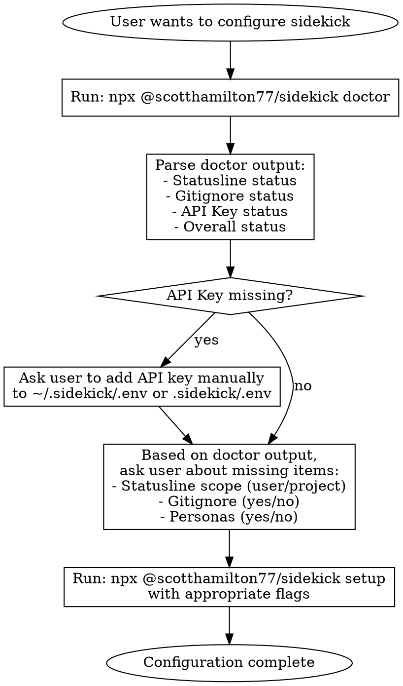

# Sidekick Setup & Configuration

## Overview

Configure sidekick by first running diagnostics, then executing setup with appropriate parameters.

**Key principle:** Always run `doctor` first to understand current state before making changes.

**For persona configuration** (change persona, weight pool, curate list, create custom, improve voice): use the `sidekick-personas` skill instead.

## When to Use

- User mentions "configure sidekick", "customize sidekick", "set up sidekick"
- User wants to set up or troubleshoot API keys (OpenRouter, OpenAI)
- User gets "requires apiKey" or credential errors
- User wants to change LLM models/profiles
- User wants to customize the statusline format
- User wants to adjust reminders or other features
- User wants to modify prompt templates
- User asks about sidekick configuration options
- User wants to set up or update their user profile (name, role, interests)

## Setup Workflow (Initial Configuration)



### Step 1: Run Doctor

**Always start with diagnostics:**
```bash
npx @scotthamilton77/sidekick doctor
```

**Doctor output format:**
```
Sidekick Doctor
===============

Checking configuration...

[Cache corrections if any]

Checking live status of Sidekick... this may take a few moments.

✓ Plugin: installed            # or "✗ not installed" / "✓ dev-mode (local)" / "⚠ conflict (both)"
✓ Plugin Liveness: hooks responding  # or "✗ hooks not detected" / "⚠ check failed"
✓ Statusline: user             # or "⚠ none" / "✓ project"
✓ Gitignore: installed         # or "⚠ not-installed"
✓ OpenRouter API Key: healthy [project ✓ user ✓ env ✗]  # per-scope breakdown
✓ Overall: healthy             # or "⚠ needs attention"
```

### Step 2: Handle API Key (If Missing or Invalid)

**CRITICAL:** The setup CLI cannot accept API keys directly. The doctor shows per-scope status:
- `healthy` — key found and validated
- `invalid` — key found but validation failed
- `missing` / `not found` — no key at that scope

If no scope has a healthy key, instruct the user:

```
Your OpenRouter API key is not configured (or invalid). Please add it manually:

1. Get a key at https://openrouter.ai → Keys → Create Key
2. Add to your config (choose one):

   User-wide (all projects):
   mkdir -p ~/.sidekick && echo 'OPENROUTER_API_KEY=sk-or-v1-your-key' >> ~/.sidekick/.env

   Project-only:
   mkdir -p .sidekick && echo 'OPENROUTER_API_KEY=sk-or-v1-your-key' >> .sidekick/.env

Then re-run this configuration.
```

### Step 3: Gather Setup Parameters

Based on doctor output, ask about unconfigured items:

| Doctor Shows | Ask User |
|--------------|----------|
| Statusline: none | "Configure statusline? (user-level or project-level?)" |
| Gitignore: not-installed | "Update .gitignore to exclude sidekick files?" |
| (always ask if not using --force) | "Enable persona features?" |

**Dev-mode note:** If doctor shows `Plugin: dev-mode (local)`, the setup command will automatically skip overwriting a dev-mode statusline at that scope and print `⚠ Statusline managed by dev-mode (skipped)`.

### Step 4: Run Setup with Flags

```bash
npx @scotthamilton77/sidekick setup [options]

Options:
  --statusline-scope=<user|project>  Configure statusline scope
  --gitignore                        Update .gitignore
  --no-gitignore                     Skip .gitignore
  --personas                         Enable personas
  --no-personas                      Disable personas
  --user-profile-name=<name>         Set user profile name
  --user-profile-role=<role>         Set user profile role
  --user-profile-interests=<list>    Set interests (comma-separated)
  --force                            Apply all defaults non-interactively
```

**Examples:**
```bash
# User wants statusline at user level, gitignore, and personas
npx @scotthamilton77/sidekick setup --statusline-scope=user --gitignore --personas

# User wants project-level statusline, no gitignore changes
npx @scotthamilton77/sidekick setup --statusline-scope=project --no-gitignore --personas

# Apply all defaults without prompting
npx @scotthamilton77/sidekick setup --force
```

## Config CLI

Read or write any configuration value using dot-path notation:

```bash
# Read (cascade-resolved value — what's actually in effect)
npx @scotthamilton77/sidekick config get <dot.path> [--scope=user|project|local] [--format=json]

# Write (requires scope question first)
npx @scotthamilton77/sidekick config set <dot.path> <value> [--scope=user|project|local]

# Remove an override (fall back to next cascade level)
npx @scotthamilton77/sidekick config unset <dot.path> [--scope=user|project|local]
```

**Dot-path examples:**

| Dot Path | Domain File | YAML Key |
|----------|-------------|----------|
| `llm.defaultProfile` | `llm.yaml` | `defaultProfile:` |
| `features.statusline.settings.format` | `features.yaml` | `statusline: settings: format:` |
| `core.logging.level` | `core.yaml` | `logging: level:` |

## Advanced Configuration (Post-Setup)

### Choosing Configuration Method

| Method | When to Use | Example |
|--------|-------------|---------|
| **Config CLI** | Single values, validated changes | `config set llm.defaultProfile my-profile` |
| **YAML file** | Complex objects, multiple settings | Custom LLM profile with all fields |
| **`.local.yaml` file** | Local-only overrides (untracked) | Debug logging, dev settings |
| **Asset override** | Modify prompts, reminders | Custom prompt template |

### YAML Files

Best for complex objects or multiple related settings. Copy the default file and modify:

1. Find default: `assets/sidekick/defaults/{domain}.defaults.yaml`
2. Copy to: `.sidekick/{domain}.yaml` or `~/.sidekick/{domain}.yaml`
3. Modify as needed

## Configuration Scopes

| Scope | Location | Use When | Persists |
|-------|----------|----------|----------|
| **User** | `~/.sidekick/` | Personal defaults across all projects | Yes |
| **Project** | `.sidekick/` | Project-specific, shared with team | Yes (git) |
| **Local** | `.sidekick/{domain}.local.yaml` | Personal overrides, untracked | No |

**Override order (highest to lowest):**
1. `.sidekick/{domain}.local.yaml` - Project local (untracked)
2. `.sidekick/{domain}.yaml` - Project (tracked)
3. `~/.sidekick/{domain}.yaml` - User
4. `assets/sidekick/defaults/` - Bundled defaults

## Detailed Reference Documentation

| Topic | Reference File | Default Location |
|-------|----------------|------------------|
| **API keys & credentials** | [resources/CREDENTIALS.md](resources/CREDENTIALS.md) | `~/.sidekick/.env` |
| LLM models & profiles | [resources/LLM.md](resources/LLM.md) | `assets/sidekick/defaults/llm.defaults.yaml` |
| Features (statusline, reminders, session-summary) | [resources/FEATURES.md](resources/FEATURES.md) | `assets/sidekick/defaults/features/*.defaults.yaml` |
| Core (logging, paths, daemon) | [resources/CORE.md](resources/CORE.md) | `assets/sidekick/defaults/core.defaults.yaml` |
| Prompt templates | [resources/PROMPTS.md](resources/PROMPTS.md) | `assets/sidekick/prompts/` |
| Personas | [resources/PERSONAS.md](resources/PERSONAS.md) | `assets/sidekick/personas/` |
| Reminders | [resources/REMINDERS.md](resources/REMINDERS.md) | `assets/sidekick/reminders/` |

## Quick Examples

### Change Default LLM Model

```yaml
# .sidekick/llm.yaml
defaultProfile: my-cheap-profile

profiles:
  my-cheap-profile:
    provider: openrouter
    model: google/gemma-3-4b-it
    temperature: 0
    maxTokens: 500
    timeout: 10
```

### Customize Statusline

```yaml
# .sidekick/features.yaml
statusline:
  enabled: true
  settings:
    format: "{model} | {tokenPercentageActual}"
    theme:
      useNerdFonts: ascii
```

### Modify Prompt Template

Copy and customize:
```bash
cp assets/sidekick/prompts/snarky-message.prompt.txt .sidekick/assets/prompts/
# Then edit .sidekick/assets/prompts/snarky-message.prompt.txt
```

### Configure User Profile

The user profile is stored at `~/.sidekick/user.yaml`.

**Interactive** (Step 8 in the wizard):
```bash
npx @scotthamilton77/sidekick setup
```

**Non-interactive** (scripting flags):
```bash
npx @scotthamilton77/sidekick setup \
  --user-profile-name="Scott" \
  --user-profile-role="Software Architect" \
  --user-profile-interests="Sci-Fi,hiking"
```

Or create the file manually:
```yaml
# ~/.sidekick/user.yaml
name: "Your Name"
role: "Your Role"
interests:
  - "Interest 1"
  - "Interest 2"
```

### Generate Reminders from CLAUDE.md

When user asks to "generate reminders", "customize reminders from my rules", or "infuse my CLAUDE.md into reminders":

**Interactive Flow:**
1. Ask: Which reminder types? (user-prompt-submit, verify-completion, or both)
2. Ask: User-scope (~/.sidekick/) or project-scope (.sidekick/)?
3. Read the user's CLAUDE.md and AGENTS.md files
4. Show current defaults alongside suggested customizations
5. Let user review and refine before writing

**Reminder Type Purposes:**

| Type | When It Fires | Purpose |
|------|---------------|---------|
| `user-prompt-submit` | Every user message | Input processing discipline |
| `verify-completion` | Before claiming "done" | Output verification |

**Writing the Reminder:**

**CRITICAL:** Only customize `additionalContext`. Copy all other fields exactly from the source.

```yaml
# .sidekick/assets/reminders/user-prompt-submit.yaml
# Copy these fields EXACTLY from assets/sidekick/reminders/user-prompt-submit.yaml
id: user-prompt-submit
blocking: false
priority: 10
persistent: true

# THIS is what you customize:
additionalContext: |
  [Generated content based on CLAUDE.md analysis]
```

**Location:** `.sidekick/assets/reminders/` or `~/.sidekick/assets/reminders/`

## Asset Override Cascade

For prompts, reminders, and other assets:

1. `.sidekick/assets.local/` - Untracked project overrides
2. `.sidekick/assets/` - Tracked project overrides
3. `~/.sidekick/assets/` - User overrides
4. `assets/sidekick/` - Bundled defaults

## Hot-Reloading

**Most settings apply immediately.** Daemon/IPC connection settings may require a daemon restart (`npx @scotthamilton77/sidekick daemon kill && npx @scotthamilton77/sidekick daemon start`).

## Common Mistakes

| Mistake | Correct Approach |
|---------|-----------------|
| Wrap features.yaml content under `features:` | Feature names at root: `statusline:`, not `features: statusline:` |
| Assume project scope | Ask user: user-level or project-level? |
| Say "restart required" | Most changes hot-reload automatically |
| Edit YAML directly for simple changes | Use `config set` CLI — it validates inputs |

## Debugging

```bash
# View loaded config
cat ~/.sidekick/llm.yaml
cat .sidekick/features.yaml

# Enable debug logging (use .local.yaml for local overrides)
# .sidekick/core.local.yaml:
#   logging:
#     level: debug
# .sidekick/llm.local.yaml:
#   global:
#     debugDumpEnabled: true

# Check daemon logs
tail -f .sidekick/logs/daemon.log
```
